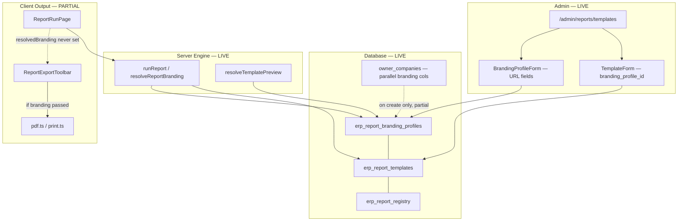

# Templates & Branding — Deep System Analysis and Recommendations

**Document Type:** Analysis Only (No Implementation)  
**Date:** 2026-07-02  
**Codebase:** ALGT ERP / `agt-erp`  
**Phases Reviewed:** REPORT.2, REPORT.3, REPORT.4, REPORT.5 (all marked CLOSED in Source of Truth)  
**Analyst Scope:** Read-only audit of live code, migrations, standards, and implementation reports

---

## 1. Executive Summary

ALGT ERP has a **substantial Report Center foundation** for Templates & Branding. The database schema, server-side branding resolver, admin CRUD UI, report registry, run history, and export adapter layer are **implemented and closed** through REPORT.5. However, **end-to-end branded output is not fully wired**: the client rarely receives resolved branding context, asset storage is **URL-only text fields** (no upload pipeline), logo/stamp/signature **images are not embedded in PDF output**, and organization master data (`owner_companies`) and report branding profiles (`erp_report_branding_profiles`) are **partially duplicated without sync**.

The user's proposed requirement — **uploadable, ERP-managed branding assets linked to organization/company with global default fallback** — is **correct and aligned** with the existing standards document (`docs/standards/ERP_REPORT_TEMPLATE_BRANDING_STANDARD.md`) and the audit plan. The current implementation is approximately **60% infrastructure / 40% runtime consumption**. The highest-risk gaps are: (1) dual logo sources with no sync, (2) missing asset upload/storage, (3) client branding bridge not connected, (4) stamp/signature security not enforced.

**Recommendation:** Proceed with a phased **BRANDING.1–BRANDING.7** roadmap starting with asset storage foundation and org-profile sync, then wire the existing resolver and export adapters end-to-end before expanding to module-specific outputs (HR letters, DMS, finance, etc.).

---

## 2. Current Implementation Analysis

### 2.1 Phase Status (from `.cursor/ALGT_ERP_SOURCE_OF_TRUTH.md`)

| Phase | Status | Scope |
|-------|--------|-------|
| REPORT.2 | CLOSED ✅ | DB schema: branding profiles, templates, registry, runs, delivery logs; RLS; permissions; seeds |
| REPORT.3 | CLOSED ✅ | Branding resolver, output adapters (`ExportBrandingContext`), admin template/branding UI, company onboarding hook |
| REPORT.4 | CLOSED ✅ | 26 HR report/letter/form registry entries + fetchers |
| REPORT.5 | CLOSED ✅ | Saved filters, column profiles, schedules, email delivery, history UI |

**Important:** REPORT.3 closure report describes adapter upgrades as complete, but subsequent code review shows **client wiring gaps** remain (see §2.6).

### 2.2 Database Tables

**Primary migration:** `supabase/migrations/20260619130000_report_2_global_report_engine_registry_security_foundation.sql`  
**Schedules migration:** `supabase/migrations/20260619160000_report_5_email_scheduling_history_security_uat.sql`

| Table | Purpose | Key Branding Columns |
|-------|---------|---------------------|
| `erp_report_branding_profiles` | Company/group/neutral branding identity | `logo_url`, `small_logo_url`, `stamp_url`, `signature_url`, `watermark_url`, theme colors, legal/contact/signatory fields, `owner_company_id`, `is_default_for_company`, `is_group_profile`, `is_neutral_profile` |
| `erp_report_templates` | Reusable output layouts | `branding_profile_id`, `show_logo`, `show_stamp`, `show_signatory`, `requires_stamp_permission`, `body_html_en/ar`, `custom_css`, layout JSON |
| `erp_report_registry` | Central report catalog | `branding_strategy`, `default_template_id`, `is_letter_type`, `required_permissions`, `sensitive_profile` |
| `erp_report_runs` | Immutable run audit | `selected_template_id`, `resolved_branding_profile_id`, `owner_company_ids[]`, `template_selected_manually` |
| `erp_report_delivery_logs` | Email/download/print tracking | Attachment metadata only — no raw report body |
| `erp_report_schedules` | Automated delivery | `owner_company_id`, `selected_template_id`, email recipients |
| `erp_report_saved_filters` | User filter presets | No branding |
| `erp_report_column_profiles` | Column visibility presets | No branding |

**Extended `owner_companies` columns (REPORT.2):**  
`small_logo_url`, `stamp_url`, `signature_url`, `watermark_url`, `report_theme_*`, `report_footer_*`, `report_signatory_*`, `default_report_template_id`, `default_letter_template_id`  
(Base `logo_url` existed from `20260527120000_erp_base_foundation.sql`.)

**Not present in DB:** `erp_report_branding_assets`, `template_versions`, dedicated asset metadata table, branch-level branding override table.

### 2.3 Routes and Screens

| Route | File | Function |
|-------|------|----------|
| `/admin/reports` | `src/app/(protected)/admin/reports/page.tsx` | Report Center landing; registry list |
| `/admin/reports/templates` | `src/app/(protected)/admin/reports/templates/page.tsx` | **Templates & Branding** admin (profiles + templates tabs) |
| `/admin/reports/run/[reportCode]` | `src/app/(protected)/admin/reports/run/[reportCode]/page.tsx` | Generic report runner + export toolbar |
| `/admin/reports/history` | `src/app/(protected)/admin/reports/history/page.tsx` | Run history |
| `/admin/reports/schedules` | `src/app/(protected)/admin/reports/schedules/page.tsx` | Scheduled report delivery |

**Sidebar:** Report Center, Templates & Branding, Report History, Report Schedules (`src/components/layout/app-sidebar.tsx`).

**Separate (NOT report branding):** `/admin/notifications/templates` — notification email templates.

### 2.4 UI Components

| Component | Path | Role |
|-----------|------|------|
| `ReportTemplatesPageClient` | `src/features/report-center/report-templates-page-client.tsx` | Admin list (ERPDataTable) for profiles + templates |
| `BrandingProfileForm` | `src/features/report-center/branding-profile-form.tsx` | Add/edit branding profile (`ERPChildDialogForm`, xl) |
| `TemplateForm` | `src/features/report-center/template-form.tsx` | Add/edit report template (`ERPChildDialogForm`, lg) |
| `ReportRunPage` | `src/features/report-center/report-run-page.tsx` | Run report, export, template selection |
| `ReportExportToolbar` | `src/features/report-center/report-export-toolbar.tsx` | PDF/Excel/CSV/print/email with optional branding |
| `ReportTemplateSelectDialog` | `src/components/report-center/report-template-select-dialog.tsx` | Manual template picker (shows profile logo) |
| `ReportPreviewHeader` | `src/components/report-center/report-preview-header.tsx` | On-screen branded header preview |
| `LetterPreviewDialog` | `src/features/report-center/letter-preview-dialog.tsx` | HR letter quick preview from employee workspace |
| `HrLetterGenerator` | `src/features/report-center/hr-letter-generator.tsx` | 8 HR letter/form types |
| `ERPExportMenu` | `src/components/erp/export/erp-export-menu.tsx` | Generic export dropdown (branding props exist, rarely used) |
| `OrganizationWorkspaceForm` | `src/features/organizations/organization-workspace-form.tsx` | Org master `logo_url` only |

### 2.5 Server Actions and Library Functions

| File | Key Functions | Permissions |
|------|---------------|-------------|
| `src/server/actions/reports/templates.ts` | `list/create/update` branding profiles & templates; `resolveTemplatePreview()` → `ExportBrandingContext` | `reports.view` (read), `reports.manage` (write) |
| `src/server/actions/reports/runner.ts` | `runReportAction`, `resolveReportTemplateForContextAction` | `reports.run`, `reports.view` |
| `src/server/actions/reports/registry.ts` | Registry CRUD + list helpers | `reports.view`, `reports.manage` |
| `src/server/actions/reports/schedules.ts` | Schedule CRUD, `executeScheduleRun` | `reports.schedule.*`, `reports.run`, `reports.email` |
| `src/server/actions/email.ts` | `sendReportEmail` | `reports.email` |
| `src/server/actions/organizations.ts` | Calls `ensureReportBrandingForOwnerCompany` on org create | Org permissions |
| `src/lib/report-center/branding-resolver.ts` | `resolveReportBranding()`, `detectReportCompanyContext()` | Server-only |
| `src/lib/report-center/report-runner.ts` | `runReport()` orchestration | Server-only |
| `src/lib/report-center/company-onboarding.ts` | `ensureReportBrandingForOwnerCompany()` | Server-only (caller-guarded) |
| `src/lib/export/pdf.ts`, `print.ts`, `excel.ts`, `generate-attachment.ts` | Branded output when `options.branding` provided | Client-side |

### 2.6 How Branding Works Today (Runtime)

#### Server-side resolution (`resolveReportBranding`)

Decision tree (from `branding-resolver.ts`):

1. Explicit `templateId` → load template + joined branding profile  
2. `branding_strategy = template_fixed` → registry `default_template_id`  
3. `branding_strategy = none` → no branding  
4. `branding_strategy = group_default` → `GROUP_DEFAULT` profile + `GROUP_REPORT_TEMPLATE`  
5. `branding_strategy = manual_required` → `requiresManualTemplateSelection = true`  
6. Multiple `ownerCompanyIds` → manual selection required  
7. Single `ownerCompanyId` → company default report/letter template + default branding profile  
8. No company context → `NEUTRAL_DEFAULT` + `DEFAULT_REPORT_TEMPLATE` (fallback)

#### Client-side consumption

- `runReportAction` resolves branding **server-side** and writes `resolved_branding_profile_id` to `erp_report_runs`.
- `ReportRunPage` declares `resolvedBranding` state and passes it to export toolbar/preview header.
- **`setResolvedBranding` is never called** — no UI invocation of `resolveTemplatePreview()` after a successful run.
- `runReportAction` from UI does **not pass `ownerCompanyIds`** — auto-by-company resolution depends on explicit filter values, not fetcher meta.
- `LetterPreviewDialog` exports PDF/print **without** `branding` option.
- Scheduled runs (`executeScheduleRun`) generate attachments **without** branding context.

#### Asset storage today

- All asset fields are **nullable TEXT URL columns** on `erp_report_branding_profiles` and duplicated on `owner_companies`.
- Admin forms expose **free-text URL inputs** for logo, small logo, stamp, signature (`branding-profile-form.tsx`).
- Migration seed copies `owner_companies.logo_url` → profile on initial seed only.
- `company-onboarding.ts` on new org create **does not copy** `logo_url`, legal names, TRN, or theme from org record.
- **No Supabase Storage bucket**, no upload UI, no signed URL generation for branding assets.
- **No DMS linkage** for branding assets.

#### Output rendering today

`ExportBrandingContext` (`export-types.ts`) includes: company names, `logoUrl`, address, TRN, theme colors, signatory **text**, watermark text, display flags.  
**Missing from ExportBrandingContext:** `smallLogoUrl`, `stampUrl`, `signatureUrl`, `watermarkUrl`.

PDF adapter (`pdf.ts`): renders branded **text header** (company name, address, TRN, colors, watermark text, signatory name/title).  
**Does not embed logo, stamp, or signature images** even when URLs exist.

Template `body_html_en/ar` and `custom_css` are stored in DB and editable in admin UI but **not rendered** in any output adapter.

---

## 3. Files / Routes / Tables / Components Inspected

### Migrations
- `supabase/migrations/20260619130000_report_2_global_report_engine_registry_security_foundation.sql`
- `supabase/migrations/20260619150000_report_4_hr11_reports_letters_forms_library.sql`
- `supabase/migrations/20260619160000_report_5_email_scheduling_history_security_uat.sql`
- `supabase/migrations/20260619170000_hr11_report_final_fix_report_history_rls.sql`
- `supabase/migrations/20260527120000_erp_base_foundation.sql` (owner_companies base)

### Standards & Planning
- `docs/standards/ERP_REPORT_TEMPLATE_BRANDING_STANDARD.md`
- `docs/standards/ERP_GLOBAL_REPORT_CENTER_STANDARD.md`
- `implementation_Review/Reports/ERP_GLOBAL_REPORT_CENTER_AUDIT_AND_INTEGRATION_PLAN.md`
- `implementation_Review/Reports/REPORT_2_*`, `REPORT_3_*`, `REPORT_4_*`, `REPORT_5_*` closure reports
- `.cursor/ALGT_ERP_SOURCE_OF_TRUTH.md`

### Runtime Code (representative)
- `src/lib/report-center/*` (8 files)
- `src/server/actions/reports/*` (templates, runner, registry, schedules, hr/*)
- `src/lib/export/*` (8 files)
- `src/features/report-center/*` (15+ files)
- `src/components/report-center/*`, `src/components/erp/export/erp-export-menu.tsx`

---

## 4. How Templates and Branding Currently Work



**Template selection:** Registry `branding_strategy` drives automatic vs manual selection. Multi-company data triggers manual template dialog. User-selected template ID is passed on re-run.

**Branding application:** Intended flow is server resolves profile → `resolveTemplatePreview` maps to `ExportBrandingContext` → export adapters apply colors/text/watermark. **Actual flow today:** server logs resolved profile ID; client exports mostly use neutral fallback.

---

## 5. Where Branding Affects (or Should Affect) the ERP

| Module / Output | Current State | Future State |
|-----------------|---------------|--------------|
| **Report Center** | Infrastructure live; branded preview/export partially wired | Full branded run + export + email |
| **HR letters & certificates** | 8 letter types in registry; field-grid preview; no branded PDF | Branded letter layout via template HTML + assets |
| **HR reports (lists/summaries)** | Fetchers live; neutral export | Company-branded headers on PDF/Excel |
| **Employee documents** | DMS-backed; separate from report branding | Optional cross-link for official letterhead assets |
| **DMS document outputs** | Storage signed URLs for files; no report branding | May share asset storage bucket; separate concern |
| **Finance/accounting reports** | Not in registry yet | Should consume same engine when built |
| **Party/customer/vendor documents** | No report templates | Future: branded statements, confirmations |
| **Procurement documents** | Not implemented | Future: PO/GRN branded outputs |
| **Fleet/workshop reports** | Not implemented | Future |
| **Transport/weighbridge tickets** | Draft design in `ChatGPT/Report_Design/` only | Future; needs ticket template type |
| **Notifications/email templates** | Separate `notification_templates` table | Different system; may reference branding for HTML emails |
| **Printable forms / external submissions** | Registry types exist; no fetchers | Future MOHRE/WPS formats |
| **Generic list exports (ERPDataTable)** | No branding | Optional via `ERPExportMenu` template gate |
| **Scheduled email reports** | Schedules live; attachments unbranded | Must pass resolved branding in `executeScheduleRun` |

---

## 6. Validation of User Suggestion

> Branding should not rely only on a logo URL. Logos and branding assets should be uploadable and stored/managed by the ERP. Branding should be connected to organization/company, but there may also be a global/default branding profile. Branding assets should include logo, small logo, stamp, and signature.

### Verdict: **VALID — with refinements**

| Aspect | Assessment |
|--------|------------|
| URL-only logos insufficient | **Correct.** Current TEXT URL fields are a REPORT.2 placeholder. Standards §6 already define logo/stamp/signature URLs but assume admin provides URLs manually. Production requires ERP-managed upload. |
| Upload to storage + DB reference | **Correct.** Store files in Supabase Storage; DB holds metadata/path FK, not binary BLOBs. |
| Binary in DB vs path | **Recommend path/reference only.** Postgres is not appropriate for image blobs at scale. Use `erp_report_branding_assets` metadata table + storage path. |
| Connect to organization/company | **Correct and partially exists.** `erp_report_branding_profiles.owner_company_id` + `is_default_for_company` already model this. Needs sync from `owner_companies` and elimination of duplicate columns long-term. |
| Global/default branding profile | **Already exists.** `NEUTRAL_DEFAULT`, `GROUP_DEFAULT`, per-company `COMPANY_{id}_DEFAULT`. |
| Branch-level override | **Not implemented; recommend optional future.** Branch-specific letterhead is rare in UAE ERP context but valid for multi-branch companies. Defer to BRANDING.4+ unless business requires immediately. |
| Auto-select by `owner_company_id` | **Designed but incomplete.** Resolver supports it; UI doesn't pass `ownerCompanyIds`; fetcher meta not used post-fetch. |
| Manual selection for mixed-company | **Implemented server-side** (`requiresManualTemplateSelection`); UI dialog exists. |
| Separate small logo, stamp, signature | **Correct.** DB columns exist; `ExportBrandingContext` and PDF renderer don't use stamp/signature URLs yet. |
| Stamp/signature permission restrictions | **Designed (`reports.sign`, `requires_stamp_permission`) but not enforced** in resolver, preview, or export. |
| Signature per org vs per person | **Recommend both layers:** profile default signatory (current) + optional authorized signatory registry per company (future). HR letters often need named signatory per letter type. |
| Active/inactive + versioning | **Partial.** `is_active` + soft delete exist. No version history for assets or templates. Recommend versioning for official assets (audit/compliance). |

### Corrections / Additions to User Suggestion

1. **Do not remove URL fields immediately** — migrate to storage-backed references while keeping URL column as resolved public/signed URL cache or legacy fallback during soak period.
2. **Sync strategy required** between `owner_companies` and `erp_report_branding_profiles` — standards §5 describes copy-on-create; code doesn't fully implement it.
3. **Watermark** should be included alongside stamp/signature (already in schema).
4. **Template HTML body** (`body_html_en/ar`) is a separate gap from asset upload — letters need both assets AND layout rendering.
5. **DMS** may eventually host official documents but branding assets for reports should use a dedicated storage namespace, not party documents.

---

## 7. Corrected Recommended Architecture

```
┌─────────────────────────────────────────────────────────────────┐
│                     Report Output Layer                          │
│  PDF / Print / Excel / Email attachments / Letter HTML render   │
└───────────────────────────┬─────────────────────────────────────┘
                            │ ExportBrandingContext (+ asset URLs)
┌───────────────────────────▼─────────────────────────────────────┐
│              Branding Resolution Service (server)                  │
│  resolveReportBranding → resolveTemplatePreview → signed URLs     │
└───────────────────────────┬─────────────────────────────────────┘
                            │
        ┌───────────────────┼───────────────────┐
        ▼                   ▼                   ▼
┌───────────────┐  ┌────────────────┐  ┌───────────────────┐
│ erp_report_   │  │ erp_report_    │  │ erp_report_       │
│ templates     │──│ branding_      │──│ branding_assets   │
│               │  │ profiles       │  │ (NEW)             │
└───────────────┘  └───────┬────────┘  └─────────┬─────────┘
                           │ owner_company_id     │ storage_path
                           ▼                      ▼
                   ┌───────────────┐      ┌──────────────────┐
                   │ owner_        │      │ Supabase Storage │
                   │ companies     │      │ bucket: report-  │
                   │ (master data) │      │ branding-assets  │
                   └───────────────┘      └──────────────────┘
```

**Principles:**
- **Single resolution path:** all outputs call `resolveTemplatePreview` (or server equivalent with signed URLs).
- **Company master is source of truth for identity;** branding profile is source of truth for report output (synced, not duplicated long-term).
- **Assets are private** in storage; signed URLs generated at render time with short TTL.
- **Stamp/signature gated** by `reports.sign` before URL exposure.

---

## 8. Recommended Data Model (Future — Not Implemented)

All PKs: **BIGINT GENERATED ALWAYS AS IDENTITY** (consistent with existing REPORT.2 tables).

### 8.1 `erp_report_branding_profiles` (extend existing)

Keep current columns. Add:

| Column | Type | Purpose |
|--------|------|---------|
| `version_no` | INT DEFAULT 1 | Profile version |
| `effective_from` | TIMESTAMPTZ | Optional effective dating |
| `effective_to` | TIMESTAMPTZ | Optional expiry |
| `approved_by` | BIGINT FK → user_profiles | Official branding approval |
| `approved_at` | TIMESTAMPTZ | Approval timestamp |
| `branch_id` | BIGINT FK → branches NULL | Optional branch override (nullable) |

Deprecate over time: direct `logo_url` etc. on profile → replace with FK to assets table.

### 8.2 `erp_report_branding_assets` (NEW — recommended)

| Column | Type | Purpose |
|--------|------|---------|
| `id` | BIGINT PK | |
| `branding_profile_id` | BIGINT FK → erp_report_branding_profiles | |
| `asset_type` | TEXT CHECK | `logo`, `small_logo`, `stamp`, `signature`, `watermark` |
| `storage_bucket` | TEXT | e.g. `report-branding-assets` |
| `storage_path` | TEXT | `{owner_company_id}/{profile_id}/{asset_type}/{version}.{ext}` |
| `original_filename` | TEXT | User upload name |
| `mime_type` | TEXT | `image/png`, `image/jpeg`, `image/svg+xml` |
| `file_size_bytes` | INT | |
| `width_px`, `height_px` | INT NULL | Optional validation metadata |
| `is_active` | BOOLEAN DEFAULT true | Current version flag |
| `version_no` | INT DEFAULT 1 | |
| `replaced_by_asset_id` | BIGINT FK self NULL | Version chain |
| Audit fields | | created_at, created_by, updated_at, updated_by, deleted_at, deleted_by |

**Unique constraint:** one active asset per `(branding_profile_id, asset_type)` where `is_active = true AND deleted_at IS NULL`.

### 8.3 `erp_report_templates` (extend existing)

Add optional:

| Column | Purpose |
|--------|---------|
| `version_no` | Already exists |
| `published_at`, `published_by` | Template publish workflow |
| `parent_template_id` | Version fork |

### 8.4 `erp_report_template_versions` (NEW — optional)

Snapshot of template JSON/HTML at publish time for audit replay.

### 8.5 `owner_companies` (simplify long-term)

Retain `default_report_template_id`, `default_letter_template_id`.  
**Deprecate** duplicate branding URL/theme columns after migration soak — profile becomes canonical.

### 8.6 Existing tables — retain as-is

- `erp_report_registry` — no schema change needed
- `erp_report_runs` — already stores `resolved_branding_profile_id`; consider adding `resolved_asset_snapshot_json` for audit
- `erp_report_delivery_logs` — sufficient for email audit

---

## 9. Recommended Asset Storage Design

| Topic | Recommendation |
|-------|----------------|
| **Bucket name** | `report-branding-assets` (private) |
| **Public vs private** | **Private bucket.** Official stamps/signatures must not be public URLs. |
| **Path strategy** | `{owner_company_id}/{branding_profile_id}/{asset_type}/v{version}.{ext}` |
| **DB metadata** | `erp_report_branding_assets` table (§8.2) |
| **Signed URLs** | Generated server-side in `resolveTemplatePreview` with 15–60 min TTL for PDF/print rendering |
| **Allowed MIME** | `image/png`, `image/jpeg`, `image/webp`; SVG only if sanitized (XSS risk) |
| **File size limits** | Logo: 2 MB; stamp/signature: 1 MB; watermark: 2 MB |
| **Dimensions** | Logo max 1200×400 px recommended; stamp/signature max 600×600 px |
| **Naming** | System-generated paths; preserve `original_filename` in metadata |
| **Replacement** | New upload creates new asset row, marks old `is_active=false`, sets `replaced_by_asset_id` |
| **Audit** | Log upload/replace/delete via `logAudit()` with profile_id, asset_type, version |
| **RLS** | SELECT: `reports.view`; INSERT/UPDATE: `reports.manage` + `reports.branding.upload`; DELETE: soft-delete only, `reports.manage` |
| **Runtime resolution** | `resolveTemplatePreview` joins active assets, checks `reports.sign` for stamp/signature, returns signed URLs in `ExportBrandingContext` |

---

## 10. Recommended Runtime Flows

### 10.1 Create branding profile
1. Admin opens Templates & Branding → New Profile.  
2. Select profile type (`company`), link `owner_company_id`.  
3. Save profile metadata (names, colors, contact).  
4. System creates `COMPANY_{id}_DEFAULT` if not exists (idempotent).

### 10.2 Upload logo / small logo / stamp / signature
1. Admin opens profile detail → Asset Upload card per type.  
2. Client uploads to Supabase Storage via signed upload URL (server action).  
3. Server creates `erp_report_branding_assets` row, deactivates prior active asset.  
4. Audit log entry written.

### 10.3 Connect profile to organization
1. Set `owner_company_id` + `is_default_for_company=true`.  
2. On org create/update, sync legal name, TRN, address, phone from `owner_companies`.  
3. Update `owner_companies.default_report_template_id` / `default_letter_template_id`.

### 10.4 Auto-select branding by `owner_company_id`
1. Report run fetches data.  
2. `detectReportCompanyContext(rows)` extracts distinct company IDs.  
3. If single ID → `resolveReportBranding` loads company default template + profile.  
4. Server returns `resolvedTemplateId` + profile ID to client.  
5. Client calls `resolveTemplatePreview({ templateId })` → `ExportBrandingContext`.

### 10.5 Manual selection (mixed-company)
1. Resolver returns `requiresManualTemplateSelection=true`.  
2. UI opens `ReportTemplateSelectDialog` filtered by relevant companies.  
3. User selects template → re-run with `templateId`.

### 10.6 Generate report/letter/certificate
1. `runReport` → fetcher → redaction → return data.  
2. Parallel: `resolveTemplatePreview` with resolved template ID.  
3. Screen: `ReportPreviewHeader` + data table / letter field grid.  
4. PDF/print: pass branding to adapters; embed logo/stamp images via signed URLs.

### 10.7 Email branded output
1. Client generates branded PDF attachment via `generateAttachmentByType({ branding })`.  
2. `sendReportEmail` attaches base64 PDF; writes `erp_report_delivery_logs`.

### 10.8 Print / export PDF / Excel / Word
- PDF/print: full branding context.  
- Excel: metadata rows (company name, TRN, report code).  
- CSV: no branding (by design).  
- Word/DOCX: **not implemented** — future adapter.

### 10.9 Record run/output history
- Already implemented: `erp_report_runs` + `erp_report_delivery_logs`.  
- Enhance: store asset version snapshot JSON on run row.

### 10.10 Audit branding asset changes
- `logAudit()` on profile CRUD, asset upload/replace, template publish.  
- Optional: read-only Asset History tab on profile detail.

---

## 11. Permissions and Security Model

### Existing permissions (seeded)

| Code | Purpose |
|------|---------|
| `reports.view` | View registry, templates, profiles, resolve preview |
| `reports.run` | Execute reports |
| `reports.manage` | CRUD templates and branding profiles |
| `reports.email` | Send report email |
| `reports.history.view` | View all run/delivery logs |
| `reports.export` | **Defined, not enforced in UI** |
| `reports.sign` | **Defined, not enforced** — stamp/signature access |
| `reports.schedule.view/manage` | Schedules |
| `reports.saved_filters.manage` | Saved filters |
| `reports.column_profiles.manage` | Column profiles |

### Recommended new permissions

| Code | Purpose |
|------|---------|
| `reports.branding.upload` | Upload/replace branding assets |
| `reports.branding.approve` | Approve official branding profile for production use |
| `reports.templates.publish` | Publish template version (separate from draft edit) |

### Stamp and signature security

- **Never expose stamp/signature URLs** to users lacking `reports.sign`.  
- `resolveTemplatePreview` must strip `stampUrl`/`signatureUrl` when permission absent, even if template `show_stamp=true`.  
- Template flag `requires_stamp_permission=true` must gate rendering.  
- Audit every stamp/signature URL generation (who, when, which report run).  
- Consider watermarking PDFs that include stamp images with run reference.

---

## 12. UI/UX Recommendation

| Screen | Recommendation |
|--------|----------------|
| **Branding Profiles list** | Current ERPDataTable list is adequate; add company column, asset status indicators (logo ✓/✗, stamp ✓/✗) |
| **Profile detail** | Replace URL text fields with **Asset Upload cards** (drag-drop), live preview thumbnail, replace/version history |
| **Template form** | Add **live preview panel** showing selected branding profile applied to sample report header |
| **Org/branch assignment** | On Organization workspace: "Report Branding" section linking to default profile; optional branch override dropdown |
| **Default indicator** | Badge "Default for Company X" on profile list |
| **Active/version status** | Show `version_no`, `approved_at`, inactive badge |
| **Permission-aware buttons** | Upload button requires `reports.branding.upload`; stamp preview requires `reports.sign` |
| **Audit/history tab** | Asset change log, profile edit history |
| **Missing asset warnings** | Yellow banner on template if linked profile missing logo when `show_logo=true` |
| **Safe replacement flow** | Confirm dialog: "Replace official stamp? Previous version retained for audit." |

**Form standard:** Continue using `ERPChildDialogForm` (already migrated from Sheet drawer — correct per ERP GLOBAL UI.2/4G).

---

## 13. Template Types and Scope

| Type | Registry Value | Branding Usage |
|------|----------------|----------------|
| Reports | `report` | Header bar, logo, TRN, footer, watermark |
| Letters | `letter` | Full letterhead, signatory block, stamp (optional), bilingual layout |
| Certificates | `certificate` | Logo, decorative border, signatory, stamp |
| Forms | `form` | Logo, company identity header, form reference number |
| Checklists | `checklist` | Logo, company name, checklist ID |
| Badges | `badge` | Small logo, employee photo area, company name |
| External submissions | `external_submission` | Government-prescribed format; may restrict branding |
| Group summary | `group_summary` | GROUP_DEFAULT profile, consolidated header |
| Email templates | *(separate system)* | May embed logo URL from profile for HTML emails |
| HR letters | `letter` + HR fetchers | Highest priority consumer — experience/salary/NOC certificates |
| DMS outputs | N/A | Document files; not template-branded unless generating cover sheet |
| Finance documents | Future | Invoice/statement branding via company profile |
| Transport/weighbridge | Future | Ticket template type; weight + company logo |

---

## 14. Gap Analysis

| Area | Current State | Required/Future State | Gap | Risk | Recommended Phase |
|------|---------------|----------------------|-----|------|-------------------|
| Branding profile data model | LIVE — `erp_report_branding_profiles` with URL columns | Profile + asset metadata table | Missing assets table | Medium | BRANDING.1 |
| Logo storage | URL text field only | Supabase Storage upload + signed URL | No upload pipeline | **High** | BRANDING.1–2 |
| Small logo | URL column exists | Upload + render in compact headers | Not in ExportBrandingContext or PDF | Medium | BRANDING.2–4 |
| Stamp | URL column exists | Upload + permission-gated render | Not rendered; `reports.sign` not enforced | **High** (compliance) | BRANDING.2–4 |
| Signature | URL column exists | Upload + permission-gated render | Not rendered; text-only signatory | **High** | BRANDING.2–4 |
| Organization/company linkage | `owner_company_id` on profile; partial onboarding | Full sync on create/update org | Onboarding omits logo/legal fields; no edit sync | **High** | BRANDING.3 |
| Branch override | Not implemented | Optional `branch_id` on profile | Missing | Low | BRANDING.4+ |
| Default branding resolution | Server resolver LIVE | Client receives and applies branding | `setResolvedBranding` never called | **High** | BRANDING.4 (wire existing) |
| Report templates | LIVE CRUD + DB | Published versions + HTML render | body_html not rendered | Medium | BRANDING.5 |
| Template versioning | `version_no` column only | Version snapshots + publish workflow | Missing | Medium | BRANDING.5 |
| Report registry | LIVE — 29+ entries | Module expansion | HR only populated | Low | Per-module |
| Report run history | LIVE | Asset snapshot on run | No asset version captured | Low | BRANDING.6 |
| Output/email history | LIVE delivery logs | Branded attachment verification | Scheduled runs unbranded | Medium | BRANDING.4–6 |
| Permissions | 7 report perms seeded | Add upload/approve/sign enforcement | `reports.export`, `reports.sign` unused | Medium | BRANDING.2–6 |
| UI screens | Admin list + forms LIVE | Asset upload cards + preview | URL inputs only | Medium | BRANDING.2 |
| Print/PDF rendering | Text branding in adapters | Image embed + HTML letters | No logo/stamp images | **High** | BRANDING.4–5 |
| Email output | LIVE with unbranded attachments | Branded PDF attachments | Schedule path missing branding | Medium | BRANDING.6 |
| Audit logging | Profile CRUD partially audited | Asset upload/replace audit | Incomplete | Medium | BRANDING.2 |
| RLS/security | LIVE on all report tables | Asset table RLS + private bucket | No asset table yet | Medium | BRANDING.1 |

---

## 15. Risk Register

| ID | Risk | Likelihood | Impact | Mitigation |
|----|------|------------|--------|------------|
| R1 | Dual logo source (`owner_companies` vs profile) causes wrong logo on reports | High | High | BRANDING.3 sync + deprecate duplicate columns |
| R2 | Stamp/signature exposed without permission check | Medium | **Critical** | Enforce `reports.sign` in `resolveTemplatePreview` before URL return |
| R3 | Client exports neutral branding despite server resolution | **Confirmed** | High | Wire `resolveTemplatePreview` in ReportRunPage + LetterPreviewDialog |
| R4 | Public URL logos leak official stamps | Medium | High | Private bucket + signed URLs only |
| R5 | Template HTML injection (XSS) in letter render | Medium | High | Sanitize HTML; CSP; allowlist tags |
| R6 | SVG upload XSS | Medium | Medium | Disallow SVG or sanitize server-side |
| R7 | Mixed-company report uses wrong company branding | Medium | High | Enforce manual selection; audit `owner_company_ids` on run |
| R8 | Scheduled reports send unbranded attachments to external recipients | Medium | Medium | Pass branding in `executeScheduleRun` |
| R9 | No asset version audit for compliance disputes | Medium | Medium | Version chain on assets table |
| R10 | ownerCompanyIds not passed from UI breaks auto-resolution | **Confirmed** | High | Extract from fetcher meta or filters after first run |

---

## 16. Implementation Phasing Roadmap

| Phase | Name | Scope | Depends On |
|-------|------|-------|------------|
| **BRANDING.0** | Deep audit & plan finalization | This document; stakeholder sign-off | — |
| **BRANDING.1** | Data model & storage foundation | `erp_report_branding_assets` migration; private Supabase bucket; RLS; server upload action | BRANDING.0 |
| **BRANDING.2** | Branding Profiles UI & asset upload | Replace URL inputs with upload cards; preview thumbnails; audit log | BRANDING.1 |
| **BRANDING.3** | Org/company linkage & sync | Fix `ensureReportBrandingForOwnerCompany` to copy logo/legal/TRN; org update sync hook; deprecate plan for duplicate owner_companies cols | BRANDING.1 |
| **BRANDING.4** | Report template integration & wire existing engine | Call `resolveTemplatePreview` from ReportRunPage; pass `ownerCompanyIds`; embed logo in PDF/print; extend `ExportBrandingContext`; fix LetterPreviewDialog + schedules | BRANDING.2–3 |
| **BRANDING.5** | HR letters/certificates & HTML templates | Render `body_html_en/ar`; bilingual layout; HR letter branded PDF | BRANDING.4 |
| **BRANDING.6** | Output history, email, audit, security hardening | Enforce `reports.sign`; asset snapshot on runs; scheduled branded exports; `reports.export` enforcement | BRANDING.4 |
| **BRANDING.7** | QA/UAT/Playwright | End-to-end branded report tests; stamp permission tests; multi-company selection tests | BRANDING.5–6 |

**Quick win (can precede BRANDING.1):** Wire existing `resolveTemplatePreview` into `ReportRunPage` — no schema change, immediate branded text headers on export.

---

## 17. Recommended Planning File Additions

Copy-ready text for `.cursor/ALGT_ERP_SOURCE_OF_TRUTH.md` and/or `docs/standards/ERP_REPORT_TEMPLATE_BRANDING_STANDARD.md`:

```md
## BRANDING — Uploaded Assets & Company Linkage (PLANNED)

### Asset Storage (replaces URL-only approach)
- Branding assets (logo, small logo, stamp, signature, watermark) MUST be uploaded through the ERP and stored in Supabase Storage bucket `report-branding-assets` (private).
- Database table `erp_report_branding_assets` stores metadata: storage_path, mime_type, file_size, version_no, is_active, replaced_by_asset_id.
- Binary image data MUST NOT be stored in Postgres columns.
- Legacy TEXT URL columns on `erp_report_branding_profiles` remain during soak period; new uploads write to assets table. URL columns may cache last resolved signed URL for display only.

### Organization / Company Linkage
- Each active owner company MUST have a default branding profile: `COMPANY_{id}_DEFAULT` with `owner_company_id` FK and `is_default_for_company=true`.
- On organization create AND update, sync legal name, trade name, TRN, address, phone, email, website, logo from `owner_companies` into the linked branding profile (idempotent).
- `owner_companies.default_report_template_id` and `default_letter_template_id` MUST point to company-scoped templates.
- Long-term: deprecate duplicate branding URL/theme columns on `owner_companies`; branding profile is canonical for report output.

### Global / Group Default Profiles
- `NEUTRAL_DEFAULT` — fallback when no company context (already seeded).
- `GROUP_DEFAULT` — multi-company / consolidated reports (already seeded).
- Resolver MUST never hardcode company names; always DB lookup.

### Optional Branch Overrides (Future)
- Nullable `branch_id` on `erp_report_branding_profiles` for branch-specific letterhead.
- Resolution order: branch profile → company default → group → neutral.

### Asset Types
- Required asset types: logo, small_logo, stamp, signature, watermark (optional).
- Stamp and signature are sensitive official assets.

### Security — Stamp & Signature
- Permission `reports.sign` REQUIRED to view/use stamp and signature assets.
- `resolveTemplatePreview` MUST strip stamp/signature URLs when caller lacks `reports.sign`.
- Template flag `requires_stamp_permission` MUST be enforced at render time.
- All stamp/signature URL generations MUST be audit-logged.

### Automatic Branding Selection
- Single `owner_company_id` in report data → auto-resolve company default template + branding profile via `resolveReportBranding`.
- Multiple companies → `requiresManualTemplateSelection=true`; user MUST pick template via dialog.
- UI MUST pass `ownerCompanyIds` to `runReportAction` (from filters or fetcher meta).

### Manual Template / Branding Selection
- Registry strategies: `auto_by_owner_company`, `manual_required`, `group_default`, `template_fixed`, `none`.
- User-selected `templateId` overrides automatic resolution.

### Template Versioning
- Templates support `version_no`; publish workflow creates immutable snapshot.
- Report runs SHOULD record resolved template version and branding asset versions for audit replay.

### Output History & Audit
- `erp_report_runs.resolved_branding_profile_id` (existing) + new `resolved_asset_snapshot_json` (planned).
- Asset upload/replace/delete MUST write audit log entries.
- Delivery logs retain email attachment metadata without raw report body.

### Permissions & RLS
- Existing: reports.view, reports.manage, reports.run, reports.email, reports.sign, reports.history.view.
- New (planned): reports.branding.upload, reports.branding.approve, reports.templates.publish.
- RLS on `erp_report_branding_assets`: SELECT with reports.view; INSERT/UPDATE with reports.manage + reports.branding.upload; no hard DELETE (soft delete only).

### UI Standard
- Branding profile add/edit MUST use ERPChildDialogForm (not Sheet drawer).
- Asset upload via drag-drop cards with preview, not URL text inputs.
- Missing logo/stamp warnings when template display flags require them.
```

---

## 18. Final Recommendation

1. **Accept the user's suggestion** — uploaded ERP-managed branding assets linked to company with global fallback is the correct architecture for ALGT ERP.

2. **Do not rebuild the Report Center** — REPORT.2–5 infrastructure is sound. The next work is **completion and hardening**, not greenfield.

3. **Prioritize in this order:**
   - **Immediate (no migration):** Wire `resolveTemplatePreview` into `ReportRunPage`, `LetterPreviewDialog`, and scheduled exports; pass `ownerCompanyIds` from run results.
   - **BRANDING.1–2:** Asset storage table + upload UI replacing URL fields.
   - **BRANDING.3:** Org ↔ profile sync (fix onboarding gap).
   - **BRANDING.4–5:** Image rendering in PDF + letter HTML templates.
   - **BRANDING.6–7:** Security enforcement + UAT.

4. **Do not** store binary images in Postgres. **Do not** use public buckets for stamp/signature. **Do not** maintain two unsynchronized logo sources long-term.

5. **Mark as explicitly missing/unclear:**
   - Word/DOCX output adapter — not found in codebase.
   - Branch-level branding — not in schema; business requirement unconfirmed.
   - DMS integration for branding assets — not implemented; optional future.
   - `erp_report_branding_assets` table — planned in standards/audit docs, **not in migrations**.

This analysis is sufficient for the next implementation agent to begin **BRANDING.1** or the quick-win wiring task without re-auditing from zero.

---

*End of report. Analysis only — no code, schema, or UI changes were made except creation of this document.*
