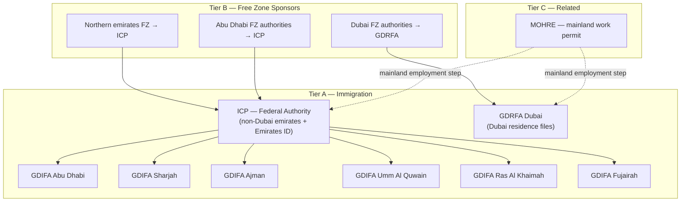

# UAE Residence Visa Issuing Authorities — Party Master Seed Plan

## 1. Executive Summary

This plan defines how to seed **UAE entities that issue or sponsor employment residence visas** into the ERP **Party Master**, so HR Compliance (Legal Documents, identity prefill, issuing-authority dropdowns) can resolve authorities such as **ICP**, **GDRFA Dubai**, emirate immigration directorates, and **free zone authorities**.

**Readiness status:** `PLAN READY — WAITING HUMAN APPROVAL BEFORE SQL EXECUTION`

| Metric | Count |
| :--- | ---: |
| Tier A — Federal / emirate immigration authorities (candidates) | **9** |
| Tier A — Already in Party Master | **1** (ICP) |
| Tier A — Net new to seed | **8** (GDRFA Dubai + 7 emirate directorates) |
| Tier B — Free zone visa sponsors already in Party Master | **28** |
| Tier B — Free zone gaps (Phase 2 candidates) | **~14** |
| Tier C — Related (work permit, not visa stamp) — already seeded | **1** (MOHRE) |

**Primary use case:** HR employee compliance → Legal Documents / residence visa → **Issuing Authority** party lookup (`GOVERNMENT_AUTHORITY`, `FREE_ZONE_AUTHORITY`, `LICENSE_ISSUER`).

**Template reference:** `docs/seed/UAE_INSURANCE_POLICY_ISSUERS_SEED_PLAN.md`  
**SQL target (after approval):** `supabase/manual_sql/seed_uae_residence_visa_issuing_authorities.sql`

---

## 2. Scope Definition

### 2.1 In scope — “Issuing authority” for residence visa

An entity is **in scope** if it is the **legal immigration counterparty** that:

1. **Stamps / issues** an employment residence visa or coordinates its issuance with immigration, **or**
2. **Acts as visa sponsor** for employees of companies licensed under that authority (free zones, DIFC, ADGM).

### 2.2 Out of scope — do NOT seed as issuing authorities

| Category | Examples | Reason |
| :--- | :--- | :--- |
| Service channels / typing centres | Amer centres, Tasheel, Tadbeer offices, private PRO agencies | Process applications; they are not the issuing authority |
| Medical fitness providers | DHA, DOH, SEHA clinics | Pre-condition for visa; not the visa issuer |
| Mainland trade licence issuers | DED Dubai, ADDED, SEDD | Issue business licences; visa route goes through MOHRE + ICP/GDRFA |
| Embassies / consulates | UAE missions abroad | Issue visit visas abroad; not UAE employment residence sponsor |
| Employers (private companies) | Customer / vendor parties | Sponsors in practice but not master “authorities” |

### 2.3 Architectural note — federal vs emirate split

Per the **official UAE Government portal** ([u.ae — Track visa application and validity](https://u.ae/en/information-and-services/visa-and-emirates-id/track-visa-application-and-validity)):

- **Abu Dhabi, Sharjah, Ajman, Umm Al Quwain, Ras Al Khaimah, Fujairah** → track visas via **ICP** (Federal Authority for Identity, Citizenship, Customs & Port Security).
- **Dubai** → track visas via **GDRFA Dubai** (General Directorate of Residency and Foreigners Affairs – Dubai; legacy acronym DNRD).

ICP operates **emirate-level directorates** branded *General Directorate of Identity and Foreigners Affairs – [Emirate]* (see [ICP Customer Happiness Centers](https://icp.gov.ae/en/customer-happiness-centers/)). These are seeded as **child parties** under ICP for granular HR matching, while ICP remains the federal parent.

---

## 3. Web Research Sources (June 2026)

| Source | URL | Used for |
| :--- | :--- | :--- |
| UAE Government — visa tracking | https://u.ae/en/information-and-services/visa-and-emirates-id/track-visa-application-and-validity | Federal vs Dubai authority split |
| ICP official site | https://icp.gov.ae | Federal authority name, smart services, happiness centres |
| ICP Customer Happiness Centers | https://icp.gov.ae/en/customer-happiness-centers/ | Emirate GDIFA/GDRFA branch official names |
| ICP Services Guide 2024 (PDF) | https://icp.gov.ae/wp-content/themes/ica_v3/assets/images/servicesGuideEN2024.pdf | Residence permit service categories |
| GDRFA Dubai official site | https://gdrfad.gov.ae/en | Dubai immigration services, establishment cards |
| MOHRE | https://www.mohre.gov.ae | Mainland work permit step (related, not visa stamp) |
| DMCC visa guidelines | https://dmcc.ae/members/support/knowledge-bank/new-employee-residence-visa-guidelines | Free zone → GDRFA coordination pattern |
| ADGM Work Permit Guidance 2024 | https://assets.adgm.com/download/assets/ADGM+RA+Work+Permit+Guidance+2024.pdf | ADGM as visa/work permit sponsor |
| National Economic Register context | https://virtuzone.com/blog/ner/ | Free zone authorities as licence issuers (46+ integrated entities) |
| Industry comparison guides | sezarroverseas.com, juriszone.com, inlex-partners.com | Gap analysis for free zone list (secondary sources — verify against NER) |

---

## 4. Authority Taxonomy



### 4.1 Visa file emirate prefix codes (for remarks / AI alias matching)

Commonly printed on UAE residence files (verify against sample documents before operational use):

| Prefix | Emirate | Primary authority |
| :---: | :--- | :--- |
| 101 | Abu Dhabi | ICP / GDIFA Abu Dhabi |
| 201 | Dubai | GDRFA Dubai |
| 301 | Sharjah | ICP / GDIFA Sharjah |
| 401 | Ajman | ICP / GDIFA Ajman |
| 501 | Umm Al Quwain | ICP / GDIFA UAQ |
| 601 | Ras Al Khaimah | ICP / GDIFA RAK |
| 701 | Fujairah | ICP / GDIFA Fujairah |

---

## 5. Tier A — Immigration Authorities (Full Candidate List)

### 5.1 Federal + Dubai (mandatory seed)

| # | display_name | legal_name_en | short_name | party_type | emirate_id | website | parent_party | Seed? |
| :---: | :--- | :--- | :--- | :--- | :---: | :--- | :--- | :---: |
| 1 | Federal Authority for Identity, Citizenship, Customs and Port Security | Federal Authority for Identity, Citizenship, Customs and Port Security | ICP | GOVERNMENT_AUTHORITY | NULL (federal) | https://icp.gov.ae | — | **EXISTS** `PTY-000005` |
| 2 | General Directorate of Residency and Foreigners Affairs – Dubai | General Directorate of Residency and Foreigners Affairs – Dubai | GDRFA Dubai | GOVERNMENT_AUTHORITY | Dubai (2) | https://gdrfad.gov.ae | — | **NEW** |
| 2b | *(alias only — do not duplicate party)* | General Directorate of Identity and Foreigners Affairs – Dubai | GDRFA-D | — | — | — | — | Alias → row 2 |

**Search aliases for AI / OCR matching:** `ICP`, `ICA`, `Federal Authority for Identity`, `UAEICP`, `Emirates ID Authority`, `GDRFA`, `GDRFA Dubai`, `GDRFA-D`, `DNRD`, `Dubai Naturalisation and Residency Department`, `General Directorate of Residency and Foreigners Affairs`.

### 5.2 Emirate directorates under ICP (recommended seed — Phase 1)

Official names from ICP Customer Happiness Centers:

| # | display_name | legal_name_en | short_name | emirate_id | parent_party_id | Seed? |
| :---: | :--- | :--- | :--- | :---: | :--- | :---: |
| 3 | General Directorate of Identity and Foreigners Affairs – Abu Dhabi | General Directorate of Identity and Foreigners Affairs – Abu Dhabi | GDIFA Abu Dhabi | Abu Dhabi (1) | ICP | **NEW** |
| 4 | General Directorate of Identity and Foreigners Affairs – Sharjah | General Directorate of Identity and Foreigners Affairs – Sharjah | GDIFA Sharjah | Sharjah (3) | ICP | **NEW** |
| 5 | General Directorate of Identity and Foreigners Affairs – Ajman | General Directorate of Identity and Foreigners Affairs – Ajman | GDIFA Ajman | Ajman (4) | ICP | **NEW** |
| 6 | General Directorate of Identity and Foreigners Affairs – Umm Al Quwain | General Directorate of Identity and Foreigners Affairs – Umm Al Quwain | GDIFA UAQ | Umm Al Quwain (5) | ICP | **NEW** |
| 7 | General Directorate of Identity and Foreigners Affairs – Ras Al Khaimah | General Directorate of Identity and Foreigners Affairs – Ras Al Khaimah | GDIFA RAK | Ras Al Khaimah (6) | ICP | **NEW** |
| 8 | General Directorate of Identity and Foreigners Affairs – Fujairah | General Directorate of Identity and Foreigners Affairs – Fujairah | GDIFA Fujairah | Fujairah (7) | ICP | **NEW** |

**Legacy alias names** (store in `remarks`, not separate parties): `GDRFA Abu Dhabi`, `GDRFA Sharjah`, `General Directorate of Residency and Foreigners Affairs`, `Naturalisation and Residency Department`.

### 5.3 Sub-offices (optional — Phase 3, human approval)

These appear on ICP’s site but are **service centres**, not separate visa issuers. Seed only if HR documents routinely show them as issuing authority:

| Name | Emirate | Recommendation |
| :--- | :--- | :--- |
| Residency and Foreigners Affairs Department – Al Ain | Abu Dhabi | Optional child under GDIFA Abu Dhabi |
| Residency and Foreigners Affairs Department – Al Dhafra | Abu Dhabi | Optional child under GDIFA Abu Dhabi |
| Residency and Foreigners Affairs Department – Khorfakkan | Sharjah | Optional child under GDIFA Sharjah |
| ICP Customer Happiness Centers (Dubai) | Dubai | **Exclude** — Dubai visas belong to GDRFA Dubai |

---

## 6. Tier B — Free Zone Authorities (Visa Sponsors)

Free zone companies receive employment residence visas **through their free zone authority**, which liaises with **GDRFA (Dubai zones)** or **ICP (other emirates)**.

### 6.1 Already in Party Master (28 records — verified live DB 2026-06-20)

| party_code | display_name | emirate |
| :--- | :--- | :--- |
| PTY-000030 | Abu Dhabi Global Market Registration Authority | Abu Dhabi |
| PTY-000034 | Abu Dhabi Airports Free Zone | Abu Dhabi |
| PTY-000031 | Khalifa Economic Zones Abu Dhabi | Abu Dhabi |
| PTY-000032 | Masdar City Free Zone | Abu Dhabi |
| PTY-000033 | twofour54 | Abu Dhabi |
| PTY-000035 | Jebel Ali Free Zone Authority | Dubai |
| PTY-000036 | Dubai Multi Commodities Centre | Dubai |
| PTY-000037 | Dubai Silicon Oasis Authority | Dubai |
| PTY-000038 | Dubai Airport Freezone Authority | Dubai |
| PTY-000039 | Dubai South | Dubai |
| PTY-000040 | Dubai International Financial Centre | Dubai |
| PTY-000041 | Dubai World Trade Centre Authority | Dubai |
| PTY-000042 | Dubai Healthcare City Authority | Dubai |
| PTY-000043 | Dubai Development Authority | Dubai |
| PTY-000044 | TECOM Group | Dubai |
| PTY-000045 | Meydan Free Zone | Dubai |
| PTY-000046 | International Free Zone Authority | Dubai |
| PTY-000047 | Trakhees - Ports, Customs and Free Zone Corporation | Dubai |
| PTY-000048 | Sharjah Airport International Free Zone | Sharjah |
| PTY-000049 | Hamriyah Free Zone Authority | Sharjah |
| PTY-000050 | Sharjah Media City | Sharjah |
| PTY-000051 | Sharjah Publishing City Free Zone | Sharjah |
| PTY-000052 | Ajman Free Zone Authority | Ajman |
| PTY-000053 | Ajman Media City Free Zone | Ajman |
| PTY-000054 | Umm Al Quwain Free Trade Zone | Umm Al Quwain |
| PTY-000055 | Ras Al Khaimah Economic Zone | Ras Al Khaimah |
| PTY-000056 | Ras Al Khaimah International Corporate Centre | Ras Al Khaimah |
| PTY-000057 | Fujairah Free Zone Authority | Fujairah |
| PTY-000058 | Creative City Fujairah | Fujairah |

**Enrichment pass (no new party row):** For each existing FZ party, backfill `website`, `short_name`, `emirate_id`, dual type assignment (`FREE_ZONE_AUTHORITY` + `LICENSE_ISSUER` where missing), and `remarks` with visa-sponsor note.

### 6.2 Phase 2 gap candidates (NOT in DB — verify via NER before seed)

| display_name | legal_name_en | emirate | website (verify) | Notes |
| :--- | :--- | :--- | :--- | :--- |
| Sharjah Research Technology and Innovation Park | Sharjah Research Technology and Innovation Park | Sharjah | https://srtip.ae | Visa sponsor for SRTIP licensees |
| Dubai CommerCity | Dubai CommerCity Free Zone Authority | Dubai | https://commercity.ae | E-commerce free zone |
| Dubai Production City | Dubai Production City | Dubai | https://www.dubai-production-city.com | TECOM member — confirm if separate party needed vs TECOM |
| Dubai Industrial City | Dubai Industrial City | Dubai | https://www.dubaiindustrialcity.ae | Under TECOM / Dubai Holding |
| Dubai Science Park | Dubai Science Park | Dubai | https://www.dubisciencepark.com | Life sciences zone |
| Dubai Outsource City | Dubai Outsource City | Dubai | https://www.dubaioutsourcecity.com | TECOM cluster |
| Dubai Design District (d3) | Dubai Design District | Dubai | https://d3.ae | Creative industries |
| Dubai Maritime City Authority | Dubai Maritime City Authority | Dubai | https://www.dmc.ae | Maritime sector |
| National Industries Park | National Industries Park | Dubai | https://www.nip.ae | Industrial/logistics |
| Expo City Dubai Authority | Expo City Dubai Authority | Dubai | https://www.expocitydubai.com | Post-Expo 2020 entity |
| Higher Corporation for Specialized Economic Zones | Higher Corporation for Specialized Economic Zones (ZonesCorp) | Abu Dhabi | https://www.zonescorp.ae | Industrial zones / visa sponsor |
| SAIF Zone Authority | Sharjah Airport International Free Zone Authority | Sharjah | https://www.saif-zone.com | **Possible duplicate** of PTY-000048 — merge, do not insert |
| Fujairah Oil Industry Zone | Fujairah Oil Industry Zone | Fujairah | https://www.foiz.ae | Energy sector |
| Ajman NuVentures Centre Free Zone | Ajman NuVentures Centre | Ajman | — | Verify active status |

**TECOM sub-zones:** Dubai Internet City, Dubai Media City, Dubai Knowledge Park, Dubai Studio City are operated under **TECOM Group (PTY-000044)**. Default: **do not** create separate parties unless HR documents consistently show sub-zone name as issuer.

---

## 7. Tier C — Related Authority (Already Seeded)

| party_code | display_name | Role in visa workflow | Seed action |
| :--- | :--- | :--- | :--- |
| PTY-000004 | Ministry of Human Resources and Emiratisation | Mainland **work permit** / contract registration before immigration | **Enrich only** — add `remarks` clarifying not primary visa stamp authority |
| PTY-000005 | ICP | Federal immigration + Emirates ID | **Enrich** — add `party_government_authority_profiles` row |

---

## 8. Confirmed ERP Rules (Live DB — 2026-06-20)

| Lookup | ID / value |
| :--- | :--- |
| `party_types.GOVERNMENT_AUTHORITY` | 52 |
| `party_types.LICENSE_ISSUER` | 55 |
| `party_types.FREE_ZONE_AUTHORITY` | 56 |
| `party_natures.GOVERNMENT` | 30 |
| `party_natures.FREE_ZONE_ENTITY` | 31 |
| `party_statuses.ACTIVE` | 14 |
| `countries.AE` | 1 |
| `authority_types.IMMIGRATION` | *(query at execution time)* |
| `authority_types.FREE_ZONE_AUTHORITY` | *(query at execution time)* |
| Numbering rule | `MASTER_PARTY` → `PTY-{SEQ6}` via `generate_next_reference_number()` |

**HR Compliance FK** (`20260620140000_erp_hr_compliance_identity_issuing_authority_party_fk.sql`): issuing authority must be party with type `GOVERNMENT_AUTHORITY`, `LICENSE_ISSUER`, or `FREE_ZONE_AUTHORITY`.

**Dual type assignment pattern:** Immigration authorities get **primary** `GOVERNMENT_AUTHORITY` + secondary `LICENSE_ISSUER` (matches ICP / MOHRE existing pattern). Free zones keep **primary** `FREE_ZONE_AUTHORITY` + secondary `LICENSE_ISSUER`.

---

## 9. Party Field Mapping

### 9.1 Core `parties` row

| Field | Tier A (Immigration) | Tier B (Free Zone) |
| :--- | :--- | :--- |
| `party_code` | `generate_next_reference_number('MASTER_PARTY')` | Same |
| `display_name` | Short public name | Zone brand name |
| `legal_name_en` | Full official English name | Full registered authority name |
| `legal_name_ar` | Official Arabic (Phase 2 enrichment) | Official Arabic |
| `short_name` | e.g. `GDRFA Dubai`, `GDIFA SHJ` | e.g. `DMCC`, `JAFZA` |
| `party_nature_id` | 30 (`GOVERNMENT`) | 31 (`FREE_ZONE_ENTITY`) |
| `primary_party_type_id` | 52 (`GOVERNMENT_AUTHORITY`) | 56 (`FREE_ZONE_AUTHORITY`) |
| `parent_party_id` | ICP id for emirate directorates | NULL (or holding group if known) |
| `country_id` | 1 (AE) | 1 (AE) |
| `emirate_id` | See tables above | Zone emirate |
| `website` | Official portal | Official portal |
| `is_active` | true | true |
| `is_system` | true (recommended for govt seeds) | true |
| `remarks` | Standardized seed signature — see §9.3 | Visa sponsor + immigration liaison note |

### 9.2 `party_government_authority_profiles` (Tier A only)

| Field | Value |
| :--- | :--- |
| `authority_type_id` | `IMMIGRATION` |
| `jurisdiction_country_id` | 1 (AE) |
| `jurisdiction_emirate_id` | Matching emirate or NULL for ICP federal |
| `portal_url` | Same as `parties.website` |
| `government_remarks` | Visa file prefix, coordinating free zones, smart service URL |

### 9.3 Standardized `remarks` signature (duplicate-safe rollback)

```
UAE residence visa issuing authority seed (ERP-HR-VISA-ISSUER-SEED-1). Source: u.ae + icp.gov.ae + gdrfad.gov.ae. Visa file prefix: {code}. Product use: HR Compliance issuing authority lookup.
```

---

## 10. Phased Implementation Plan

### Phase 1 — Immigration authorities (priority)

1. Insert **GDRFA Dubai** + **7 emirate GDIFA directorates** (8 net-new parties).
2. Set `parent_party_id` on emirate rows → ICP (`PTY-000005`).
3. Insert `party_type_assignments` (primary + secondary types).
4. Insert `party_government_authority_profiles` for all Tier A parties including existing ICP.
5. Backfill ICP `emirate_id` = NULL (federal) — already correct.

**Estimated new parties:** 8  
**Human approval required:** Yes

### Phase 2 — Free zone gap fill

1. Cross-check Phase 2 table against [National Economic Register](https://ner.economy.ae) / Ministry of Economy.
2. Insert only **verified active** authorities not duplicating TECOM sub-brands.
3. Enrich all 28 existing FZ parties with websites and remarks.

**Estimated new parties:** 0–14 (after dedup)  
**Human approval required:** Yes — confirm TECOM sub-zone policy

### Phase 3 — Optional sub-offices + Arabic names

1. Al Ain / Al Dhafra / Khorfakkan departments if HR sample documents require them.
2. `legal_name_ar` enrichment from official portals.

---

## 11. Duplicate Protection Rules

Before insert, skip when **any** of these match (case-insensitive):

```sql
lower(legal_name_en) = lower(candidate.legal_name_en)
OR lower(display_name) = lower(candidate.display_name)
OR lower(short_name) = lower(candidate.short_name)
OR parties.remarks ILIKE '%ERP-HR-VISA-ISSUER-SEED-1%'
```

**Known duplicates to avoid:**

| Candidate | Existing party | Action |
| :--- | :--- | :--- |
| SAIF Zone Authority | PTY-000048 Sharjah Airport International Free Zone | Merge aliases in remarks |
| Dubai World Central | PTY-000039 Dubai South | Same entity rebranded |
| ICA / Federal Authority… | PTY-000005 ICP | Skip insert |
| MOHRE | PTY-000004 | Skip insert |

---

## 12. SQL Preview Pattern (DO NOT RUN WITHOUT APPROVAL)

```sql
-- REVIEW ONLY — ERP-HR-VISA-ISSUER-SEED-1
-- DO NOT APPLY WITHOUT SAMEER APPROVAL

DO $$
DECLARE
  v_icp_id BIGINT;
  v_party_id BIGINT;
  v_code TEXT;
  v_immigration_type_id BIGINT;
  v_gov_type_id BIGINT := 52;
  v_license_type_id BIGINT := 55;
  v_gov_nature_id BIGINT := 30;
  v_country_id BIGINT := 1;
  v_status_id BIGINT := 14;
  rec RECORD;
BEGIN
  SELECT id INTO v_icp_id FROM parties WHERE party_code = 'PTY-000005';
  SELECT id INTO v_immigration_type_id FROM authority_types WHERE authority_code = 'IMMIGRATION';

  FOR rec IN
    SELECT * FROM (VALUES
      ('General Directorate of Residency and Foreigners Affairs – Dubai',
       'General Directorate of Residency and Foreigners Affairs – Dubai',
       'GDRFA Dubai', 2, NULL::BIGINT, 'https://gdrfad.gov.ae', '201'),
      ('General Directorate of Identity and Foreigners Affairs – Abu Dhabi',
       'General Directorate of Identity and Foreigners Affairs – Abu Dhabi',
       'GDIFA Abu Dhabi', 1, v_icp_id, 'https://icp.gov.ae', '101')
      -- ... remaining emirates ...
    ) AS t(display_name, legal_name_en, short_name, emirate_id, parent_party_id, website, visa_prefix)
  LOOP
    IF NOT EXISTS (
      SELECT 1 FROM parties
      WHERE lower(legal_name_en) = lower(rec.legal_name_en)
         OR lower(display_name) = lower(rec.display_name)
    ) THEN
      SELECT generated_reference_number INTO v_code
      FROM public.generate_next_reference_number(
        p_rule_code := 'MASTER_PARTY',
        p_document_type_code := 'PARTY',
        p_target_table_name := 'parties',
        p_generation_reason := 'Seed UAE Visa Issuing Authority'
      );

      INSERT INTO parties (
        party_code, display_name, legal_name_en, short_name,
        party_nature_id, primary_party_type_id, parent_party_id,
        country_id, emirate_id, website, party_status_id,
        is_active, is_system, remarks, created_at, updated_at
      ) VALUES (
        v_code, rec.display_name, rec.legal_name_en, rec.short_name,
        v_gov_nature_id, v_gov_type_id, rec.parent_party_id,
        v_country_id, rec.emirate_id, rec.website, v_status_id,
        TRUE, TRUE,
        format('UAE residence visa issuing authority seed (ERP-HR-VISA-ISSUER-SEED-1). Visa file prefix: %s.', rec.visa_prefix),
        now(), now()
      ) RETURNING id INTO v_party_id;

      INSERT INTO party_type_assignments (party_id, party_type_id, is_primary, is_active, assigned_date, created_at, updated_at)
      VALUES
        (v_party_id, v_gov_type_id, TRUE, TRUE, current_date, now(), now()),
        (v_party_id, v_license_type_id, FALSE, TRUE, current_date, now(), now());

      INSERT INTO party_government_authority_profiles (
        party_id, authority_type_id, jurisdiction_country_id, jurisdiction_emirate_id,
        portal_url, government_remarks, created_at, updated_at
      ) VALUES (
        v_party_id, v_immigration_type_id, v_country_id, rec.emirate_id,
        rec.website, 'Immigration / residence visa issuing authority', now(), now()
      );
    END IF;
  END LOOP;

  -- Backfill ICP government profile if missing
  IF v_icp_id IS NOT NULL AND NOT EXISTS (
    SELECT 1 FROM party_government_authority_profiles WHERE party_id = v_icp_id
  ) THEN
    INSERT INTO party_government_authority_profiles (
      party_id, authority_type_id, jurisdiction_country_id, portal_url,
      government_remarks, created_at, updated_at
    ) VALUES (
      v_icp_id, v_immigration_type_id, v_country_id, 'https://icp.gov.ae',
      'Federal immigration authority for non-Dubai emirates and Emirates ID services',
      now(), now()
    );
  END IF;
END $$;
```

Full script with all 8 candidates to be written to `supabase/manual_sql/seed_uae_residence_visa_issuing_authorities.sql` after approval.

---

## 13. Rollback Plan

```sql
BEGIN;

DELETE FROM party_government_authority_profiles
WHERE party_id IN (
  SELECT id FROM parties WHERE remarks ILIKE '%ERP-HR-VISA-ISSUER-SEED-1%'
);

DELETE FROM party_type_assignments
WHERE party_id IN (
  SELECT id FROM parties WHERE remarks ILIKE '%ERP-HR-VISA-ISSUER-SEED-1%'
);

DELETE FROM parties
WHERE remarks ILIKE '%ERP-HR-VISA-ISSUER-SEED-1%';

COMMIT;
```

**Note:** Rollback must **not** delete pre-existing ICP / MOHRE / free zone parties — only rows carrying the seed signature.

---

## 14. Post-Seed Verification Checklist

- [ ] HR Compliance → Legal Documents → Issuing Authority dropdown shows ICP, GDRFA Dubai, emirate GDIFAs
- [ ] AI prefill on DMS residence visa document resolves `GDRFA` / `ICP` / `General Directorate` text to correct party id
- [ ] Free zone employment visas resolve to existing FZ party (e.g. DMCC → PTY-000036)
- [ ] No duplicate `legal_name_en` rows after seed
- [ ] `party_government_authority_profiles` populated for ICP + new immigration parties
- [ ] Parent-child tree: emirate directorates show ICP as parent in Party Master UI

---

## 15. AI / OCR Alias Reference (for `compliance-party-resolve.ts` enrichment)

| OCR / document text | Resolve to party |
| :--- | :--- |
| ICP, ICA, UAEICP, Emirates ID, Federal Authority for Identity | ICP (PTY-000005) |
| GDRFA, GDRFA Dubai, GDRFA-D, DNRD, Dubai Immigration | GDRFA Dubai (new) |
| GDIFA Abu Dhabi, GDRFA Abu Dhabi, Abu Dhabi Immigration | GDIFA Abu Dhabi (new) |
| GDIFA Sharjah, Sharjah Immigration | GDIFA Sharjah (new) |
| General Directorate of Identity and Foreigners Affairs | Match emirate from `place_of_issue` or visa prefix |
| DMCC, JAFZA, IFZA, RAKEZ, ADGM, DIFC | Existing free zone party |
| Ministry of Human Resources, MOHRE | MOHRE (PTY-000004) — work permit context |

---

## 16. Approvals Required

| Decision | Owner | Default recommendation |
| :--- | :--- | :--- |
| Execute Phase 1 SQL (8 immigration parties) | Sameer | Approve |
| Seed emirate sub-offices (Al Ain, Khorfakkan) | Sameer | Defer to Phase 3 |
| Create TECOM sub-zone parties vs TECOM parent only | Sameer | TECOM parent only |
| Execute Phase 2 free zone gaps | Sameer | After NER verification |

---

## 17. Files to Create / Update After Approval

| File | Action |
| :--- | :--- |
| `supabase/manual_sql/seed_uae_residence_visa_issuing_authorities.sql` | Create full executable seed |
| `src/lib/hr/compliance/compliance-party-resolve.ts` | Add alias map + fix query (remove invalid `deleted_at` / use `party_type_assignments`) |
| `.cursor/ALGT_ERP_SOURCE_OF_TRUTH.md` | Log phase closure after execution |
| `implementation_Review/.../ERP_HR_VISA_ISSUER_SEED_1_IMPLEMENTATION_REPORT.md` | After execution |

---

*Plan authored: 2026-06-20. Live DB verification via Supabase project `mmiefuieduzdiiwnqpie`.*
