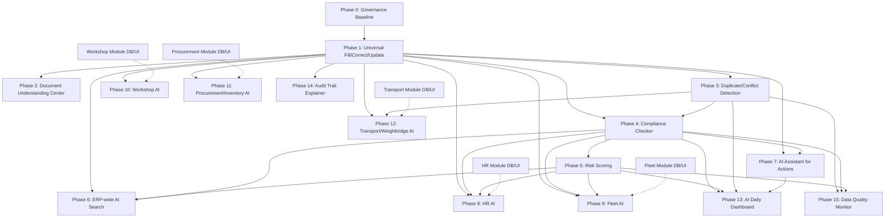

# ALGT ERP — AI Roadmap and Common AI Foundation Plan

**Status:** PLAN REVIEWED — APPROVED WITH MINOR CORRECTIONS PENDING FINAL APPROVAL

**This document is still plan-only. No code, migrations, DB changes, UI changes, or implementation have been performed.**

**This document is intended as the AI roadmap handoff file for a new ChatGPT/Cursor chat.**

**Project:** ALGT ERP 2026  
**Repository:** `c:\dev\agt-erp`  
**Prepared for:** Sameer Fahmi / ALGT ERP team  
**Prepared by:** Cursor AI (plan generation audit)  
**Date:** 2026-06-16  
**Plan type:** Planning and handoff only — **no code, migrations, or DB changes performed**

---

## Table of Contents

1. [Executive Summary](#1-executive-summary)
2. [ChatGPT Review Corrections to Apply Before Implementation](#chatgpt-review-corrections-to-apply-before-implementation)
3. [Current ERP State (Source-Verified)](#2-current-erp-state-source-verified)
3. [Strategic Decisions (Locked)](#3-strategic-decisions-locked)
4. [OpenAI API Advice](#4-openai-api-advice)
5. [Universal Internal AI Engine — Architecture](#5-universal-internal-ai-engine--architecture)
6. [Phase Dependency Map](#6-phase-dependency-map)
7. [Phase 0 — AI Roadmap / Governance / Architecture Baseline](#phase-0--ai-roadmap--governance--architecture-baseline)
8. [Phase 1 — Universal AI Fill / Correct / Update Engine](#phase-1--universal-ai-fill--correct--update-engine)
9. [Phase 2 — AI Document Understanding Center](#phase-2--ai-document-understanding-center)
10. [Phase 3 — AI Duplicate / Conflict Detection](#phase-3--ai-duplicate--conflict-detection)
11. [Phase 4 — AI Compliance Checker](#phase-4--ai-compliance-checker)
12. [Phase 5 — AI Risk Scoring](#phase-5--ai-risk-scoring)
13. [Phase 6 — AI Search Across ERP](#phase-6--ai-search-across-erp)
14. [Phase 7 — AI Assistant for Actions](#phase-7--ai-assistant-for-actions)
15. [Phase 8 — HR AI](#phase-8--hr-ai)
16. [Phase 9 — Fleet AI](#phase-9--fleet-ai)
17. [Phase 10 — Workshop AI](#phase-10--workshop-ai)
18. [Phase 11 — Procurement / Inventory AI](#phase-11--procurement--inventory-ai)
19. [Phase 12 — Transport / Weighbridge AI](#phase-12--transport--weighbridge-ai)
20. [Phase 13 — AI Daily Dashboard](#phase-13--ai-daily-dashboard)
21. [Phase 14 — AI Audit Trail Explainer](#phase-14--ai-audit-trainer-explainer)
22. [Phase 15 — AI Data Quality Monitor](#phase-15--ai-data-quality-monitor)
23. [Deferred Capabilities (Out of Near Roadmap)](#deferred-capabilities-out-of-near-roadmap)
24. [Database Planning Summary](#database-planning-summary)
25. [Permission and RLS Planning](#permission-and-rls-planning)
26. [Security and Audit Rules](#security-and-audit-rules)
27. [Global UI/UX Patterns](#global-uiux-patterns)
28. [Proposed Code Structure](#proposed-code-structure)
29. [Implementation Prompt Roadmap](#implementation-prompt-roadmap)
30. [New ChatGPT Handoff Summary](#new-chatgpt-handoff-summary)
31. [Acceptance Criteria for This Plan](#acceptance-criteria-for-this-plan)
32. [Appendix A — Live Database Audit Snapshot](#appendix-a--live-database-audit-snapshot)
33. [Appendix B — Existing DMS AI Feature Inventory](#appendix-b--existing-dms-ai-feature-inventory)
34. [Appendix C — Pilot Form Field Registry (Phase 1)](#appendix-c--pilot-form-field-registry-phase-1)
35. [Plan Correction Update Log](#plan-correction-update-log)

---

## 1. Executive Summary

ALGT ERP has completed a **production-grade DMS with full AI/OCR intelligence** (DMS.2 through DMS.15, OCR-AI FIX.1) and **cross-module master data foundation** (COMMON MD.1). The next major capability gap is a **Universal Internal AI Engine** that can compare linked DMS documents against any registered ERP record form, suggest fills/corrections/updates, and apply changes only after explicit human approval with full audit.

### What exists today

- DMS document storage, OCR, AI classification/extraction, intake review, summaries, completeness/risk scoring, AI search, Ask AI, tag/link suggestions, semantic search (pgvector), batch intake, security QA, and integration readiness components.
- AI provider configuration via `erp_ai_provider_configs` with OpenAI (`gpt-4.1`) as the live chat/classification/extraction provider and `text-embedding-3-small` for embeddings.
- Reusable `DmsEntityDocumentsTab` on Organization, Branch, and Work Site forms; Party Master has its own DMS-backed documents tab.
- `dms_required_document_rules` table (COMMON MD.1) with 8 seeded rules for company and site entity types.

### What does NOT exist yet

- Generic ERP form field suggestion engine (`erp_ai_field_suggestions`).
- AI Review & Update tab on record forms.
- Cross-record duplicate/conflict detection.
- Record-level compliance and risk scoring (beyond per-document DMS scoring).
- ERP-wide natural language search.
- AI action preparation (draft emails, tasks, reminders) with confirm-before-execute.
- Module-specific AI (HR, Fleet, Workshop, Procurement, Transport) — blocked on respective module DB/UI.

### Core architectural decision

Build **one registry-based internal AI engine** reused across all modules. All OpenAI calls go through existing provider abstraction layers. DMS-linked documents are the trusted evidence source. **No MCP server. No public AI endpoints. No auto-apply in v1.**

### Recommended first implementation phase

**Phase 0 (governance baseline) → Phase 1 sub-phases 1A–1G (Universal AI Fill/Correct/Update Engine)** — **do not build Phase 1 in one Cursor run.**

**Pilot rollout (staged runtime testing):**
- **Stage 1:** Organization and Party only (strongest document examples: trade license, TRN, VAT, POA).
- **Stage 2:** Branch and Work Site — only after Stage 1 passes UAT.

**Do not implement anything until the Phase 0 prompt is approved separately.**

---

## ChatGPT Review Corrections to Apply Before Implementation

The following corrections were applied to this plan after ChatGPT review. They must be respected in all future implementation prompts:

1. **Keep Phase 0 small and governance-focused.** No heavy UI work. Minimal AI Settings touch only if the existing framework requires it.
2. **Split Phase 1 into safer sub-phases (1A–1G).** Do not build the full Phase 1 in one Cursor run.
3. **Use explicit pilot entity permission mapping first.** Avoid overly generic dynamic entity RLS. Map only `company`, `branch`, `site`, `party` in v1.
4. **Limit sensitive text stored in AI suggestion tables.** Full document content stays in DMS only.
5. **Add strict rule:** AI cannot update system IDs, codes, numbering fields, audit fields, or unregistered fields.
6. **Stage pilot testing:** Organization and Party first; Branch and Work Site second.
7. **Do not implement anything until Phase 0 prompt is approved separately.**

---

## 2. Current ERP State (Source-Verified)

### 2.1 Technology Stack

| Layer | Version / Detail |
|---|---|
| Next.js | 16.2.6 (App Router) |
| React | 19.2.4 |
| TypeScript | 5 |
| Supabase | JS 2.106.2 / SSR 0.10.3 |
| TanStack Query | 5.101.0 |
| Tailwind CSS | 4 |
| Zod | 4.4.3 |
| Live Supabase | `https://mmiefuieduzdiiwnqpie.supabase.co` |
| Correct MCP | **`user-supabase`** only |

### 2.2 Global Non-Negotiable Rules (Active)

- **BIGINT PK/FK only** — no UUID unless explicitly approved.
- **RLS enabled** on all ERP tables; prefer **RLS FORCED** on new AI tables.
- **No direct client-side DB access** — all reads/writes via server actions.
- **Server action pattern:** `getAuthContext()` + `hasPermission()` + Zod + `logAudit()` + `revalidatePath()`.
- **No raw OCR text, AI prompts, raw AI responses, API keys, or sensitive extracted values in logs.**
- **AI suggestions require human review before applying** — no silent auto-update in v1.
- **DMS is the document source of truth** — files in Supabase Storage (`dms-documents`, `dms-temp`), links via `dms_document_links`.
- **Party Master is the customer source of truth** — legacy customer module retired.
- **Finance Basics Banks is the bank master** — no BANK party type.
- **Workspace forms use `ERPRecordWorkspaceForm` + `useWorkspaceFormDraft`** for unsaved state.
- **Child forms use `ERPChildDialogForm`** with blocking overlay (z-index stack per UI.4G).

### 2.3 Completed Module Gates (Relevant to AI)

| Gate | Status | Key Deliverables |
|---|---|---|
| ERP SETTINGS.1 | CLOSED ✅ | `erp_ai_provider_configs`, `erp_ai_usage_logs`, `erp_ai_feature_flags`, `/admin/settings/ai` |
| ERP SETTINGS.2 | CLOSED ✅ | Email provider abstraction (Microsoft Graph ready) |
| ERP NOTIFICATIONS.1 | CLOSED ✅ | Global notification + email queue |
| ERP DMS.2–DMS.8 | CLOSED ✅ | 25+ DMS tables, storage, expiry, renewals |
| ERP DMS.9 | CLOSED ✅ | OCR pipeline (`src/lib/dms/ocr/`) |
| ERP DMS.10 | CLOSED ✅ | AI classification/extraction (`src/lib/dms/ai/`) |
| ERP DMS.11 | CLOSED ✅ | AI-first upload session intake review |
| ERP DMS.12.1–12.5 | CLOSED ✅ | Content text, summary, completeness/risk, AI search/Ask AI/tags/links, semantic search |
| ERP DMS.13 | CLOSED ✅ | Multi-file batch upload → draft intake (one-by-one approval) |
| ERP DMS OCR-AI FIX.1 | CLOSED ✅ | Unified OCR text pipeline, vision fallback, admin backfill |
| ERP DMS.14 | CLOSED ✅ | Security/RLS/confidentiality QA (25 tables audited, 4 policies fixed) |
| ERP DMS.15 | CLOSED ✅ | Integration readiness — `dms-entity-types.ts`, `DmsEntityDocumentsTab` |
| ERP COMMON MD.1 | CLOSED ✅ | Departments, designations, work sites, calendars, approval roles, DMS required doc rules |

### 2.4 Live Forms with DMS Documents Tab (Pilot-Ready)

| Record | Route | Entity Type | Documents Tab |
|---|---|---|---|
| Organization | `/admin/organizations/record/[id]` | `company` | `DmsEntityDocumentsTab` ✅ |
| Branch | `/admin/branches/record/[id]` | `branch` | `DmsEntityDocumentsTab` ✅ |
| Work Site | `/admin/common-master-data/work-sites/record/[id]` | `site` | `DmsEntityDocumentsTab` ✅ |
| Party | `/admin/master-data/parties/record/[id]` | `party` | `PartyDmsDocumentsTab` (delegates to entity-documents) ✅ |

### 2.5 Placeholder Modules (NOT Built — AI Must Not Claim Implemented)

Fleet, HR, Workshop, HSE, Finance, Inventory, Procurement — sidebar shows "Soon". No operational tables yet for employees, vehicles, equipment, job cards, weighbridge tickets, etc.

### 2.6 Existing AI Infrastructure Files

```
src/lib/ai/providers/          — SETTINGS.1 factory (test connection only for ERP-wide)
src/lib/dms/ai/                — DMS AI adapter (analyze, summarize, structured completion, embeddings)
src/server/actions/dms/        — 20+ DMS action files including ai-*.ts
src/server/actions/settings/ai-settings.ts
src/features/settings/ai/      — AI Settings admin UI
src/features/dms/entity-documents/  — Reusable documents tab
src/lib/dms/dms-entity-types.ts     — 24 entity types registered
```

---

## 3. Strategic Decisions (Locked)

These decisions are **fixed for the near roadmap** and must not be re-opened without Sameer approval:

| Decision | Value |
|---|---|
| AI scope | **Internal ERP only** — no public endpoints |
| MCP server | **Deferred / not required / not part of current plan** |
| External AI API for third-party tools | **No** |
| AI provider | **OpenAI API** via existing provider layer |
| Architecture | **One universal engine, registry-based, reused everywhere** |
| Evidence source | **Linked DMS documents only** (respecting confidentiality) |
| Auto-apply | **No in v1** — user must accept/reject each suggestion |
| Finance AI | **Deferred** |
| Projects AI | **Deferred** |
| HSE AI | **Deferred** |

---

## 4. OpenAI API Advice

### 4.1 Verdict

**OpenAI API is a good choice for this ERP AI plan.** The codebase already uses OpenAI successfully via fetch-native calls (no SDK in feature code), with proven patterns for classification, extraction, summarization, structured JSON output, vision (multimodal), and embeddings.

### 4.2 Current Live Configuration (Verified 2026-06-16)

| Config Code | Provider | Model | Purpose | Enabled |
|---|---|---|---|---|
| `DEFAULT_CHAT` | openai | gpt-4.1 | chat | ✅ |
| `DEFAULT_DMS_CLASSIFIER` | openai | gpt-4.1 | classification | ✅ |
| `DEFAULT_DMS_EXTRACTOR` | openai | gpt-4.1 | extraction | ✅ |
| `DEFAULT_EMBEDDING` | openai | text-embedding-3-small | embedding | ✅ |
| `DEFAULT_DMS_OCR` | tesseract | — | ocr | ❌ (OCR uses pdf-parse + vision fallback) |

API key resolution: `process.env[secretRef]` where `secret_ref` stores env var name (e.g., `OPENAI_API_KEY`). **Never stored in DB.**

### 4.3 API Surface Used Today

| Capability | API | Location |
|---|---|---|
| Classification + extraction | Chat Completions (`/v1/chat/completions`) | `openai-dms-adapter.ts` → `analyze()` |
| Summarization | Chat Completions | `summarize()` |
| Intent/QA/suggestions | Chat Completions + `response_format: json_object` | `callStructuredCompletion()` |
| Vision (scanned docs) | Chat Completions multimodal | `buildCombinedPrompt()` with image parts |
| Embeddings | `/v1/embeddings` | `embedText()` |
| Test connection | `/v1/models` GET | `openai-provider.ts` |

**Not used:** OpenAI Responses API, Assistants API, Realtime API.

**Recommendation:** Continue with Chat Completions for structured field suggestions in Phase 1. Evaluate Responses API only if streaming or tool-use becomes a requirement in Phase 7+.

### 4.4 Model Selection Recommendations

| Use Case | Recommended Model | Rationale |
|---|---|---|
| Field fill/correct/update suggestions | `gpt-4.1` (or `gpt-4o` if cost-sensitive) | Structured JSON, multi-field reasoning, bilingual UAE docs |
| Simple classification/routing | `gpt-4.1-mini` (future config) | Cheaper for intent routing in Phase 6 |
| Document summarization | `gpt-4.1` | Already proven in DMS 12.2 |
| Vision/OCR weak scans | `gpt-4.1` with vision | Already proven in OCR-AI FIX.1 |
| Embeddings | `text-embedding-3-small` (1536 dims) | Already deployed with pgvector HNSW index |
| Daily brief narrative | `gpt-4.1-mini` | Summarize pre-computed metrics, low risk |

### 4.5 Implementation Rules for OpenAI

1. **All calls through shared provider layer** — extend `IDmsAiProvider` or create `IErpAiProvider` in `src/lib/ai/common/`; never import OpenAI SDK in feature modules.
2. **API key only in environment variables** — `secret_ref` in DB stores env var name only.
3. **Structured JSON outputs** for field suggestions — use `response_format: { type: "json_object" }` + Zod validation (same pattern as DMS 12.4 intent extraction).
4. **Vision-capable model** when OCR text is missing — reuse `extractFileContent` + vision path from OCR-AI FIX.1.
5. **Cheaper model for simple tasks** — add `DEFAULT_AI_ROUTER` config for classification/routing in Phase 6.
6. **Token/cost logging** — extend `erp_ai_usage_logs` with `feature_area = 'ERP_AI_FIELD_SUGGESTIONS'` etc.; log counts/duration/model only.
7. **Feature flags per capability** — new flags in `erp_ai_feature_flags` (e.g., `ERP_AI_FORM_FILL`).
8. **Model switching from AI Settings** — no code deploy needed for model changes.
9. **Never expose API key to client** — server actions only.
10. **Never send unlinked/unauthorized documents** — load only documents linked to target entity via `dms_document_links`.

### 4.6 Warning

> **Do not build direct OpenAI calls inside random modules.** All calls must go through the shared AI provider/service layer (`src/lib/ai/` and `src/lib/dms/ai/`). Feature modules call server actions; server actions call provider factories.

---

## 5. Universal Internal AI Engine — Architecture

### 5.1 Concept

One engine that:

1. Knows which ERP forms/fields are AI-eligible (registry).
2. Loads current record field values from the target table.
3. Loads linked DMS documents + extracted content (OCR, content_text, ai_summary, metadata).
4. Calls OpenAI with a structured prompt comparing current vs document evidence.
5. Persists suggestions in `erp_ai_field_suggestions` with status lifecycle.
6. Presents suggestions in `AiFieldSuggestionsPanel` for human review.
7. Applies accepted suggestions via typed server actions with permission checks + audit.

### 5.2 Core Principles

| Principle | Rule |
|---|---|
| Registry-based | Each form registers fields, types, labels, validation, apply handlers |
| Internal only | No external API, no MCP |
| DMS-linked evidence | Only documents linked to entity via `dms_document_links` |
| Human approval | Accept/reject per suggestion or batch; no auto-apply v1 |
| Permission-safe | Generate requires DMS view + AI generate; apply requires record manage |
| RLS-safe | All DB reads/writes respect RLS; admin client only for provider config |
| Audit-complete | Every generate/accept/reject/apply/supersede logged |
| Confidentiality | hr/legal/executive docs gated same as DMS (requires elevated permission) |
| Idempotent apply | Re-applying same suggestion fails safely; supersede on re-generate |

### 5.3 High-Level Flow

```
User opens record form → Documents tab (existing) + AI Review & Update tab (new)
  → User clicks "Generate AI Suggestions"
    → Server: load registry config for entity_type
    → Server: load current record fields (permission: record.view)
    → Server: load linked DMS docs + content (permission: dms.documents.view)
    → Server: build prompt, call OpenAI structured completion
    → Server: validate JSON output with Zod
    → Server: supersede old pending suggestions
    → Server: insert erp_ai_field_suggestions rows (status=pending)
    → Server: log erp_ai_usage_logs + audit
  → UI: AiFieldSuggestionsPanel shows diff cards
  → User accepts/rejects
    → accept: apply via registered field handler + audit + revalidate
    → reject: mark rejected + audit
```

### 5.4 Relationship to Existing DMS AI

| DMS Feature | Role in Common AI Engine |
|---|---|
| OCR + content_text | Evidence text for field comparison |
| AI extraction results | Structured field candidates from intake/analysis |
| AI summary | Condensed document context for prompt |
| Completeness/risk (document-level) | Input signals for Phase 4/5 record-level scoring |
| AI tag/link suggestions | Pattern reference for accept/reject UX (Phase 1 UI can mirror DMS 12.4) |
| DmsEntityDocumentsTab | Existing Documents tab — do not duplicate |
| dms_required_document_rules | Input for Phase 4 compliance checker |

**Rule:** Do not duplicate DMS OCR/extraction. The common engine **consumes** DMS outputs.

### 5.5 Registry Design

Two-tier registry (recommended):

**Tier 1 — Code registry (v1):** TypeScript registry in `src/lib/ai/common/registry/` mapping:
- `entity_type` → target table, server load function, field definitions, apply handlers
- Fast to ship; version-controlled; no DB migration for config changes

**Tier 2 — DB registry (optional v2):** `erp_ai_form_fill_configs` for admin-editable field mappings per entity type. Defer until Phase 1 pilots prove the code registry.

Each field definition includes:
```typescript
{
  targetField: string;        // DB column or nested path
  fieldLabel: string;         // UI label
  fieldType: 'text' | 'date' | 'number' | 'boolean' | 'fk' | 'json';
  documentTypeHints?: string[]; // e.g. ['TRADE_LICENSE'] — which doc types may fill this
  validationSchema?: ZodSchema;
  isAiEligible: boolean;      // default false — must be explicitly true
  safetyClassification: 'business_safe' | 'requires_review' | 'restricted';
  applyHandler: (entityId, value) => Promise<void>;
}
```

**Registry default:** `isAiEligible: false` for all fields not explicitly registered. See [Non-Updatable Field Rules](#non-updatable-field-rules).

---

## 6. Phase Dependency Map



**Critical path:** Phase 0 → Phase 1 → (Phase 2 parallel with Phase 3) → Phase 4 → Phase 5 → Phase 13.

**Module AI phases (8–12) depend on both Common AI Engine AND respective module existence.**

---

## Phase 0 — AI Roadmap / Governance / Architecture Baseline

### Purpose

Establish a **small, governance-only baseline** before any Common AI engine code is written. Phase 0 produces standards, flags, permissions, and documentation — not product features.

### Scope (Governance Only)

- Create/update common AI architecture standard: `docs/standards/ERP_COMMON_AI_ENGINE_STANDARD.md`.
- Create/update Cursor rule for common AI safety: `.cursor/rules/erp-common-ai-standard.mdc`.
- Seed common AI feature flags in `erp_ai_feature_flags`.
- Seed common AI permissions in `permissions` + role mappings.
- Confirm OpenAI provider usage rules (via existing `erp_ai_provider_configs` — no new provider layer).
- Confirm logging and confidentiality rules (no raw prompts/OCR/responses in logs).
- Confirm locked decisions: no MCP, no public API, no auto-apply in v1.
- Update `.cursor/ALGT_ERP_SOURCE_OF_TRUTH.md` after Phase 0 closure.
- Create Phase 0 implementation report in `implementation_Review/`.

### What Phase 0 Must NOT Include

- No Common AI engine code.
- No `erp_ai_field_suggestions` tables or migrations (those belong to Phase 1B).
- No AI Review & Update UI tab.
- No heavy AI Settings UI work.
- No pilot integration on record forms.

### Database

| Change | Type |
|---|---|
| New feature flags | Seed rows in `erp_ai_feature_flags` |
| New permissions | Seed rows in `permissions` + role mappings |
| No new AI engine tables | Deferred to Phase 1B |

Proposed feature flags:
```
ERP_AI_FORM_FILL
ERP_AI_DOC_UNDERSTANDING
ERP_AI_DUPLICATE_DETECT
ERP_AI_COMPLIANCE
ERP_AI_RISK_SCORE
ERP_AI_ERP_SEARCH
ERP_AI_ACTIONS
ERP_AI_DAILY_BRIEF
ERP_AI_AUDIT_EXPLAINER
ERP_AI_DATA_QUALITY
```

Feature flags should default to `is_enabled = false` unless Sameer explicitly enables for UAT.

### Server Actions

None in Phase 0 (governance phase).

### UI

**Minimal only.** Do not add a large Common AI overview card or new settings section.

If new feature flags do not appear automatically in `/admin/settings/ai`, allow **one small safe update** to the existing settings framework so flags are visible — nothing beyond that.

### Permissions

Seed all `ai.*` permission codes (see [Permission and RLS Planning](#permission-and-rls-planning)). Map to `system_admin`, `group_admin` (view+generate), `company_admin` (view only) by default.

### RLS

No new tables. Verify existing AI settings tables remain RLS enabled and forced.

### Testing

- Permission codes exist and are mapped to roles.
- Feature flags seeded with safe defaults.
- Standard doc and Cursor rule created and reviewed.
- SOT updated after closure report.

### Acceptance Criteria

1. Sameer/ChatGPT approve Phase 0 before any Phase 1 work begins.
2. Standard doc + Cursor rule exist.
3. Feature flags and permissions seeded (via approved migration only).
4. Model/cost/security/logging policies documented in standard doc.
5. SOT updated + implementation report created.
6. **No Common AI engine code, UI panel, or suggestion tables implemented in Phase 0.**

---

## Phase 1 — Universal AI Fill / Correct / Update Engine

### Purpose

Build the generic AI engine that works on any **registered** form. **This is the highest priority phase after Phase 0.**

> **Do not build the full Phase 1 in one Cursor run.** Implement only the sub-phase defined in the approved Cursor prompt for that run (1A through 1G).

### Phase 1 Sub-Phase Breakdown

| Sub-Phase | Purpose |
|---|---|
| **COMMON AI.1A** | Registry, types, prompt contract, output schema |
| **COMMON AI.1B** | DB tables, RLS, permissions, server action skeleton |
| **COMMON AI.1C** | DMS evidence loader from linked documents |
| **COMMON AI.1D** | Suggestion generation and storage |
| **COMMON AI.1E** | Accept / reject / apply engine |
| **COMMON AI.1F** | UI panel and pilot integration |
| **COMMON AI.1G** | Security, RLS, runtime QA, and UAT |

---

### COMMON AI.1A — Registry, Types, Prompt Contract, Output Schema

**Purpose:** Define the code registry, TypeScript types, Zod output schema, and prompt contract before any DB or UI work.

**Scope:**
- `src/lib/ai/common/types.ts`
- `src/lib/ai/common/registry/` — pilot registries for `company`, `party` (Stage 1); stubs for `branch`, `site` (Stage 2)
- `src/lib/ai/common/field-suggestions/output-schema.ts`
- `src/lib/ai/common/field-suggestions/prompt-builder.ts` (contract only — no live AI calls required yet)
- `PROMPT_VERSION` constant

**Files expected:**
```
src/lib/ai/common/types.ts
src/lib/ai/common/registry/index.ts
src/lib/ai/common/registry/company-registry.ts
src/lib/ai/common/registry/party-registry.ts
src/lib/ai/common/registry/branch-registry.ts (stub)
src/lib/ai/common/registry/site-registry.ts (stub)
src/lib/ai/common/field-suggestions/output-schema.ts
src/lib/ai/common/field-suggestions/prompt-builder.ts
```

**Must-not-do:**
- No DB migration.
- No server actions that call OpenAI.
- No UI components.
- No apply handlers that write to DB.

**Acceptance criteria:**
1. Every AI-eligible field explicitly registered with: target field, label, type, validation, source document hints, apply handler reference, safety classification.
2. Output schema validated with Zod.
3. Non-updatable field list enforced in registry (see [Non-Updatable Field Rules](#non-updatable-field-rules)).
4. TS PASS.

---

### COMMON AI.1B — DB Tables, RLS, Permissions, Server Action Skeleton

**Purpose:** Create suggestion persistence tables with explicit pilot entity RLS and stub server actions.

**Scope:**
- Migration: `erp_ai_field_suggestions`, `erp_ai_field_suggestion_events`, optional `erp_ai_record_ai_status`
- RLS policies using explicit pilot entity permission helpers (not generic dynamic resolver)
- Seed `ai.*` permissions if not done in Phase 0
- Server action file skeleton with typed signatures and permission gates — **stubs only, no AI calls**

**Files expected:**
```
supabase/migrations/*_erp_common_ai_1b_field_suggestions.sql
src/server/actions/ai/common/field-suggestions.ts (skeleton)
src/lib/ai/common/entity-permissions.ts (explicit pilot mapping)
```

**Must-not-do:**
- No OpenAI calls.
- No suggestion generation logic.
- No UI.
- No broad dynamic entity RLS helper that accepts unregistered entity types.

**Acceptance criteria:**
1. Tables created with RLS ENABLED + FORCED.
2. Sensitive storage policy documented on table (see below).
3. Server action skeleton compiles with permission checks.
4. Explicit mapping for `company`, `branch`, `site`, `party` only.

---

### COMMON AI.1C — DMS Evidence Loader from Linked Documents

**Purpose:** Load linked DMS document evidence for a registered entity without generating suggestions yet.

**Scope:**
- `src/lib/ai/common/field-suggestions/evidence-loader.ts`
- Reuse `getDmsDocumentsByEntity` / entity-documents patterns
- Load: document metadata, ai_summary (capped), content_text snippets (capped), extraction results, metadata values
- Enforce confidentiality gates (hr/legal/executive)
- Never return full OCR text to client or persist in suggestion tables

**Files expected:**
```
src/lib/ai/common/field-suggestions/evidence-loader.ts
src/lib/ai/common/provider-bridge.ts (wrap getDmsAiProvider)
```

**Must-not-do:**
- No OpenAI calls yet.
- No writing to `erp_ai_field_suggestions`.
- No UI.

**Acceptance criteria:**
1. Evidence loader returns capped, sanitized snippets for linked docs only.
2. Confidential docs blocked for non-admin.
3. Unit/integration test with mock entity + linked docs.

---

### COMMON AI.1D — Suggestion Generation and Storage

**Purpose:** Call OpenAI structured completion, validate output, persist suggestions.

**Scope:**
- Implement `generateAiFieldSuggestions(entityType, entityId)`
- Implement `supersedeAiFieldSuggestions(entityType, entityId)`
- Implement `getAiFieldSuggestions(entityType, entityId)`
- Log to `erp_ai_usage_logs` (metadata only)
- Feature flag gate: `ERP_AI_FORM_FILL`

**Files expected:**
```
src/server/actions/ai/common/field-suggestions.ts (generation logic)
src/lib/ai/common/field-suggestions/output-validator.ts
```

**Must-not-do:**
- No apply/write to target record tables.
- No UI panel yet.
- No pilot form integration.

**Acceptance criteria:**
1. Generate persists suggestions with sanitized values only.
2. Re-generate supersedes pending (never deletes).
3. No raw prompts/OCR/responses in logs.
4. Works for Stage 1 pilots: `company`, `party`.

---

### COMMON AI.1E — Accept / Reject / Apply Engine

**Purpose:** Human-reviewed apply workflow with registered field handlers.

**Scope:**
- `acceptAiFieldSuggestion`, `rejectAiFieldSuggestion`, `applyAiFieldSuggestion`, `acceptSelectedAiFieldSuggestions`
- `src/lib/ai/common/field-suggestions/apply-engine.ts`
- Audit via `erp_ai_field_suggestion_events` + `logAudit()`
- Permission: record manage + `ai.field_suggestions.apply`

**Files expected:**
```
src/lib/ai/common/field-suggestions/apply-engine.ts
src/server/actions/ai/common/field-suggestions.ts (accept/reject/apply)
```

**Must-not-do:**
- No UI yet (test via server actions / UAT scripts).
- No updates to non-registered or non-updatable fields.
- No auto-apply.

**Acceptance criteria:**
1. Accept + apply updates target field via registered handler only.
2. Reject retains row with status = rejected.
3. Apply failure sets status = failed + apply_error (sanitized).
4. Full audit trail.

---

### COMMON AI.1F — UI Panel and Pilot Integration

**Purpose:** Build shared UI and integrate into pilot record forms with staged rollout.

**Scope:**
- `AiFieldSuggestionsPanel` and supporting components
- Query keys + invalidation helpers
- **Stage 1 integration:** Organization form, Party form
- **Stage 2 integration (after Stage 1 UAT):** Branch form, Work Site form

**Files expected:**
```
src/features/ai/common/field-suggestions/*.tsx
src/lib/query/query-keys.ts (ai.* keys)
src/lib/query/invalidation.ts (invalidateAi* helpers)
src/features/organizations/organization-workspace-form.tsx (Stage 1)
src/features/master-data/parties/party-form-drawer.tsx (Stage 1)
src/features/branches/branch-workspace-form.tsx (Stage 2)
src/features/common-master-data/work-sites/work-site-workspace-form.tsx (Stage 2)
```

**Must-not-do:**
- Do not integrate Branch/Work Site until Stage 1 UAT passes.
- Do not skip `ERPRecordWorkspaceForm` / draft standards.

**Acceptance criteria:**
1. AI Review & Update tab on Stage 1 forms.
2. Generate / accept / reject / apply UX matches DMS 12.4 patterns.
3. Stage 2 forms added only after Stage 1 sign-off.

---

### COMMON AI.1G — Security, RLS, Runtime QA, and UAT

**Purpose:** Security QA gate before declaring Phase 1 closed.

**Scope:**
- RLS policy verification for all new tables
- Permission matrix verification
- Confidentiality gate verification
- Browser UAT on Stage 1 then Stage 2 pilots
- Implementation report + SOT update

**Must-not-do:**
- No new features beyond Phase 1 scope.
- No Phase 2 work.

**Acceptance criteria:**
1. All Phase 1 security rules verified (see below).
2. Stage 1 UAT PASS (Organization + Party).
3. Stage 2 UAT PASS (Branch + Work Site).
4. TS PASS + Build PASS.
5. Implementation report created.

---

### Capabilities (Phase 1 Overall)

| Capability | Description |
|---|---|
| Fill missing | Suggest values for empty/null fields from linked documents |
| Correct wrong | Suggest replacement when document evidence contradicts current value |
| Update existing | Suggest update when renewed document shows newer expiry/number |
| Conflict detect | Flag when two linked documents disagree on same field |
| Evidence display | Show source document, excerpt, confidence, AI reason |
| Accept/reject | Per-suggestion and batch accept |
| Apply | Write accepted values through registered handlers |
| Audit | Full trail of generate/accept/reject/apply |

### Pilot Records (v1)

All four entity types are **registry-ready**, but **runtime testing is staged**:

| Stage | Entity Types | Table | Form Component | When |
|---|---|---|---|---|
| **Stage 1** | `company` | `owner_companies` | `organization-workspace-form.tsx` | First UAT |
| **Stage 1** | `party` | `parties` (+ profiles) | `party-form-drawer.tsx` | First UAT |
| **Stage 2** | `branch` | `branches` | `branch-workspace-form.tsx` | After Stage 1 PASS |
| **Stage 2** | `site` | `work_sites` | `work-site-workspace-form.tsx` | After Stage 1 PASS |

**Stage 1 rationale:** Organization and Party have stronger document examples (trade license, TRN certificate, VAT certificate, POA) and are the highest-value pilots.

### Future-Ready Records (registry stubs only — no runtime access)

`employee`, `vehicle`, `equipment`, `workshop_job`, `inventory_item` (future table), `transport_trip` (future), `weighbridge_ticket` (future).

### Suggestion Types

```
fill_missing
correct_value
update_existing
clear_wrong_value
conflict_detected
needs_human_review
```

### Suggestion Statuses

```
pending
accepted
rejected
superseded
applied
failed
```

### Database

#### Table: `erp_ai_field_suggestions`

```sql
CREATE TABLE erp_ai_field_suggestions (
  id                      BIGINT GENERATED ALWAYS AS IDENTITY PRIMARY KEY,
  entity_type             TEXT NOT NULL,
  entity_id               BIGINT NOT NULL,
  target_table            TEXT NOT NULL,
  target_field            TEXT NOT NULL,
  field_label             TEXT NOT NULL,
  field_type              TEXT NOT NULL,
  current_value           TEXT,
  suggested_value         TEXT,
  suggested_value_json      JSONB,
  suggestion_type         TEXT NOT NULL,
  confidence_score        NUMERIC(5,4),
  source_document_id      BIGINT REFERENCES dms_documents(id) ON DELETE SET NULL,
  source_file_id          BIGINT REFERENCES dms_document_files(id) ON DELETE SET NULL,
  source_document_type    TEXT,
  source_excerpt          TEXT,
  ai_reason               TEXT,
  status                  TEXT NOT NULL DEFAULT 'pending',
  accepted_by             BIGINT REFERENCES user_profiles(id) ON DELETE SET NULL,
  accepted_at             TIMESTAMPTZ,
  rejected_by             BIGINT REFERENCES user_profiles(id) ON DELETE SET NULL,
  rejected_at             TIMESTAMPTZ,
  applied_by              BIGINT REFERENCES user_profiles(id) ON DELETE SET NULL,
  applied_at              TIMESTAMPTZ,
  apply_error             TEXT,
  generation_batch_id     BIGINT,
  prompt_version          TEXT,
  created_at              TIMESTAMPTZ NOT NULL DEFAULT now(),
  created_by              BIGINT REFERENCES user_profiles(id) ON DELETE SET NULL,
  deleted_at              TIMESTAMPTZ,
  CONSTRAINT erp_ai_field_suggestions_type_chk CHECK (
    suggestion_type IN ('fill_missing','correct_value','update_existing','clear_wrong_value','conflict_detected','needs_human_review')
  ),
  CONSTRAINT erp_ai_field_suggestions_status_chk CHECK (
    status IN ('pending','accepted','rejected','superseded','applied','failed')
  )
);
```

Indexes:
- `(entity_type, entity_id, status)` WHERE `deleted_at IS NULL`
- `(source_document_id)` WHERE `deleted_at IS NULL`
- `(generation_batch_id)` WHERE `generation_batch_id IS NOT NULL`

RLS: **ENABLED + FORCED**. Policies scoped by explicit pilot entity permission helpers + `ai.field_suggestions.view`.

#### Sensitive Data Storage Policy (`erp_ai_field_suggestions`)

**Allowed in suggestion table columns:**
- Field name, field label
- Old value **if not sensitive** (business-safe text only)
- Suggested value **if not sensitive** (business-safe text only)
- `source_document_id`, `source_file_id`
- Confidence score
- Short sanitized evidence excerpt (max ~500 chars recommended)
- Short AI reason (max ~1000 chars recommended)

**Not allowed in suggestion tables:**
- Full OCR text
- Full document text / `content_text`
- Full prompt
- Raw AI response JSON
- Long unredacted source excerpts
- API keys
- Highly sensitive values (Emirates ID numbers, passport numbers, bank account numbers) unless explicitly required, permission-protected, and masked where possible

**Rule for `current_value`, `suggested_value`, `source_excerpt`, `ai_reason`:**

These fields must store **only minimal, sanitized, business-safe text** needed for human review. Long document content must remain in DMS only. Users who need full text open the source document in DMS.

Consider column-level length limits in migration (e.g., `VARCHAR(1000)` for excerpts/reasons).

#### Table: `erp_ai_field_suggestion_events` (append-only audit trail)

```sql
CREATE TABLE erp_ai_field_suggestion_events (
  id              BIGINT GENERATED ALWAYS AS IDENTITY PRIMARY KEY,
  suggestion_id   BIGINT NOT NULL REFERENCES erp_ai_field_suggestions(id) ON DELETE CASCADE,
  event_type      TEXT NOT NULL,
  event_data_json JSONB,
  actor_user_id   BIGINT REFERENCES user_profiles(id) ON DELETE SET NULL,
  created_at      TIMESTAMPTZ NOT NULL DEFAULT now()
);
```

Event types: `generated`, `accepted`, `rejected`, `applied`, `apply_failed`, `superseded`.

RLS: **ENABLED + FORCED**. SELECT only for users with `ai.field_suggestions.view`.

#### Optional: `erp_ai_record_ai_status`

Lightweight cache on record for UI badge:
```sql
CREATE TABLE erp_ai_record_ai_status (
  id                    BIGINT GENERATED ALWAYS AS IDENTITY PRIMARY KEY,
  entity_type           TEXT NOT NULL,
  entity_id             BIGINT NOT NULL,
  pending_suggestions   INT NOT NULL DEFAULT 0,
  last_generated_at     TIMESTAMPTZ,
  last_applied_at       TIMESTAMPTZ,
  last_generation_status TEXT,
  updated_at            TIMESTAMPTZ NOT NULL DEFAULT now(),
  UNIQUE (entity_type, entity_id)
);
```

#### Optional v2: `erp_ai_form_fill_configs`

Defer to post-pilot. Code registry sufficient for v1.

### Server Actions

File: `src/server/actions/ai/common/field-suggestions.ts`

| Action | Permission Gates | Description |
|---|---|---|
| `generateAiFieldSuggestions(entityType, entityId)` | `dms.documents.view` + `ai.field_suggestions.generate` + record view | Load registry, docs, current values; call AI; persist suggestions |
| `getAiFieldSuggestions(entityType, entityId)` | record view + `ai.field_suggestions.view` | List pending/applied/rejected for entity |
| `acceptAiFieldSuggestion(suggestionId)` | record manage + `ai.field_suggestions.apply` | Mark accepted (not yet applied) |
| `rejectAiFieldSuggestion(suggestionId)` | record view + `ai.field_suggestions.view` | Mark rejected |
| `acceptSelectedAiFieldSuggestions(entityType, entityId, suggestionIds)` | record manage + apply perm | Batch accept + apply |
| `applyAiFieldSuggestion(suggestionId)` | record manage + apply perm | Execute registered apply handler |
| `supersedeAiFieldSuggestions(entityType, entityId)` | generate perm | Mark all pending → superseded (called before re-generate) |

Internal helpers (not exported):
- `loadEntityCurrentValues(entityType, entityId)`
- `loadLinkedDocumentEvidence(entityType, entityId)`
- `buildFieldSuggestionPrompt(registry, current, evidence)`
- `validateAndPersistSuggestions(aiOutput, batchId)`

### UI Components

File: `src/features/ai/common/field-suggestions/`

| Component | Purpose |
|---|---|
| `AiFieldSuggestionsPanel` | Main tab content — generate button, suggestion list, batch actions |
| `AiSuggestionReviewTable` | Table view of all suggestions with sort/filter |
| `AiSuggestionDiffCard` | Side-by-side current vs suggested with type badge |
| `AiEvidencePopover` | Source document link, excerpt, confidence |
| `AiConflictBadge` | Visual indicator for conflict_detected |
| `AiConfidenceBadge` | Reuse pattern from `DmsAiConfidenceBadge` |
| `AiApplySelectedBar` | Sticky bar: "Accept Selected (N)" + "Reject Selected" |
| `AiRecordAiStatusBadge` | Header badge: "3 pending AI suggestions" |

### Record Form Placement

```
Record form tabs:
  ... existing tabs ...
  Documents          ← existing DmsEntityDocumentsTab
  AI Review & Update ← NEW AiFieldSuggestionsPanel
```

Add to: Organization and Party forms (Stage 1); Branch and Work Site forms (Stage 2 after UAT).

### Non-Updatable Field Rules

AI must **never** update:

- Primary keys (`id`)
- Foreign keys — unless explicitly registered, validated, and resolved to a safe lookup ID
- System codes (`party_code`, `site_code`, department codes, etc.)
- Numbering fields (`document_no`, reference numbers from `generateNextReference()`)
- `party_code`, `site_code`, `document_no`
- `created_at`, `created_by`, `updated_at`, `updated_by`, `deleted_at`
- Audit fields
- Status fields — unless explicitly approved in registry with business sign-off
- Any field not registered as AI-eligible (`isAiEligible: true`)

**Every AI-eligible field must be explicitly registered with:**
- Target field
- Label
- Type
- Validation (Zod schema)
- Source document hints
- Apply handler
- Safety classification (`business_safe` | `requires_review` | `restricted`)

Registry must default `isAiEligible: false` for all fields not explicitly listed.

### Security Rules (Phase 1)

- User needs **DMS view + AI generate permission** to generate suggestions.
- User needs **target record manage permission** to apply.
- AI cannot update fields not registered in code registry.
- AI cannot read documents not linked to entity.
- Confidential documents (hr/legal/executive) excluded from evidence unless user has `dms.admin` or appropriate confidentiality permission.
- **No direct auto-update in v1.**
- Re-generate supersedes prior pending suggestions (never deletes — status → superseded).

- AI cannot update fields not registered in code registry or listed as non-updatable.
- AI cannot read documents not linked to entity.
- Confidential documents (hr/legal/executive) excluded from evidence unless user has `dms.admin` or appropriate confidentiality permission.
- **No direct auto-update in v1.**
- Re-generate supersedes prior pending suggestions (never deletes — status → superseded).
- Suggestion table columns store sanitized business-safe text only (see Sensitive Data Storage Policy).

### Testing

**Stage 1 (Organization + Party):**
1. Organization with linked trade license → generate → suggests `trade_name`, expiry-related fields.
2. Party with TRN certificate → suggests/corrects tax registration fields.
3. Accept one suggestion → field updates + audit log + suggestion status = applied.
4. Reject suggestion → status = rejected, field unchanged.
5. Re-generate → old pending → superseded.
6. User without manage permission → can view but not apply.
7. No OCR text on linked doc → vision fallback or graceful "needs_human_review".
8. Confidential doc → blocked for non-admin user.
9. Attempt to suggest `party_code` / `site_code` → blocked by registry.

**Stage 2 (Branch + Work Site — after Stage 1 PASS):**
10. Branch with linked trade license → suggests branch profile fields.
11. Work Site with CICPA/ADNOC pass → suggests site access fields (not `site_code`).

### Acceptance Criteria (Phase 1 Overall)

1. All sub-phases 1A–1G completed in order (each via approved Cursor prompt).
2. Migration applied with RLS forced on new tables.
3. All server actions implemented with full security pattern.
4. Stage 1 pilot forms have AI Review & Update tab (Organization, Party).
5. Stage 2 pilot forms integrated after Stage 1 UAT PASS (Branch, Work Site).
6. At least 4 entity types registered in code registry.
7. Suggestions persisted with sanitized values only.
8. Accept/reject/apply workflow complete with audit.
9. No raw prompts/OCR/responses in logs.
10. Feature flag `ERP_AI_FORM_FILL` gates generation.
11. Non-updatable field rules enforced in registry and apply engine.
12. TS PASS + Build PASS.
13. Implementation report created.

---

## Phase 2 — AI Document Understanding Center

### Purpose

Centralize document intelligence: explain what each DMS document is, what ERP record it belongs to, what fields it may update, expiry/risk/compliance items, duplicate/conflict clues, and linking suggestions.

### Scope

- New route: `/dms/intelligence/document/[id]` or enhanced section in document record form.
- Aggregates existing DMS AI outputs (OCR, extraction, summary, completeness, risk, tag/link suggestions) into one "Understanding" view.
- Adds **entity matching suggestion** (which company/party/site does this doc belong to?) — extends DMS 12.4 smart links beyond parties.
- Adds **field update candidates** preview (what ERP fields would Phase 1 engine suggest?) — dry-run without persisting.
- Does NOT duplicate OCR/extraction pipelines.

### Database

No new tables required for v1. Optional:
- `erp_ai_document_understanding_snapshots` — cached aggregated understanding JSON per document (for performance).

### Server Actions

| Action | Description |
|---|---|
| `getDocumentUnderstanding(documentId)` | Aggregate all intelligence signals |
| `suggestDocumentEntityMatch(documentId)` | AI suggests company/branch/site/party link |
| `previewFieldUpdateCandidates(documentId, entityType, entityId)` | Dry-run Phase 1 logic |

### UI

- `AiDocumentUnderstandingPanel` in document record (new "Understanding" tab or enhance Intelligence tab).
- Cards: Identity, Entity Match, Field Candidates, Expiry, Compliance Gaps, Risk, Duplicates, Link Suggestions.

### Dependencies

Phase 1 registry (for field candidate preview). DMS 12.x (existing).

### Acceptance Criteria

1. Single panel shows all document intelligence signals.
2. Entity match suggestion works for company/branch/site/party.
3. Field candidate preview calls Phase 1 registry without persisting.
4. Reuses existing DMS data — no duplicate AI pipelines.

---

## Phase 3 — AI Duplicate / Conflict Detection

### Purpose

Detect duplicate records and conflicting data across master data and DMS.

### Scope

| Area | Examples |
|---|---|
| Parties | Same TRN on multiple parties; "Alliance Gulf" vs "Alliance Gult" |
| Companies/Branches | Duplicate trade license numbers |
| Sites | Same site code with different addresses |
| DMS | Document linked to wrong record; same license linked to two parties |
| Future | Duplicate vehicle plate/chassis; duplicate employee Emirates ID |

### Database

#### Table: `erp_ai_duplicate_candidates`

```sql
CREATE TABLE erp_ai_duplicate_candidates (
  id                  BIGINT GENERATED ALWAYS AS IDENTITY PRIMARY KEY,
  candidate_type      TEXT NOT NULL,  -- 'duplicate_record' | 'conflicting_field' | 'wrong_document_link'
  entity_type_a       TEXT NOT NULL,
  entity_id_a         BIGINT NOT NULL,
  entity_type_b       TEXT,
  entity_id_b         BIGINT,
  conflict_field      TEXT,
  value_a             TEXT,
  value_b             TEXT,
  confidence_score    NUMERIC(5,4),
  detection_method    TEXT NOT NULL,  -- 'deterministic' | 'ai' | 'hybrid'
  ai_reason           TEXT,
  evidence_json       JSONB,
  status              TEXT NOT NULL DEFAULT 'pending',
  reviewed_by         BIGINT REFERENCES user_profiles(id),
  reviewed_at         TIMESTAMPTZ,
  resolution          TEXT,  -- 'merge' | 'ignore' | 'needs_review' | 'confirmed_duplicate'
  created_at          TIMESTAMPTZ NOT NULL DEFAULT now(),
  created_by          BIGINT REFERENCES user_profiles(id),
  deleted_at          TIMESTAMPTZ
);
```

Status: `pending`, `reviewed`, `ignored`, `merged`, `escalated`.

**No automatic merge in any version without explicit future approval.**

### Server Actions

| Action | Description |
|---|---|
| `scanForDuplicates(entityType?, entityId?)` | Run deterministic + AI scan |
| `getDuplicateCandidates(filters)` | List pending/reviewed |
| `reviewDuplicateCandidate(id, resolution, notes)` | Human review workflow |
| `getDuplicateCandidateDetail(id)` | Full evidence view |

### Detection Methods

1. **Deterministic (no AI cost):** Exact match on TRN, license number, phone, email; fuzzy name match via pg_trgm (future index).
2. **AI-assisted:** Compare document content across linked records; name normalization; bilingual variants.

### UI

- `AiDuplicateReviewDialog` — side-by-side record comparison.
- Duplicate alerts badge on record forms.
- Admin page: `/admin/ai/duplicates` — review queue.

### Dependencies

Phase 1 (conflict detection overlap). DMS links.

### Acceptance Criteria

1. Detects same TRN on two parties (deterministic).
2. Detects name spelling variants (AI or trigram).
3. Review workflow: merge/ignore/review — no auto-merge.
4. Evidence and confidence shown.

---

## Phase 4 — AI Compliance Checker

### Purpose

Check if records are complete and compliant using `dms_required_document_rules`, expiry dates, and linked documents.

### Scope

| Entity Types (v1) | Rules Source |
|---|---|
| company | `dms_required_document_rules` (5 rules seeded) |
| site | `dms_required_document_rules` (3 rules seeded) |
| branch | Extend rules (new seed data) |
| party | Extend rules (new seed data) |
| Future HR/Fleet | Module-specific rules when built |

### Status Outputs

```
ready
missing_documents
expired
expiring_soon
needs_review
blocked_candidate
```

**Important:** `blocks_activation` in rules is data-only today. Compliance checker **reports** blocked status but does **not enforce** blocking unless a module explicitly enables it in its own phase.

### Database

#### Table: `erp_ai_compliance_snapshots`

```sql
CREATE TABLE erp_ai_compliance_snapshots (
  id                    BIGINT GENERATED ALWAYS AS IDENTITY PRIMARY KEY,
  entity_type           TEXT NOT NULL,
  entity_id             BIGINT NOT NULL,
  compliance_status     TEXT NOT NULL,
  missing_documents_json JSONB,
  expired_documents_json JSONB,
  expiring_soon_json    JSONB,
  rule_results_json     JSONB,
  evaluated_at          TIMESTAMPTZ NOT NULL DEFAULT now(),
  evaluated_by          BIGINT REFERENCES user_profiles(id),
  is_current            BOOLEAN NOT NULL DEFAULT true
);
```

Partial unique index: one `is_current = true` per entity.

### Server Actions

| Action | Description |
|---|---|
| `evaluateRecordCompliance(entityType, entityId)` | Run checker, store snapshot |
| `getRecordComplianceStatus(entityType, entityId)` | Return current snapshot |
| `bulkEvaluateCompliance(entityTypes, batchSize)` | Admin batch (like DMS intelligence admin) |

Enhance existing `getDmsEntityDocumentComplianceSummary` to use `dms_required_document_rules` for `missingRequiredDocuments` (currently returns 0 in DMS.15 v1).

### UI

- Compliance badge on record form header.
- Compliance detail card in Documents tab or dedicated Compliance section.
- Extend `DmsEntityDocumentComplianceCards` with rule-based missing count.

### Dependencies

COMMON MD.1 (`dms_required_document_rules`). Phase 1 optional. DMS.15 compliance summary.

### Acceptance Criteria

1. Company missing TRADE_LICENSE → status = `missing_documents`.
2. Expired trade license → status = `expired`.
3. All required docs present and valid → `ready`.
4. `blocks_activation` surfaced as warning, not enforced.

---

## Phase 5 — AI Risk Scoring

### Purpose

Generate consistent risk score and risk level for **records** (not just individual documents).

### Risk Levels

`low`, `medium`, `high`, `critical`

### Inputs

- Missing required documents (Phase 4)
- Expired/expiring documents
- Conflicts/duplicates (Phase 3)
- Document-level risk scores (DMS 12.3 `ai_risk_score`)
- High-value authority gaps (no signatory, no approval role assigned)
- Restricted sites missing CICPA/ADNOC passes
- Future: vehicle/employee/workshop signals

### Database

#### Table: `erp_ai_risk_snapshots`

```sql
CREATE TABLE erp_ai_risk_snapshots (
  id                  BIGINT GENERATED ALWAYS AS IDENTITY PRIMARY KEY,
  entity_type         TEXT NOT NULL,
  entity_id           BIGINT NOT NULL,
  risk_score          NUMERIC(5,4) NOT NULL,
  risk_level          TEXT NOT NULL,
  risk_reasons_json   JSONB NOT NULL,
  contributing_factors_json JSONB,
  last_ai_risk_review_at TIMESTAMPTZ NOT NULL DEFAULT now(),
  evaluated_by        BIGINT REFERENCES user_profiles(id),
  is_current          BOOLEAN NOT NULL DEFAULT true
);
```

Optional column on pilot tables (denormalized for list views):
- `owner_companies.ai_risk_score`, `ai_risk_level`, `last_ai_risk_review_at`
- Same for `parties`, `work_sites`, `branches`

### Server Actions

| Action | Description |
|---|---|
| `evaluateRecordRisk(entityType, entityId)` | Compute + store snapshot |
| `getRecordRiskStatus(entityType, entityId)` | Current risk |
| `bulkEvaluateRisk(batch)` | Admin batch |

Scoring algorithm v1: **Deterministic weighted sum** (like DMS 12.3 document risk). AI narrative for reasons optional in v2.

### UI

- `AiRiskBadge` on record list and form header.
- Risk detail panel with factor breakdown.

### Dependencies

Phase 3, Phase 4. DMS document risk scores.

### Acceptance Criteria

1. Company with expired license + missing VAT cert → high/critical.
2. Risk reasons list explains each factor with score contribution.
3. Snapshot stored and queryable.

---

## Phase 6 — AI Search Across ERP

### Purpose

Natural language ERP search across records, DMS, compliance, risk, and future modules.

### Example Queries

- "Show me companies with expired trade licenses"
- "Show me parties missing TRN"
- "Which work sites need CICPA renewal?"
- "Which vehicles will have insurance expiring next month?" (future)
- "Find duplicate suppliers"
- "Show abnormal weighbridge tickets" (future)

### Safety Architecture

```
User question
  → AI extracts search intent (structured JSON)
  → Intent mapped to approved query templates (NOT raw SQL)
  → Each template enforces permission filters
  → Results returned with match reason
```

**Rules:**
- AI translates question to allowed internal query intent.
- Permission-filtered results.
- **No raw SQL from user.**
- **No arbitrary database execution.**
- Only approved query intents (extend DMS 12.4 `DmsSearchIntent` pattern).

### Database

#### Table: `erp_ai_search_intents` (optional audit)

Log intent extraction metadata (not query text in production logs — hash only).

### Server Actions

| Action | Description |
|---|---|
| `extractErpSearchIntent(question)` | AI → structured intent |
| `searchErpByIntent(intent)` | Route to approved query handlers |
| `askErpQuestion(question)` | Combined extract + search |

Query handlers (code registry):
- `searchCompaniesByCompliance(status)`
- `searchPartiesByMissingField(field)`
- `searchSitesByExpiringDocType(typeCode, days)`
- `searchRecordsByRiskLevel(entityType, level)`
- `searchDmsDocumentsByIntent()` — reuse DMS 12.4

### UI

- Global search bar enhancement or dedicated `/ai/search` route.
- Results grouped by entity type with badges.

### Dependencies

Phase 4, Phase 5. DMS 12.4 AI search (reuse).

### Acceptance Criteria

1. Natural language query returns permission-filtered results.
2. No SQL injection path.
3. Intent panel shows parsed filters (transparency).

---

## Phase 7 — AI Assistant for Actions

### Purpose

AI prepares actions; user confirms before execution.

### Examples

- Create renewal reminder for expiring trade license
- Draft email requesting updated document
- Create task for missing document
- Prepare compliance checklist
- Suggest approval route based on `approval_roles`
- Create follow-up note on record

### Rules

- **No automatic send.**
- **No automatic delete.**
- **No automatic approval.**
- **No workflow execution without user confirmation.**

### Database

#### Table: `erp_ai_action_drafts`

```sql
CREATE TABLE erp_ai_action_drafts (
  id                BIGINT GENERATED ALWAYS AS IDENTITY PRIMARY KEY,
  entity_type       TEXT,
  entity_id         BIGINT,
  action_type       TEXT NOT NULL,
  action_payload_json JSONB NOT NULL,
  preview_text      TEXT,
  status            TEXT NOT NULL DEFAULT 'draft',
  prepared_by_ai    BOOLEAN NOT NULL DEFAULT true,
  confirmed_by      BIGINT REFERENCES user_profiles(id),
  confirmed_at      TIMESTAMPTZ,
  executed_at       TIMESTAMPTZ,
  execution_result_json JSONB,
  created_at        TIMESTAMPTZ NOT NULL DEFAULT now(),
  created_by        BIGINT REFERENCES user_profiles(id),
  deleted_at        TIMESTAMPTZ
);
```

Action types: `create_reminder`, `draft_email`, `create_task`, `create_note`, `suggest_approval_route`, `create_checklist`.

### Server Actions

| Action | Description |
|---|---|
| `prepareAiAction(entityType, entityId, actionType, context)` | AI generates draft |
| `getAiActionDrafts(entityType, entityId)` | List drafts |
| `confirmAiAction(draftId)` | User confirms → execute via existing notification/email/task systems |
| `dismissAiAction(draftId)` | User rejects draft |

Integration points:
- `erp_notifications` (NOTIFICATIONS.1)
- `erp_email_queue` (via email provider)
- DMS expiry reminders
- Future task module

### UI

- `AiActionDraftCard` — preview + Confirm/Dismiss buttons.
- Accessible from AI Review tab and compliance/risk panels.

### Dependencies

Phase 1, Phase 4. NOTIFICATIONS.1. SETTINGS.2 email provider.

### Acceptance Criteria

1. AI drafts renewal reminder → user confirms → notification created.
2. AI drafts email → user confirms → email queued (not auto-sent without confirm).
3. No action executes without explicit confirm click.

---

## Phase 8 — HR AI

### Purpose

Apply common AI engine to HR employee documents: fill, correct, update, compliance, risk.

### Documents

Emirates ID, passport, visa, labour card, medical insurance, driving license, training certificates.

### Prerequisites

- **HR Module DB/UI must exist** (Roadmap 004 — not built).
- `employees` table + employee record form.
- `DmsEntityDocumentsTab` with `entityType=employee`.

### Scope

- Register employee form in Phase 1 registry.
- Employee-specific compliance rules in `dms_required_document_rules`.
- Employee duplicate detection (same Emirates ID, passport number).
- Employee risk scoring (expired visa, missing medical).

### Dependencies

HR Module + Phase 1 + Phase 4 + Phase 5.

### Acceptance Criteria

1. Employee record has Documents + AI Review tabs.
2. Emirates ID upload → suggests employee name, ID number, expiry.
3. Compliance shows missing visa/medical.

---

## Phase 9 — Fleet AI

### Purpose

Vehicle/equipment document AI: registration, insurance, inspection, permits, ownership.

### Prerequisites

- Fleet Module DB/UI (Roadmap 005 — not built).
- `vehicles`, `equipment` tables.
- DMS entity types already registered: `vehicle`, `equipment`, `fleet_asset`.

### Scope

- Register vehicle/equipment forms in AI registry.
- Fleet compliance rules (mulkiya, insurance, inspection).
- Duplicate plate/chassis detection.
- Fleet risk scoring.

### Dependencies

Fleet Module + Phase 1 + Phase 4 + Phase 5.

---

## Phase 10 — Workshop AI

### Purpose

AI assistance for workshop operations.

### Capabilities

- Driver complaint → job card draft
- Mechanic note → structured service report
- Voice/transcribed note → job card (future: speech-to-text provider)
- Repeated breakdown detection
- Suggested repair checklist
- Spare parts suggestion
- Fault category suggestion

### Prerequisites

- Workshop Module DB/UI (Roadmap 006 — not built).
- `workshop_job`, `job_card` entity types already in DMS registry.

### Dependencies

Workshop Module + Phase 1 + Phase 3 (repeat breakdown = duplicate pattern).

---

## Phase 11 — Procurement / Inventory AI

### Purpose

Quotation PDF extraction, supplier comparison, item cleanup, reorder suggestions.

### Capabilities

- Read quotation PDFs → extract supplier, prices, delivery, VAT/TRN
- Compare quotations side-by-side
- Detect duplicate item names
- Suggest reorder based on stock signals
- Link quotations to parties/items

**Finance posting is explicitly out of scope.**

### Prerequisites

- Procurement/Inventory Module (Roadmap 007/008 — not built).

### Dependencies

Procurement Module + Phase 1 + Phase 3 (duplicate items).

---

## Phase 12 — Transport / Weighbridge AI

### Purpose

Weighbridge ticket extraction, abnormal load detection, trip matching, duplicate ticket detection.

### Capabilities

- Extract ticket fields (gross, tare, net, vehicle, material, timestamp)
- Flag abnormal gross/tare/net ratios
- Duplicate ticket detection
- Match ticket to transport trip
- Compare driver trip vs ticket weights
- Suggest material movement type

### Prerequisites

- Transport/Weighbridge Module (not built).

### Dependencies

Transport Module + Phase 1 + Phase 3.

---

## Phase 13 — AI Daily Dashboard

### Purpose

Management daily AI brief summarizing operational intelligence.

### Must Summarize

- Expiring documents (next 7/30 days)
- Missing required documents
- High/critical risk records
- Pending AI field suggestions awaiting review
- Duplicate/conflict alerts
- Abnormal weighbridge/trip issues (when module exists)
- Upcoming renewals
- AI action drafts awaiting confirmation

### Database

#### Table: `erp_ai_daily_briefs`

```sql
CREATE TABLE erp_ai_daily_briefs (
  id              BIGINT GENERATED ALWAYS AS IDENTITY PRIMARY KEY,
  brief_date      DATE NOT NULL,
  scope_type      TEXT NOT NULL DEFAULT 'company',
  scope_id        BIGINT,
  brief_json      JSONB NOT NULL,
  narrative_text  TEXT,
  generated_at    TIMESTAMPTZ NOT NULL DEFAULT now(),
  generated_by    BIGINT REFERENCES user_profiles(id),
  UNIQUE (brief_date, scope_type, scope_id)
);
```

### Server Actions

| Action | Description |
|---|---|
| `generateDailyBrief(scopeType, scopeId, date)` | Aggregate all signals |
| `getDailyBrief(date)` | Return brief for dashboard |
| `getDailyBriefNarrative(briefId)` | Optional AI narrative (gpt-4.1-mini) |

### UI

- `AiDailyBriefPanel` on `/dashboard` or `/ai/brief`.
- Section cards with drill-down links to records.

### Dependencies

Phase 4, Phase 5, Phase 3, Phase 7. Module signals as available.

---

## Phase 14 — AI Audit Trail Explainer

### Purpose

Explain audit logs in human language.

### Example Questions

- "Who changed this record?"
- "What changed last week?"
- "Which AI suggestions were accepted?"
- "Which document caused this update?"
- "Who approved this correction?"

### Architecture

```
User question + record context
  → Load audit_logs + erp_ai_field_suggestion_events for entity
  → AI summarizes timeline (structured input, no hallucination)
  → Return narrative with source event IDs
```

### Database

No new tables. Reads `audit_logs`, `erp_ai_field_suggestion_events`, `dms_document_events`.

### Server Actions

| Action | Description |
|---|---|
| `explainRecordAuditTrail(entityType, entityId, question?)` | AI narrative |
| `getAiSuggestionHistory(entityType, entityId)` | Structured timeline |

### UI

- "Explain Changes" button on record form Audit section.
- Chat-style panel with timeline + AI summary.

### Dependencies

Phase 1 (suggestion events). Existing audit_logs.

### Security

- Requires record view permission.
- Never include confidential field values in AI prompt — use field names + change type only.

---

## Phase 15 — AI Data Quality Monitor

### Purpose

Continuously scan ERP master data quality and suggest cleanup.

### Finds

- Missing TRN, wrong phone/email format
- Duplicate parties
- Expired documents on active records
- Empty department, orphan designations
- Employee without branch (future)
- Vehicle without site (future)
- Unlinked DMS documents (docs with no entity link)
- Conflicting names/numbers across records

### Database

#### Table: `erp_ai_data_quality_findings`

```sql
CREATE TABLE erp_ai_data_quality_findings (
  id                BIGINT GENERATED ALWAYS AS IDENTITY PRIMARY KEY,
  finding_type      TEXT NOT NULL,
  entity_type       TEXT,
  entity_id         BIGINT,
  field_name        TEXT,
  severity          TEXT NOT NULL,
  description       TEXT NOT NULL,
  suggested_action  TEXT,
  status            TEXT NOT NULL DEFAULT 'open',
  detected_at       TIMESTAMPTZ NOT NULL DEFAULT now(),
  resolved_at       TIMESTAMPTZ,
  resolved_by       BIGINT REFERENCES user_profiles(id),
  deleted_at        TIMESTAMPTZ
);
```

Severity: `info`, `warning`, `error`, `critical`.

### Server Actions

| Action | Description |
|---|---|
| `runDataQualityScan(scope?)` | Full or scoped scan |
| `getDataQualityFindings(filters)` | List findings |
| `resolveDataQualityFinding(id, resolution)` | Mark resolved/dismissed |
| `getDataQualitySummary()` | Dashboard counts |

Detection mix: deterministic rules (format validation, null checks) + AI (name similarity, context).

### UI

- `AiDataQualityPanel` at `/admin/ai/data-quality`.
- Finding cards with jump-to-record links.

### Dependencies

Phase 3, Phase 4, Phase 5.

---

## Deferred Capabilities (Out of Near Roadmap)

These may be listed for future consideration but **must not appear in near-term implementation prompts**:

| # | Capability | Reason Deferred |
|---|---|---|
| 12 | Finance AI | Sameer decision — defer |
| 13 | Projects AI | Sameer decision — defer |
| 14 | HSE AI | Sameer decision — defer |
| — | MCP Server | Sameer decision — not required |
| — | Public ERP AI API | Internal only decision |
| — | Auto-apply AI suggestions | v2 consideration only |
| — | Auto-merge duplicates | Never without explicit approval |

---

## Database Planning Summary

| Phase | New Tables | Notes |
|---|---|---|
| 0 | — | Feature flags + permissions seed only |
| 1 | `erp_ai_field_suggestions`, `erp_ai_field_suggestion_events`, `erp_ai_record_ai_status` | Core engine |
| 2 | `erp_ai_document_understanding_snapshots` (optional) | Cache only |
| 3 | `erp_ai_duplicate_candidates` | Review workflow |
| 4 | `erp_ai_compliance_snapshots` | Rule-based |
| 5 | `erp_ai_risk_snapshots` | Record-level risk |
| 6 | `erp_ai_search_intents` (optional) | Audit only |
| 7 | `erp_ai_action_drafts` | Confirm-before-execute |
| 8–12 | — | Use Phase 1–5 tables + module tables |
| 13 | `erp_ai_daily_briefs` | Aggregated briefs |
| 14 | — | Reads existing audit tables |
| 15 | `erp_ai_data_quality_findings` | Scan results |

**All tables:** BIGINT identity PK, RLS enabled + forced, standard audit columns, soft-delete where user-visible.

---

## Permission and RLS Planning

### Proposed Permission Codes

```
ai.common.view
ai.common.generate
ai.common.apply
ai.common.admin

ai.field_suggestions.view
ai.field_suggestions.generate
ai.field_suggestions.apply
ai.field_suggestions.manage

ai.duplicates.view
ai.duplicates.review

ai.compliance.view
ai.compliance.generate

ai.risk.view
ai.risk.generate

ai.search.use

ai.actions.prepare
ai.actions.execute_after_confirm

ai.dashboard.view
ai.audit_explainer.view
ai.data_quality.view
ai.data_quality.manage
```

### Permission Interaction Rules

| Action | Required Permissions |
|---|---|
| View AI suggestions | Target record **view** + `ai.field_suggestions.view` |
| Generate suggestions | Target record **view** + `dms.documents.view` + `ai.field_suggestions.generate` |
| Accept/apply suggestions | Target record **manage** + `ai.field_suggestions.apply` |
| Admin bulk scans | `ai.common.admin` |
| View daily brief | `ai.dashboard.view` |
| Prepare action draft | `ai.actions.prepare` + record view |
| Execute confirmed action | `ai.actions.execute_after_confirm` + action-specific perm |

### RLS Policy Pattern (New AI Tables)

```sql
-- SELECT: explicit pilot entity view permission OR ai.common.admin
-- INSERT: ai generate permission + created_by = current_user
-- UPDATE: ai apply permission OR status-only updates by creator
-- DELETE: soft-delete only; system_admin for hard delete
```

#### Explicit Pilot Entity Permission Mapping (Phase 1 — Required)

For Phase 1, **do not create a broad dynamic entity resolver**. Use explicit mapping for pilot entity types only:

- `company`
- `branch`
- `site`
- `party`

Helper function names (recommended):

```sql
current_user_can_view_ai_entity(entity_type, entity_id)
current_user_can_manage_ai_entity(entity_type, entity_id)
```

**Critical v1 rules for these helpers:**

- The first version must **internally map only known pilot entity types** to existing permissions and tables.
- **No dynamic SQL.**
- **No unregistered entity types** — return false for anything outside the four pilot types.
- **No future module entity access** until the module exists and is explicitly registered in a new phase.

Example explicit mapping (application layer or SQL CASE):

| entity_type | View permission | Manage permission | Target table |
|---|---|---|---|
| `company` | `organizations.view` or `common_md.organizations.view` | `organizations.manage` or `common_md.organizations.manage` | `owner_companies` |
| `branch` | `branches.view` or `common_md.branches.view` | `branches.manage` or `common_md.branches.manage` | `branches` |
| `site` | `common_md.work_sites.view` | `common_md.work_sites.manage` | `work_sites` |
| `party` | `master_data.party_master.view` | `master_data.party_master.manage` | `parties` |

Implement mapping in `src/lib/ai/common/entity-permissions.ts` (server-side only). RLS policies on AI tables should call the same logic or mirror it with explicit CASE on `entity_type`.

**Do not use generic helpers like `current_user_can_view_entity` that accept arbitrary entity types without a whitelist.**

---

## Security and Audit Rules

### Logging Prohibitions (Non-Negotiable)

- No raw prompt text in logs or audit.
- No raw OCR text in logs.
- No raw AI response in logs (unless sanitized metadata: token count, model, duration, prompt_version).
- No API keys anywhere except `process.env`.
- No personal/sensitive extracted values in `erp_ai_usage_logs`.

### Safe Logging (Allowed)

- Feature area, operation, model ID, token counts, duration_ms, prompt_version, entity_type, entity_id, suggestion count, status transitions, error codes.

### Data Access Rules

- Only linked DMS documents used as evidence.
- DMS confidentiality tiers enforced (hr/legal/executive).
- Target record permissions enforced independently of AI permissions.
- AI cannot update unregistered fields.
- AI cannot execute arbitrary SQL.
- AI cannot bypass RLS.
- All writes through server actions.
- All accepted changes audited in both `erp_ai_field_suggestion_events` and `audit_logs`.
- Rejected suggestions retained for traceability.
- Superseded suggestions retained (never hard-deleted).

---

## Global UI/UX Patterns

### Common Components (Shared Library)

```
src/features/ai/common/
  field-suggestions/
    ai-field-suggestions-panel.tsx
    ai-suggestion-review-table.tsx
    ai-suggestion-diff-card.tsx
    ai-evidence-popover.tsx
    ai-conflict-badge.tsx
    ai-confidence-badge.tsx
    ai-apply-selected-bar.tsx
  status/
    ai-record-ai-status-badge.tsx
    ai-risk-badge.tsx
    ai-compliance-badge.tsx
  dashboard/
    ai-daily-brief-panel.tsx
  data-quality/
    ai-data-quality-panel.tsx
  duplicates/
    ai-duplicate-review-dialog.tsx
```

### Record Form Tab Standard

```
Tabs:
  [Overview] [Extended Profile] [Signatories] [Documents] [AI Review & Update] [Audit]
                                      ↑ existing              ↑ NEW Phase 1
```

### Suggestion Display (Each Row)

| Element | Source |
|---|---|
| Field label | `field_label` |
| Current value | `current_value` |
| Suggested value | `suggested_value` |
| Suggestion type | Badge (fill/correct/update/conflict) |
| Confidence | `AiConfidenceBadge` |
| Source document | Link to DMS record |
| Source excerpt | Truncated tooltip |
| AI reason | Collapsible text |
| Actions | Accept / Reject buttons |

### UX Rules

- Follow `ERPRecordWorkspaceForm` + `useWorkspaceFormDraft` standard.
- AI Review tab does not block form save — suggestions are separate from form draft.
- Apply suggestion may trigger form refresh / query invalidation.
- Show disclaimer: "AI suggestions require human review. Verify before applying."
- Mirror DMS 12.4 accept/reject UX patterns for consistency.

---

## Proposed Code Structure

```
src/lib/ai/common/
  types.ts                          — shared AI types
  provider-bridge.ts                — bridge DMS AI provider for common engine
  registry/
    index.ts
    company-registry.ts
    branch-registry.ts
    site-registry.ts
    party-registry.ts
  field-suggestions/
    prompt-builder.ts
    output-schema.ts
    output-validator.ts
    apply-engine.ts
    evidence-loader.ts

src/server/actions/ai/common/
  field-suggestions.ts
  compliance.ts                     — Phase 4
  risk.ts                           — Phase 5
  duplicates.ts                     — Phase 3
  erp-search.ts                     — Phase 6
  action-drafts.ts                  — Phase 7
  daily-brief.ts                    — Phase 13
  audit-explainer.ts                — Phase 14
  data-quality.ts                   — Phase 15

src/features/ai/common/
  (UI components as listed above)

src/lib/query/query-keys.ts         — add ai.* keys
src/lib/query/invalidation.ts       — add invalidateAi* helpers
src/lib/workspace/workspace-route-registry.ts — add /admin/ai/* routes
```

### Query Keys (Proposed)

```typescript
ai: {
  fieldSuggestions: (entityType, entityId) => [...],
  recordAiStatus: (entityType, entityId) => [...],
  complianceStatus: (entityType, entityId) => [...],
  riskStatus: (entityType, entityId) => [...],
  duplicateCandidates: (filters) => [...],
  actionDrafts: (entityType, entityId) => [...],
  dailyBrief: (date, scope) => [...],
  dataQualityFindings: (filters) => [...],
}
```

---

## Implementation Prompt Roadmap

> **Important:** This roadmap file is **not** an implementation instruction. Do not execute any phase until Sameer/ChatGPT generates and approves a **dedicated Cursor implementation prompt** for that phase.

Recommended Cursor prompt sequence. **Do not create these files until Phase 0 is approved.**

### Phase 0
```
ChatGPT/CURSOR_PROMPT_ERP_COMMON_AI_0_GOVERNANCE_AND_ARCHITECTURE_BASELINE.md
```

### Phase 1 (split into safer sub-phases — one prompt per sub-phase)
```
ChatGPT/CURSOR_PROMPT_ERP_COMMON_AI_1A_REGISTRY_TYPES_PROMPT_CONTRACT_OUTPUT_SCHEMA.md
ChatGPT/CURSOR_PROMPT_ERP_COMMON_AI_1B_DB_RLS_PERMISSIONS_SERVER_ACTION_SKELETON.md
ChatGPT/CURSOR_PROMPT_ERP_COMMON_AI_1C_DMS_EVIDENCE_LOADER_FROM_LINKED_DOCUMENTS.md
ChatGPT/CURSOR_PROMPT_ERP_COMMON_AI_1D_SUGGESTION_GENERATION_AND_STORAGE.md
ChatGPT/CURSOR_PROMPT_ERP_COMMON_AI_1E_ACCEPT_REJECT_APPLY_ENGINE.md
ChatGPT/CURSOR_PROMPT_ERP_COMMON_AI_1F_UI_PANEL_AND_PILOT_INTEGRATION.md
ChatGPT/CURSOR_PROMPT_ERP_COMMON_AI_1G_SECURITY_RLS_RUNTIME_QA_UAT.md
```

**Do not build the full Phase 1 in one Cursor run.**

### Phase 2
```
ChatGPT/CURSOR_PROMPT_ERP_COMMON_AI_2_DOCUMENT_UNDERSTANDING_CENTER.md
```

### Phase 3
```
ChatGPT/CURSOR_PROMPT_ERP_COMMON_AI_3_DUPLICATE_CONFLICT_DETECTION.md
```

### Phase 4
```
ChatGPT/CURSOR_PROMPT_ERP_COMMON_AI_4_COMPLIANCE_CHECKER.md
```

### Phase 5
```
ChatGPT/CURSOR_PROMPT_ERP_COMMON_AI_5_RECORD_RISK_SCORING.md
```

### Phase 6
```
ChatGPT/CURSOR_PROMPT_ERP_COMMON_AI_6_ERP_WIDE_AI_SEARCH.md
```

### Phase 7
```
ChatGPT/CURSOR_PROMPT_ERP_COMMON_AI_7_AI_ASSISTANT_FOR_ACTIONS.md
```

### Phases 8–12 (after respective modules)
```
ChatGPT/CURSOR_PROMPT_ERP_COMMON_AI_8_HR_AI.md
ChatGPT/CURSOR_PROMPT_ERP_COMMON_AI_9_FLEET_AI.md
ChatGPT/CURSOR_PROMPT_ERP_COMMON_AI_10_WORKSHOP_AI.md
ChatGPT/CURSOR_PROMPT_ERP_COMMON_AI_11_PROCUREMENT_INVENTORY_AI.md
ChatGPT/CURSOR_PROMPT_ERP_COMMON_AI_12_TRANSPORT_WEIGHBRIDGE_AI.md
```

### Phases 13–15
```
ChatGPT/CURSOR_PROMPT_ERP_COMMON_AI_13_DAILY_DASHBOARD.md
ChatGPT/CURSOR_PROMPT_ERP_COMMON_AI_14_AUDIT_TRAIL_EXPLAINER.md
ChatGPT/CURSOR_PROMPT_ERP_COMMON_AI_15_DATA_QUALITY_MONITOR.md
```

---

## New ChatGPT Handoff Summary

### For a new ChatGPT/Cursor chat — read this section first

#### Where the ERP stands (2026-06-16)

ALGT ERP is a Next.js 16 + React 19 + Supabase enterprise ERP for Alliance Gulf Transport (UAE). Core admin, RBAC, master data, Party Master, numbering, DMS, notifications, email settings, and cross-module master data are **implemented and closed**.

**DMS is fully AI-ready:** OCR, AI classification/extraction, intake review, content text, AI summary, completeness/risk scoring, AI search, Ask AI, auto tags, smart links, semantic search (pgvector), batch intake, security QA, and integration readiness (`DmsEntityDocumentsTab`).

**COMMON MD.1 is complete:** departments, designations, work sites, work calendars, approval roles, DMS required document rules (8 seeded for company/site).

**OpenAI is live:** `gpt-4.1` for chat/classification/extraction, `text-embedding-3-small` for embeddings. API keys in env vars only.

#### What AI capabilities are planned

A **Universal Internal AI Engine** (Phase 1+) that fills/corrects/updates any registered ERP form from linked DMS documents, plus 14 follow-on phases covering document understanding, duplicate detection, compliance, risk, ERP search, action assistant, module AI (HR/Fleet/Workshop/Procurement/Transport), daily dashboard, audit explainer, and data quality monitor.

#### Key decisions (do not re-open)

- **Internal only** — no MCP, no public API, no third-party AI tools.
- **OpenAI API** via existing provider layer.
- **Human approval required** before applying AI suggestions.
- **DMS-linked documents** are the only evidence source.
- **Finance/Projects/HSE AI deferred.**

#### First phase to implement

**Phase 0** (governance-only: standards, flags, permissions, SOT update) — **requires separate approved Cursor prompt before any code.**

Then **Phase 1 sub-phases 1A → 1G** (never as one block).

**Pilot UAT staging:**
- Stage 1: Organization + Party
- Stage 2: Branch + Work Site (after Stage 1 PASS)

#### Files to upload/read in next chat

```
implementation_Review/ERP_AI_ROADMAP_AND_COMMON_AI_FOUNDATION_PLAN.md   ← THIS FILE
.cursor/ALGT_ERP_SOURCE_OF_TRUTH.md
.cursor/rules/erp-ai-settings-standard.mdc
.cursor/rules/erp-dms-standard.mdc
.cursor/rules/erp-party-master-standard.mdc
implementation_Review/ERP_DMS_15_INTEGRATION_READINESS_IMPLEMENTATION_REPORT.md
implementation_Review/ERP_COMMON_MD_1_CROSS_MODULE_MASTER_DATA_FOUNDATION_IMPLEMENTATION_REPORT.md
implementation_Review/ERP_DMS_14_SECURITY_RLS_CONFIDENTIALITY_PERMISSION_QA_IMPLEMENTATION_REPORT.md
src/lib/dms/dms-entity-types.ts
src/lib/dms/ai/factory.ts
src/lib/dms/ai/openai-dms-adapter.ts
src/server/actions/dms/entity-documents.ts
src/features/dms/entity-documents/dms-entity-documents-tab.tsx
```

#### Key rules and constraints

1. BIGINT PKs only. RLS enabled + forced on new tables.
2. Server actions: `getAuthContext()` + `hasPermission()` + Zod + `logAudit()` + `revalidatePath()`.
3. No raw prompts/OCR/AI responses in logs.
4. All OpenAI calls through provider factory — never direct SDK in features.
5. AI cannot auto-update records in v1.
6. Use `user-supabase` MCP only (not `plugin-supabase-supabase`).
7. Do not implement without approved phase prompt.
8. Create implementation report + update SOT after each phase.

---

## Acceptance Criteria for This Plan

| # | Criterion | Status |
|---|---|---|
| 1 | Full current app/database/DMS/COMMON MD.1 context | ✅ |
| 2 | Internal-only AI decision | ✅ |
| 3 | OpenAI API advice | ✅ |
| 4 | All selected AI capabilities (1–11, 15–18) | ✅ |
| 5 | Finance/Projects/HSE AI excluded from near roadmap | ✅ |
| 6 | Detailed phase breakdown (0–15) | ✅ |
| 7 | Dependencies between phases | ✅ |
| 8 | Database planning per phase | ✅ |
| 9 | Server action planning | ✅ |
| 10 | UI planning | ✅ |
| 11 | Permission/RLS planning | ✅ |
| 12 | Audit/security rules | ✅ |
| 13 | Handoff summary for new ChatGPT chat | ✅ |
| 14 | First recommended implementation phase | ✅ Phase 0 → 1A–1G |
| 15 | Future enhancement notes | ✅ |
| 16 | No implementation performed | ✅ |
| 17 | ChatGPT review corrections incorporated | ✅ |
| 18 | Phase 0 reduced to governance-only baseline | ✅ |
| 19 | Phase 1 split into safer sub-phases (1A–1G) | ✅ |
| 20 | Sensitive AI suggestion storage policy added | ✅ |
| 21 | Non-updatable field rules added | ✅ |
| 22 | Pilot rollout staged: Organization/Party first, Branch/Work Site second | ✅ |

---

## Appendix A — Live Database Audit Snapshot

**Audited via `user-supabase` on 2026-06-16.**

### RLS Status (Key Tables)

| Table | RLS Enabled | RLS Forced |
|---|---|---|
| erp_ai_provider_configs | ✅ | ✅ |
| erp_ai_usage_logs | ✅ | ✅ |
| erp_ai_feature_flags | ✅ | ✅ |
| dms_documents | ✅ | ✅ |
| dms_document_links | ✅ | ✅ |
| dms_ai_tag_suggestions | ✅ | ✅ |
| dms_ai_link_suggestions | ✅ | ✅ |
| dms_required_document_rules | ✅ | ✅ |
| departments | ✅ | ✅ |
| designations | ✅ | ✅ |
| work_sites | ✅ | ✅ |
| work_calendars | ✅ | ✅ |
| work_shifts | ✅ | ✅ |
| approval_roles | ✅ | ✅ |
| owner_companies | ✅ | ❌ |
| branches | ✅ | ❌ |
| parties | ✅ | ❌ |

**Note:** New AI tables should use RLS FORCED. Consider follow-up migration to force RLS on owner_companies/branches/parties (out of scope for this plan).

### AI Feature Flags (All Verified)

| Flag | Enabled | Human Review |
|---|---|---|
| DMS_OCR | ✅ | ✅ |
| DMS_CLASSIFICATION | ✅ | ✅ |
| DMS_EXTRACTION | ✅ | ✅ |
| DMS_AI_REVIEW | ✅ | ✅ |
| DMS_AI_SUMMARY | ✅ | ❌ |
| DMS_COMPLETENESS | ✅ | ❌ |
| DMS_RISK_SCORE | ✅ | ❌ |
| DMS_AI_SEARCH | ✅ | ❌ |
| DMS_DOCUMENT_QA | ✅ | ❌ |
| DMS_AUTO_TAGS | ✅ | ✅ |
| DMS_SMART_LINKS | ✅ | ✅ |
| DMS_SEMANTIC_SEARCH | ✅ | ❌ |
| DMS_BATCH_INTAKE | ✅ | ✅ |
| ERP_AI_ASSISTANT | ✅ | ❌ |
| LOCAL_LLM | ❌ | ✅ |

**No `ERP_AI_FORM_FILL` flag yet** — to be seeded in Phase 0.

### Existing AI Permissions

Only `settings.ai.*` and `dms.*` exist today. **No `ai.*` common permissions yet.**

### DMS Required Document Rules (Live)

| Rule | Entity | Document Type | Required |
|---|---|---|---|
| COMP-TRADE-LICENSE | company | TRADE_LICENSE | ✅ |
| COMP-VAT-CERT | company | VAT_CERTIFICATE | ✅ |
| COMP-TRN-CERT | company | TRN_CERTIFICATE | ❌ |
| COMP-INSURANCE | company | INSURANCE_CERTIFICATE | ✅ |
| COMP-POA | company | POWER_OF_ATTORNEY | ❌ |
| SITE-ACCESS-PERMIT | site | SITE_ACCESS_PERMIT | ❌ |
| SITE-CICPA-PASS | site | CICPA_PASS | ❌ |
| SITE-ADNOC-PASS | site | ADNOC_GATE_PASS | ❌ |

---

## Appendix B — Existing DMS AI Feature Inventory

| Feature | Server Action File | UI Location | Human Review |
|---|---|---|---|
| OCR | `ocr.ts` | Document → OCR/Text tab | Manual trigger |
| AI Analysis | `ai-analysis.ts` | Document → AI Analysis tab | View only; no auto-save |
| AI Intake | `ai-intake.ts` | `/dms/intake/[sessionCode]` | Mandatory review before save |
| Batch Intake | `batch-intake.ts` | `/dms/inbox/batch/[batchCode]` | One-by-one approval |
| Content Text | `document-content.ts` | Document → Extracted Text tab | Auto-sync (system) |
| AI Summary | `ai-summary.ts` | Document → AI Summary tab | Manual generate |
| Completeness | `ai-completeness.ts` | Document → Intelligence tab | Manual evaluate |
| Document Risk | `ai-risk.ts` | Document → Intelligence tab | Manual evaluate |
| AI Search | `ai-search.ts` | All Documents → AI Search mode | Results only |
| Ask AI (doc) | `document-qa.ts` | Document → Ask AI tab | Read-only Q&A |
| AI Tags | `ai-tags.ts` | Document → Tags section | Accept/reject per tag |
| Smart Links | `ai-links.ts` | Document → Links section | Accept/reject per link |
| Semantic Search | `semantic-search.ts` | All Documents → Semantic mode | Results only |
| Intelligence Admin | `intelligence-admin.ts` | `/admin/dms/intelligence` | Admin bulk tools |

---

## Appendix C — Pilot Form Field Registry (Phase 1)

High-priority fields for v1 registry (to be refined during Phase 1A):

### Company (`owner_companies`, entity_type=`company`) — Stage 1 Pilot

| Field | Source Document Types | Suggestion Types |
|---|---|---|
| `trade_name` | TRADE_LICENSE | fill_missing, correct_value |
| `main_activity` | TRADE_LICENSE | fill_missing |
| `established_date` | TRADE_LICENSE | fill_missing |
| `office_address_line_1/2` | TRADE_LICENSE, UTILITY_BILL | fill_missing, update_existing |
| `office_emirate_id`, `office_city_id` | TRADE_LICENSE | fill_missing |
| `compliance_status` | (derived from Phase 4) | update_existing |

Signatories tab fields sourced from POA / authorized signatory documents.

### Branch (`branches`, entity_type=`branch`) — Stage 2 Pilot

| Field | Source Document Types |
|---|---|
| `legal_branch_name` | TRADE_LICENSE |
| `trade_license_branch_ref` | TRADE_LICENSE |
| `opening_date` | TRADE_LICENSE |
| `emirate_id`, `city_id`, `area_zone_id` | TRADE_LICENSE |

### Work Site (`work_sites`, entity_type=`site`) — Stage 2 Pilot

| Field | Source Document Types |
|---|---|
| `site_name` | SITE_ACCESS_PERMIT, CICPA_PASS |
| `site_code` | (manual — AI should NOT overwrite codes) |
| `address_line_1/2` | SITE_ACCESS_PERMIT |
| `emirate_id`, `city_id` | SITE_ACCESS_PERMIT |
| `access_restrictions` | CICPA_PASS, ADNOC_GATE_PASS |

**Rule:** Numbering/code fields (`site_code`, `party_code`, `document_no`) must be marked `isAiEligible: false` — see [Non-Updatable Field Rules](#non-updatable-field-rules).

### Party (`parties`, entity_type=`party`) — Stage 1 Pilot

| Field | Source Document Types |
|---|---|
| `display_name`, `legal_name_en` | TRADE_LICENSE |
| `party_tax_registrations.trn` | TRN_CERTIFICATE, VAT_CERTIFICATE |
| `party_licenses.license_number` | TRADE_LICENSE |
| `party_licenses.expiry_date` | TRADE_LICENSE |
| Profile-specific fields via `party_customer_profiles`, `party_supplier_profiles`, etc. |

---

## Plan Correction Update Log

- **Date:** 2026-06-16
- **Updated by:** Cursor AI (corrections-only pass per ChatGPT review prompt)
- **Summary of corrections applied:**
  - Strengthened plan status to reflect review state and plan-only confirmation
  - Added "ChatGPT Review Corrections to Apply Before Implementation" section
  - Reduced Phase 0 to governance-only baseline (removed heavy AI Settings UI requirements)
  - Split Phase 1 into sub-phases 1A–1G with purpose, scope, files, must-not-do, and acceptance criteria each
  - Added explicit pilot entity permission mapping (company, branch, site, party only — no dynamic resolver)
  - Added sensitive data storage policy for `erp_ai_field_suggestions`
  - Added non-updatable field rules and registry safety classification requirements
  - Staged pilot rollout: Organization/Party first, Branch/Work Site second
  - Updated implementation prompt roadmap with corrected 1A–1G prompt names and "do not start yet" warning
  - Extended plan acceptance criteria
- **Confirmation:** Plan-only update. No implementation performed.

---

**End of Plan**

*Next step: Sameer/ChatGPT final review → generate and approve Cursor prompt for COMMON AI.0 Governance and Architecture Baseline.*
