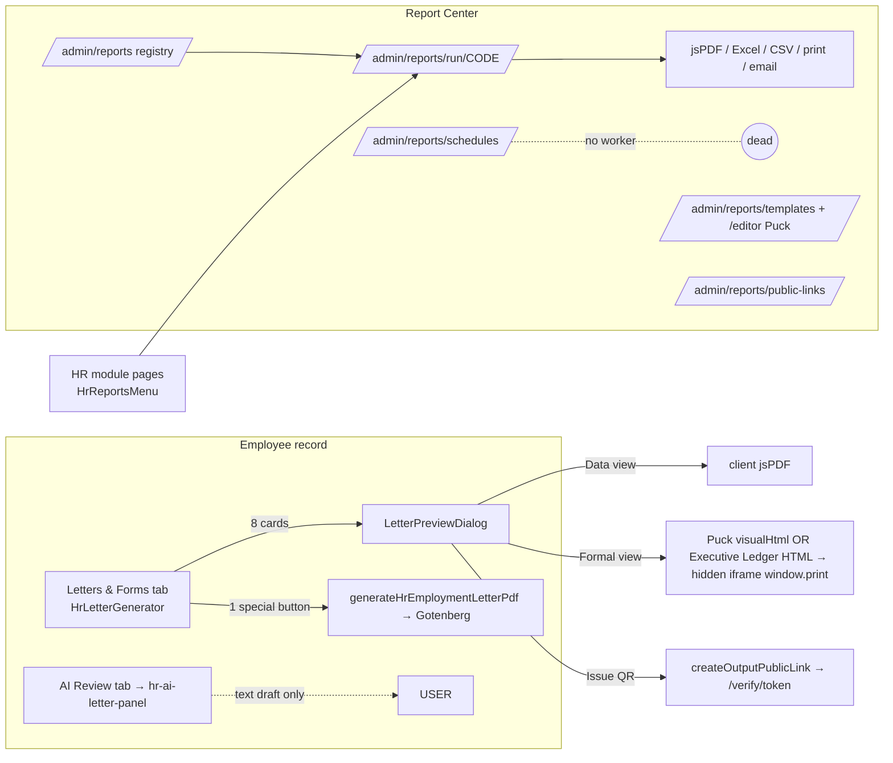
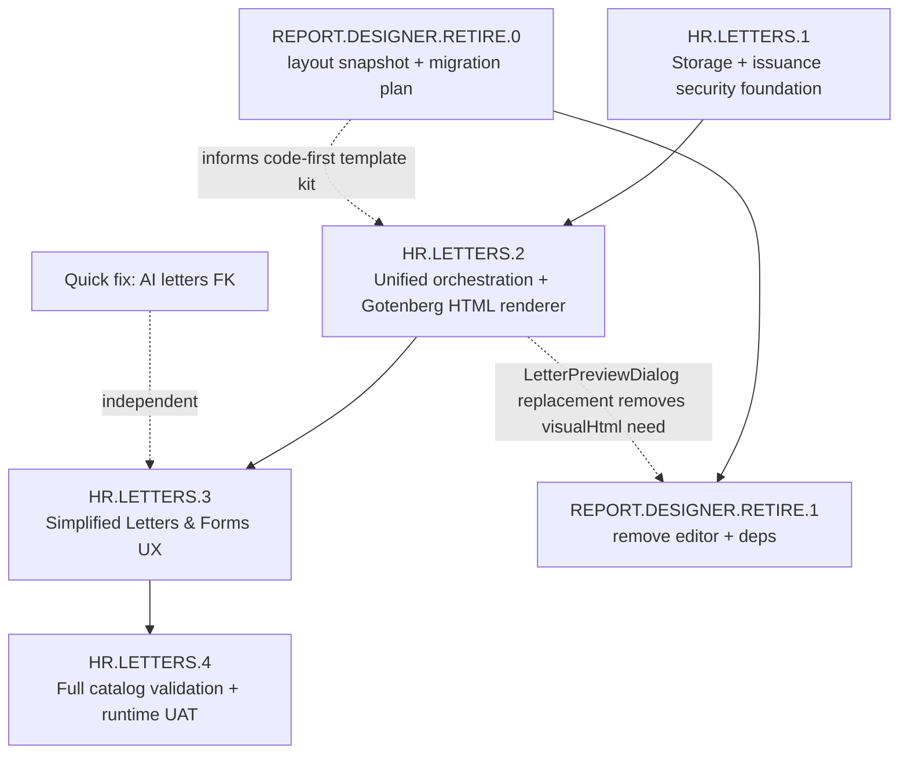

# HR.LETTERS.0 — Deep Analysis, Investigation, Architecture, Security and Simplified UX Report

**Date:** 2026-07-25
**Phase:** HR.LETTERS.0 — Investigation and Planning ONLY (no implementation performed)
**Auditor:** Cursor Agent (senior ERP QA / RLS auditor / PDF architecture / UX analysis persona per phase prompt)
**Prompt:** `ChatGPT/HR_LETTERS_0_DEEP_ANALYSIS_INVESTIGATION_ARCHITECTURE_SECURITY_AND_UX_CURSOR_PROMPT.md`
**Path note:** The phase prompt referenced `implementation_Review/HR_Module/…`. That folder was merged into `implementation_Review/HR/` in the 2026-07-25 documentation reorganization; this report and the enhancement plan live at the new path.

**Nothing was modified in this phase:** no application code, no migrations, no RLS changes, no DB rows, no storage objects, no issued documents, no feature flags, no emails. Only read-only repository search, read-only live-DB queries (via `user-supabase`), and the two Markdown deliverables.

---

## 1. Executive Decision Summary

1. **The "26 HR reports/letters/forms" claim is TRUE and fully reconciled** (VERIFIED — live DB + migration + code): `erp_report_registry` contains exactly 26 `module_code='HR'` rows — 18 analytical/list/summary reports + 8 record-specific letters/certificates/forms/badge — seeded by migration `20260619150000_report_4_hr11_reports_letters_forms_library.sql`, with all 26 fetchers registered in `src/lib/report-center/report-fetchers.ts`. The enhancement plan's focus on "8 cards + 1 Gotenberg letter" was a scope choice, not a data mismatch.
2. **The branding "bug" was misdiagnosed in plan v3** (CONTRADICTED): logos, stamps and signatures for BOTH companies exist in the private `erp-branding-assets` bucket and are registered in the versioned `erp_branding_assets` table (BRANDING.1/.4). The Report Center path resolves them correctly. Only the standalone Gotenberg employment-letter loader reads the legacy NULL `erp_report_branding_profiles.logo_url/stamp_url` columns — a one-file defect, not a missing-upload problem.
3. **The Puck Report Designer is NOT a zero-dependency retirement** (CONTRADICTED): all 18 live template rows carry visual layout JSON, and `LetterPreviewDialog` **prefers** the Puck-rendered HTML for Formal View / Print / PDF whenever the selected template has one. Retiring Puck without a layout migration would change the actual rendered output of the letters in production use today. Retirement remains the right decision but must be its own phase with a migration/compatibility step (`REPORT.DESIGNER.RETIRE.0/1`).
4. **There are at least five render paths, not two** (VERIFIED — code): (A) Gotenberg URL-mode official PDF, (B) client jsPDF tabular export, (C) Executive Ledger / Puck-visual hidden-iframe browser print, (D) server-side jsPDF schedule email attachments, (E) generic export/email toolbar attachments. They overlap on the same HR letters with different guarantees.
5. **Storage security is better than the handover claimed, but still incomplete** (CONTRADICTED + gap): `storage.objects` HAS RLS enabled; `erp-branding-assets` has proper per-path policies (stamp/signature behind `reports.sign`); `dms-documents` / `dms-temp` / `erp-generated-pdfs` have NO policies (deny-by-default for direct client access) — all access flows through server-side admin-client + signed URLs, which makes **server-side signed-URL issuance the real control point** and it currently has no company-scoping audit.
6. **Report scheduling is INCOMPLETE** (VERIFIED — live DB): the only active schedule is 22 days overdue (`next_run_at` 2026-07-03, `last_run_at` NULL); no cron/worker exists for report schedules (only `dms-expiry-daily` and `email-queue-15min` cron jobs exist); 15 of 17 historical scheduled-email delivery logs failed.
7. **QR verification works but is decoupled from file issuance** (VERIFIED — live DB): 13 valid HR letter public links exist with strong 256-bit tokens — but none has an expiry, none is bound to a stored file or hash (`download_file_path` NULL in all 13), and links are issued before/independently of any stored PDF. A copied QR verifies metadata, not a specific file version.
8. **The immutability schema already largely exists** (VERIFIED — live DB): `erp_generated_pdf_documents` already has checksum, template_version, renderer_version, validation/approval status and `superseded_by_id`; `erp_output_public_links` already has status/cancel/supersede/expiry columns. The gap is orchestration (idempotency, linking QR↔file, lifecycle states in code), not schema invention.
9. **AI letters "Employee not found" root cause CONFIRMED** (VERIFIED — code + live DB): ambiguous PostgREST embed `owner_company:owner_companies(...)` (line 84 of `hr-ai-letters.ts`) against two live FKs (`employees_owner_company_id_fkey`, `employees_sponsor_company_id_fkey`), with the query error silently discarded. The fix shape in plan v3 is correct and the proposed constraint names match the live DB exactly.
10. **Gate decision: `CONDITIONALLY READY`** — see §26.

---

## 2. Evidence Sources and Audit Method

### 2.1 Documents read (actual current paths)

| Required by prompt | Actual path | Status |
|---|---|---|
| `.cursor/ALGT_ERP_SOURCE_OF_TRUTH.md` | same | Read (REPORT.2–.5, BRANDING.2–.9, DESIGNER.1–.9, PDF.1, HR.11 sections in full) |
| `.cursor/rules/**` | same | Active rules loaded; `pdf-architecture.mdc` claims checked against code (see contradiction C7/C8) |
| `implementation_Review/HR_Module/HR_FULL_MODULE_AUDIT_AND_NEW_CHAT_HANDOVER_REPORT.md` | `implementation_Review/HR/HR_FULL_MODULE_AUDIT_AND_NEW_CHAT_HANDOVER_REPORT.md` | Read in full |
| `HR_LETTERS_AND_CERTIFICATES_ENHANCEMENT_PLAN.md` | `implementation_Review/HR/HR_LETTERS_AND_CERTIFICATES_ENHANCEMENT_PLAN.md` | Read in full (v3) |
| `implementation_Review/HR/HR_13_SECURITY_RLS_QA_UAT_CLOSURE_REPORT.md` | same | Key findings consumed via handover §18 + SOT (summarized, not re-read line-by-line) |
| HR.14A / HR.14B reports | `implementation_Review/HR/HR_14A_…`, `HR_14B_…` | Consumed via handover §10–11 + SOT |
| HR.11 / REPORT.2–4 reports | `implementation_Review/Reports/REPORT_2/3/4_…` | REPORT.2–.5 closure entries read in SOT; REPORT.4 item table found stale (C11) |
| ERP PDF.1 closure | `implementation_Review/PDF/ERP_PDF_1_RUNTIME_UAT_DEFECT_CORRECTION_AND_TRUE_CLOSURE_REPORT.md` | Read in full |
| Branding / QR / Designer reports | `implementation_Review/Branding/BRANDING_0–9_…` | BRANDING.2–.9 + DESIGNER.1–.9 closure entries read in SOT |
| DMS closure reports | `implementation_Review/DMS/…` (folder renamed from DMS_Module) | Key facts (buckets, scheduler, storage) verified directly against live DB instead |
| Migrations | `supabase/migrations/**` | Registry seed, PDF.1 history, BRANDING.6 QR, DESIGNER.1 columns located and verified against live schema |

### 2.2 Live database verification (user-supabase, read-only)

Queried: `erp_report_registry` (all rows), `erp_report_templates` (all rows + full column list), `erp_report_branding_profiles` (all rows), `erp_branding_assets` (all rows), `erp_generated_pdf_documents` (all rows), `erp_output_public_links` (all rows + token stats), `erp_report_runs` (aggregates), `erp_report_schedules`, `erp_report_delivery_logs`, `erp_email_queue`/`erp_email_send_logs` (aggregates), `storage.buckets` (all 4), `storage.objects` (counts + branding object listing), `pg_policy` for `storage.objects` and all report/output tables, `pg_class.relrowsecurity` for storage, `pg_constraint` FK names on `employees`, `cron.job` (all jobs). No mutation of any kind.

### 2.3 Repository investigation

Two parallel exploration passes covered: full HR output inventory (registry seeds, fetchers, print templates, UI entry points, server actions, exports, dormant artifacts) and full pipeline/designer audit (Gotenberg client modes, token, print route, storage/history helpers, report-runner, Executive Ledger, public-verification, schedules, Puck footprint/imports/dependencies). Key files were then re-verified directly (`letter-preview-dialog.tsx`, `hr-ai-letters.ts`).

### 2.4 Evidence labels used throughout

`VERIFIED — code` · `VERIFIED — live DB` · `VERIFIED — runtime/deployment configuration` · `DOCUMENTED ONLY` · `CONTRADICTED` · `NOT FOUND` · `REQUIRES CONTROLLED RUNTIME UAT`

---

## 3. Contradiction Log

| # | Claim (source) | Reality | Label |
|---|---|---|---|
| C1 | "26 reports/letters/forms" (handover §5) | TRUE — 26 registry rows, 18+8 split | VERIFIED — live DB |
| C2 | "Branding profile logo/stamp/signature all NULL, nothing uploaded — BLOCKING manual task" (plan v3 §1.1, §4) | Assets EXIST: `erp_branding_assets` rows 5–12 (logo, small logo, stamp, signature × 2 companies), files in `erp-branding-assets` bucket since 2026-07-02. BRANDING.4 made this table the primary source; legacy `erp_report_branding_profiles.*_url` columns are fallback-only and are the columns the Gotenberg loader wrongly reads | CONTRADICTED |
| C3 | "None of the 8 HR letter report codes currently depend on a Puck-authored visual layout" (plan v3 §0.1) | All 18 live template rows have `body_layout_json` non-NULL; 4 are `published` (incl. `COMPANY_1_LETTER_TEMPLATE`, ALGT Certificate); `letter-preview-dialog.tsx` L373–380/L393–400 prefer `visualHtml` (Puck production renderer) over the code-first EL path for Formal View/Print/PDF when a template is selected | CONTRADICTED |
| C4 | "storage.objects RLS not enabled for dms-documents/dms-temp/erp-generated-pdfs" (handover §18/§27, Storage.1) | `storage.objects` HAS `relrowsecurity=true`. No policies exist for those 3 buckets → direct client access is deny-by-default. 4 policies exist for `erp-branding-assets` (stamp/signature paths require `reports.sign`). Residual risk moves to server-side signed-URL issuance, not raw bucket exposure | CONTRADICTED (risk re-classified, not removed) |
| C5 | "Two parallel pipelines (A: Gotenberg, B: Report Center)" (plan v2/v3 §0) | ≥5 output paths: Gotenberg URL-mode; client jsPDF; EL/Puck iframe browser print; schedule server-jsPDF email; export-toolbar email attachments (+ DMS expiry jsPDF outside HR) | CONTRADICTED (too narrow) |
| C6 | Print tokens are "single-use" (pdf docs/rules) | Code enforces TTL (120 s) + HMAC + route binding only; no single-use/nonce store | CONTRADICTED |
| C7 | `pdf-lib` post-processing / `src/lib/pdf/post-process.ts` (`.cursor/rules/pdf-architecture.mdc`) | Package not in `package.json`; file does not exist | NOT FOUND |
| C8 | History table `pdf_generation_history` (plan v3, several sections) | Actual table is `erp_generated_pdf_documents` | CONTRADICTED (naming) |
| C9 | Governance implies published templates passed security review | `hr-employment-letter-en` (id 19) is `published` with `security_review_status='pending'` | VERIFIED — live DB (governance inconsistency) |
| C10 | REPORT.4 closure report's 26-item table | Contains codes that never existed (`HR_EXPERIENCE_LETTER_AR`, `HR_EMPLOYMENT_CONTRACT`, …). Count is right; item names wrong. Trust migration + live DB | CONTRADICTED (stale doc) |
| C11 | `generate-hr-letter.ts` header comment says UI trigger is `employee-hr-actions-tab.tsx` | Actual call site is `src/features/report-center/hr-letter-generator.tsx` | CONTRADICTED (stale comment) |
| C12 | Stored PDFs are linked to their governance template | Both `erp_generated_pdf_documents` rows have `template_id = NULL` despite `template_key='hr-employment-letter-en'` matching template id 19 | VERIFIED — live DB (broken linkage) |
| C13 | "Pipeline B has a working QR system" implies QR verifies the issued document | All 13 public links have `download_file_path=NULL`, no expiry, no hash binding — QR verifies letter *metadata*, not a stored file/version | VERIFIED — live DB (design gap, not bug) |
| C14 | Handover: schedules "background job runner not implemented" (G5, Low) | Confirmed and worse than "low": active schedule 22 days overdue; 15/17 scheduled-email deliveries failed; registry rows all have `supports_scheduling=false` yet the schedules UI exists | VERIFIED — live DB |
| C15 | Plan v3 Phase 2 "create `erp-branding-assets` bucket (public-readable) + build branding upload UI" | Bucket exists (private, correct), upload UI exists (BRANDING.2/.4 asset cards), RLS policies exist. Phase 2 as written would rebuild existing work and *weaken* security (public-readable) | CONTRADICTED |

---

## 4. Canonical Inventory of HR Outputs

Classification classes: (1) Incoming evidence · (2) Official generated document · (3) Internal form/checklist/card · (4) Recruitment output · (5) HR case output · (6) Analytical report · (7) Export-only dataset · (8) AI draft · (9) Legacy/dormant/duplicate.

### 4.1 The 26 registry items (all VERIFIED — live DB + code fetcher + migration)

Common properties for all 26: entry via Report Center `/admin/reports/run/[reportCode]` (+ module shortcut menus where noted); data via `REPORT_FETCHERS[code]` → `src/server/actions/reports/hr/*.ts`; branding via `resolveReportBranding`; run audit row in `erp_report_runs`; RLS-backed permissions in `required_permissions`; NO server-stored PDF (renderers are client jsPDF / browser print); scheduling flag false.

| ID | Code | Class | Sensitivity | Formats | Extra entry points | Status |
|---|---|---|---|---|---|---|
| CAT-01 | HR_EMPLOYEE_LIST | 6 | normal | screen,pdf,excel,csv | employees page menu | Working (6 failed runs on record) |
| CAT-02 | HR_EMPLOYEE_PROFILE | 6 (detail) | normal | screen,pdf,print | none dedicated | Partial (1 failed run; needs employee filter UX) |
| CAT-03 | HR_COMPLIANCE_EXPIRY | 6 | normal | +excel,csv,print | employees page menu | Working (17 PDF + 1 screen runs) |
| CAT-04 | HR_ATTENDANCE_SUMMARY | 6 | normal | full | time page menu | Registered; no run evidence |
| CAT-05 | HR_LEAVE_BALANCE | 6 | normal | full | time page menu | Registered; no run evidence |
| CAT-06 | HR_LEAVE_REQUESTS | 6 | normal | full | time page menu | Registered; no run evidence |
| CAT-07 | HR_WPS_READINESS | 6 | payroll | full | payroll page menu | Registered; no run evidence |
| CAT-08 | HR_ASSIGNMENT_BY_SITE | 6 | normal | full | **none** (Report Center only) | Registered; no run evidence |
| CAT-09 | HR_PRO_PROCESSES | 6 | normal | full | **none** | Registered; no run evidence |
| CAT-10 | HR_CANDIDATE_PIPELINE | 4/6 | recruitment | full | recruitment page menu | Registered; no run evidence |
| CAT-11 | HR_REQUISITIONS | 4/6 | normal | full | recruitment page menu | Registered; no run evidence |
| CAT-12 | HR_ONBOARDING_TASKS | 4/6 | normal | full | recruitment page menu | Registered; no run evidence |
| CAT-13 | HR_DISCIPLINARY_SUMMARY | 5/6 | disciplinary | screen,pdf,excel,csv | **none** | Registered; no run evidence |
| CAT-14 | HR_OVERTIME_REPORT | 6 | normal | full | time page menu | Registered; no run evidence |
| CAT-15 | HR_ABSENT_LATE_SUMMARY | 6 | normal | full | time page menu | Registered; no run evidence |
| CAT-16 | HR_EOS_CASES | 5/6 | normal | full | **none** | Registered; no run evidence |
| CAT-17 | HR_PPE_ISSUE_REPORT | 6 | normal | full | **none** | Registered; no run evidence |
| CAT-18 | HR_ASSET_ISSUE_REPORT | 6 | normal | full | **none** | Registered; no run evidence |
| CAT-19 | HR_EXPERIENCE_LETTER | 2 | normal | pdf,print | Employee → Letters & Forms card | **Most used**: 41 success + 9 failed runs; 13 QR links issued |
| CAT-20 | HR_SALARY_CERT_GENERAL | 2 | normal | pdf,print | Employee card | Working (6 + 2 failed) |
| CAT-21 | HR_SALARY_CERT_WITH_AMOUNT | 2 | **payroll** | pdf,print | Employee card | Working (8 + 1 failed); `hr.payroll.view` required |
| CAT-22 | HR_NOC | 2 | normal | pdf,print | Employee card | Working (1 run) |
| CAT-23 | HR_EMPLOYEE_ID_CARD | 3 (card/badge) | normal | pdf,print | Employee card | Working (2 + 1 failed) |
| CAT-24 | HR_PPE_ISSUE_FORM | 3 | normal | pdf,print | Employee card | Registered; **never run** |
| CAT-25 | HR_JOINING_CHECKLIST | 3 | normal | pdf,print | Employee card | Working (3 runs) |
| CAT-26 | HR_CLEARANCE_FORM | 3/5 | normal | pdf,print | Employee card | Registered; **never run** |

Numbering rules exist for the letter/form items (HREL/HRSAL/HRNOC/HRPPE/HRJC/HRCF families in `global_numbering_rules`) — VERIFIED — code (migration).

### 4.2 Items outside the 26

| ID | Item | Class | Evidence | Status / Disposition |
|---|---|---|---|---|
| CAT-27 | `hr-employment-letter-en` Gotenberg letter (`src/components/erp/print/templates/hr-employment-letter.tsx` + `generateHrEmploymentLetterPdf`) | 2 | VERIFIED — code + live DB (2 stored PDFs, 2026-07-24) | Working but defective (reads legacy branding columns → no logo/stamp; no QR; duplicate concept of CAT-19). **Disposition: merge into unified official-issuance path; keep history rows** |
| CAT-28 | `bilingual-sample-en-ar` print template | 9 | VERIFIED — code (registered in print route; template row `draft`) | Dormant proof template, no UI entry. **Keep as engineering sample or delete in cleanup** |
| CAT-29 | `sample-quotation-en` print template | 9 (non-HR) | VERIFIED — code | Non-HR proof. Out of HR scope |
| CAT-30 | 10 HR notification text templates (`HR_OFFER_LETTER`, `HR_WARNING_LETTER`, `HR_NOC_LETTER`, …) seeded in `erp_notification_templates` by HR.1 migration | 9 | VERIFIED — code (migration) ; NOT FOUND (no generator code references) | Dormant email/notification wording rows — NOT document generators. **Do not confuse with letters; leave as-is** |
| CAT-31 | AI letter/email drafts — 8 draft types (`noc`, `salary_certificate`, `experience_letter`, `warning_letter`, `hr_email`, `offer_followup`, `missing_document_reminder`, `general`) via `hr-ai-letters.ts` | 8 | VERIFIED — code | Text drafts only; feature-flagged off; currently broken (C-BUG-1 FK ambiguity). Note: `warning_letter`/`offer_followup` have **no** corresponding official document type in the registry |
| CAT-32 | Report Center Excel/CSV exports (any of the 18 analytical items) | 7 | VERIFIED — code | Working via `src/lib/export/{excel,csv}.ts`; client-generated, not stored |
| CAT-33 | Scheduled report email attachments (server jsPDF/Excel/CSV) | 7 | VERIFIED — code + live DB | INCOMPLETE — no worker (see §14) |
| CAT-34 | Employee compliance documents (EID, passport, visa, labour card, licence, CICPA, training certs, insurance, medical fitness, dependents) | 1 | VERIFIED — code + prior closures | **Incoming DMS-managed evidence — explicitly NOT generated HR outputs.** No change proposed; DMS remains the only intake |
| CAT-35 | Report Designer (Puck) template layouts on `erp_report_templates` | 9 (engine) | VERIFIED — live DB + code | Load-bearing at render time for Formal View (C3). Disposition: retire via dedicated phases with layout migration |

**Registry rows without code: none. Code fetchers without registry rows: none.** (Both directions verified via `REPORT_FETCHERS` keys ↔ registry codes.) UI cards without working backend: none broken outright, but CAT-24/26 have never been exercised. Output history without reachable renderer: none (both stored PDFs' template still registered).

---

## 5. Reconciliation of the 26-Item Claim

| Source | Count | Verdict |
|---|---|---|
| Handover report §5 ("Report Center: 26 reports/letters/forms") | 26 | Correct |
| Migration `20260619150000` inserts | 26 | Matches |
| Live `erp_report_registry` WHERE module_code='HR' | 26 | Matches |
| `REPORT_FETCHERS` HR keys | 26 | Matches |
| Enhancement plan v3 scope | 8 letters + 1 Gotenberg | Subset — the other 18 are analytical reports the plan intentionally didn't cover, but the plan never said so explicitly, causing the perceived mismatch |
| REPORT.4 closure report item table | 26 (wrong names) | Count right, several listed codes fictional (C10) |

**Verified current count: 26 registry items + 1 parallel Gotenberg letter (CAT-27) + dormant artifacts (CAT-28/30) + 8 AI draft types (CAT-31).**

---

## 6. Incoming vs Generated Classification

- **Incoming (Class 1, DMS-owned, out of generation scope):** all employee compliance documents listed in CAT-34. These live in `dms-documents`, are linked via `dms_document_id` FKs / `dms_document_links`, are covered by the DMS expiry scheduler, and MUST NOT gain a parallel HR upload store. No proposal in this plan touches their intake.
- **Generated (Classes 2–7):** everything in §4.1/§4.2 except CAT-34. Only Class 2 (official external documents) requires the full issuance lifecycle (stored PDF + hash + QR policy + revocation). Class 3 internal forms need stored output but NOT public QR by default. Class 6/7 analytical/exports need run audit but not issuance ceremony.

---

## 7. Current Entry-Point and UX Map



**UX problems verified:**
1. Two competing generation controls in one tab (8 cards + 1 visually different Gotenberg button) with different guarantees and no explanation (CAT-19 vs CAT-27 duplicate).
2. "PDF" in the Formal View is actually the browser print dialog; nothing is stored; while the Gotenberg button stores a file but produces an unbranded letter. Neither is fully "official."
3. QR issuance is a separate manual button and verifies metadata only.
4. 6 analytical reports (operations + actions groups) have no module shortcut — reachable only through Report Center.
5. Advanced controls (Formal/Data toggle, template picker) are exposed to all users in the default flow.
6. AI drafting is a separate tab with no connection to letter generation, and is currently broken + feature-flagged off.

---

## 8. Pipeline and Mechanism Traces

### Pipeline A — Gotenberg official stored PDF (CAT-27 only)

Entry `hr-letter-generator.tsx` button → `generateHrEmploymentLetterPdf` (`getAuthContext` + `reports.pdf.generate` or admin; company access via `user_roles.owner_company_id`) → `renderPdf` (`src/lib/pdf/renderer.ts`) → signs HMAC token (120 s TTL, route-bound, NOT single-use) → Gotenberg `POST /forms/chromium/convert/url` (45 s hardcoded timeout, no retry) → Gotenberg fetches `/print/[templateKey]/[recordType]/[recordId]?token=…` → route validates token, checks `erp_report_templates.governance_status` (draft → watermark; archived → 403; unknown → 404), runs `loadHrEmploymentLetterData` (admin client; **reads legacy branding columns — defect**), `renderToStaticMarkup` → PDF bytes → upload `erp-generated-pdfs` (`upsert:false`, timestamped path — collisions prevented but duplicates allowed) → `erp_generated_pdf_documents` row (checksum sha256; **`template_id` left NULL — C12**; upload-failure writes `storage_path='FAILED'` + reason; history-insert failure is swallowed, `historyId=0`) → 3600 s signed URL returned. **No QR issuance anywhere in this pipeline.**

Failure-mode audit (VERIFIED — code): double-click → two PDFs + two history rows (no idempotency key); render success + upload fail → failure history row, no file; upload success + history fail → orphan file with no row; Gotenberg down → health check + explicit error, no partial state; response timeout after upload → file + row exist but user gets error (retry duplicates). No transactions/cleanup jobs.

### Pipeline B — Report Center tabular run + client export (18 analytical items)

`report-run-page.tsx` → `runReportAction` (permission check from `required_permissions`, redaction engine, branding resolve) → `erp_report_runs` row (append-only RLS) → client `exportToPDF` (jsPDF+autotable), `exportToExcel`, CSV blob, `exportToPrint`. Nothing stored server-side; run row is metadata audit only.

### Pipeline C — Letter Formal View (8 letter items)

`LetterPreviewDialog` → `runReportAction` (screen) → EITHER Puck visual layout via `renderVisualTemplateForLetterPreview` → `production-renderer.ts` → EL HTML (**preferred when template has layout JSON — all live templates do**) OR code-built `ExecutiveLedgerDocument` → `renderExecutiveLedgerHtml` → hidden iframe `window.print()` (browser print-to-PDF). Optional manual "Issue QR" → `createOutputPublicLink` (governance-checked: letter/certificate/form types require approved/published template) → QR data URL embedded in EL HTML. **No stored file, no numbering issuance, no delivery record.**

### Pipeline D — Scheduled email (dead)

`schedules.ts` (`processDueReportSchedules`, `runReportScheduleNow`) → `runReport` → `generateAttachmentByType` (server-side jsPDF/Excel/CSV) → `sendExportEmail` → `erp_report_delivery_logs`. **No cron/worker calls `processDueReportSchedules`** (only `dms-expiry-daily` + `email-queue-15min` cron jobs exist). Registry `supports_scheduling=false` on all rows. Status: INCOMPLETE.

### Pipeline E — Export toolbar email

`report-export-toolbar.tsx` → client-generated attachment → `sendReportEmail` → email queue → delivery log. Ad-hoc, working through the ERP email system (289 emails sent overall via `erp_email_queue`).

### Atomicity / recovery matrix (current state, all VERIFIED — code unless noted)

| Scenario | Current behavior |
|---|---|
| Double-click Generate (A) | Two stored PDFs + two history rows |
| Double-click Generate (C) | Two `erp_report_runs` rows; two print dialogs |
| Render ok, upload fail (A) | History row with `storage_path='FAILED'`; user gets error |
| Upload ok, history fail (A) | Orphan file, signed URL still returned, no auditable row |
| QR issued, render fails (C) | Valid orphan public link (13 live links have no file at all — live DB) |
| Same document reissued | New timestamped file; old not superseded (`superseded_by_id` never set) |
| Branding/employee changes after issuance | Stored PDF unchanged (good); QR link metadata snapshot unchanged (good); re-render would differ (no snapshot of data inputs) |
| Template archived after issuance | Print route refuses re-render (403); stored file still downloadable |
| QR link revoked | Columns exist (`cancelled_at`, status); admin UI exists; verified working per BRANDING.9 — REQUIRES CONTROLLED RUNTIME UAT for the revoked-state display |
| Email fails after PDF issued | Pipeline A has no email; Pipeline D logs failure (15 failed rows) |
| Gotenberg down | Health check → clean error |
| Private branding assets unloadable | A: n/a today (no assets used — the defect); C: EL renders `` via signed/public URL — broken-image risk. REQUIRES CONTROLLED RUNTIME UAT |
| Cross-employee/company ID guessing | Server actions check permissions but PDF history/link SELECT policies are permission-only, **no company scoping** (§10) |

---

## 9. Renderer and Gotenberg Runtime Audit (Track C)

| Aspect | Finding | Label |
|---|---|---|
| Next.js version | Next 16 (Turbopack); print route uses `runtime="nodejs"` + dynamic `react-dom/server` import (PDF.1 D1 fix) | VERIFIED — code |
| Gotenberg client modes | URL mode live (`/forms/chromium/convert/url`); `gotenbergConvertHtml` implemented, **zero call sites** — plan v3's open question Q1 is answered: HTML mode exists, unused | VERIFIED — code |
| Deployment | Railway service; `GOTENBERG_URL`, `PDF_PRINT_TOKEN_SECRET` (set, 96-char per prior session), `INTERNAL_SITE_URL` for container networking; production generation proven by 2 real stored PDFs (2026-07-24, `renderer_version='gotenberg@prod'`) | VERIFIED — live DB; env values themselves REQUIRES CONTROLLED RUNTIME UAT (cannot read Railway env from repo) |
| Fonts | Self-hosted Noto Sans Arabic WOFF2 in `public/fonts/`; `waitForExpression` fixed to `document.fonts.status === 'loaded'` | VERIFIED — code |
| Timeouts/retries | 45 s convert (hardcoded), 5 s health, no retry loop, no concurrency limit | VERIFIED — code |
| Token security | HMAC-SHA256, 120 s TTL, route-binding; NOT single-use (C6) | VERIFIED — code |
| SSRF guard | Print-URL allowlist (`/print/` + internal hosts) | VERIFIED — code |
| Pagination/margins/headers-footers | Basic A4 CSS in print template; no repeating header/footer or multi-page table testing evidence | REQUIRES CONTROLLED RUNTIME UAT |
| Images/SVG/transparent PNG | Untested in Gotenberg path (no images render today due to C2 defect) | REQUIRES CONTROLLED RUNTIME UAT |
| Deterministic re-render | Not guaranteed (no input snapshot); stored bytes + checksum give re-download fidelity instead | VERIFIED — code |
| PDF metadata / embedded fonts / broken-link behavior | Unverified | REQUIRES CONTROLLED RUNTIME UAT |
| PDF/A / PDF/UA | Explicitly guarded off (veraPDF not installed); no conformance claims | VERIFIED — code |
| Visual regression tooling | Playwright specs exist (`tests/pdf/*`); 12/12 security tests passed at PDF.1 closure; full Gotenberg E2E documented as runtime-conditional and NOT re-run since | DOCUMENTED ONLY (E2E) |
| Browser print presented as official? | Yes — Formal View button says "PDF" but is browser print with no storage (§7 problem 2) | VERIFIED — code |

**PDF.1 closure reconciliation:** the closure is genuine for print-route security (12/12 tests) and loaders, but Gotenberg E2E, veraPDF, visual QA and the branding-asset rendering were deferred and remain unexecuted. The claim "ERP PDF.1 CLOSED" therefore holds for its stated scope but must not be read as "official PDF issuance is production-complete."

**Target official-output requirements** (per prompt Track C — all to be implemented in later phases, most schema already exists): non-overwritable unique path ✅ (timestamped, `upsert:false`); server hash ✅ (`checksum`); canonical issuance ID + human serial — partial (numbering rules exist, not wired to stored PDFs); template id/version — column exists, currently NULL (C12); branding profile version — MISSING column; data snapshot — MISSING; sensitive scope — MISSING on PDF table (exists on runs); issuer/timestamp ✅; approval — columns exist unused; renderer version ✅; QR link relationship — MISSING (no FK either direction); issued/failed/revoked/superseded states — columns exist, lifecycle not orchestrated; retention/deletion — not defined; download/delivery events — not audited.

---

## 10. Database, RLS, Storage and Permission Audit (Track F)

### 10.1 Storage (VERIFIED — live DB)

| Bucket | Public | Objects | Policies |
|---|---|---|---|
| `dms-documents` | private | 618 (~406 MB) | none → deny-by-default direct access; all access via server admin client + signed URLs |
| `dms-temp` | private | 809 (~553 MB) | none → same |
| `erp-generated-pdfs` | private | 2 | none → same |
| `erp-branding-assets` | private | 15 | 4 policies: SELECT app-scope needs `branding.app.view`/`reports.manage`; report-scope logos need `reports.view`; **stamp/signature paths need `reports.sign`**; INSERT/UPDATE/DELETE need `branding.assets.upload` (+ manage) |

**Re-classification of Storage.1:** the pre-production blocker is NOT "any authenticated user can read the buckets" (RLS denies that). It is: (a) no explicit deny-documenting policies for the 3 bucket, meaning future policy additions could accidentally open them; (b) **signed-URL issuance is the effective ACL** and the issuing server actions (`getDmsDocumentSignedUrl`-family, PDF history download) enforce permissions but NOT owner-company scoping on the PDF side; (c) `dms-temp` holds 809 objects (~553 MB) of stale uploads with no cleanup job. Treat as **pre-production blocker** per prompt instruction, with the fix being explicit policies + signed-URL issuance audit + temp cleanup, not "enable RLS" (already enabled).

### 10.2 Output-table RLS (VERIFIED — live DB)

| Table | SELECT | Notes |
|---|---|---|
| `erp_generated_pdf_documents` | `reports.pdf.view_history` | Policy is named "own_company" but has **no company predicate** — any holder sees all companies' PDF history. INSERT effectively service-role only; UPDATE only `reports.pdf.approve` on pending rows |
| `erp_output_public_links` | `reports.view`/`manage`/`publish`/`verify.admin` | No company scoping. Public access only via SECURITY DEFINER RPC `get_public_verification_by_token` (sanitized) |
| `erp_report_runs` | own rows OR `reports.history.view` | Append-only (no update/delete except global admin) |
| `erp_report_delivery_logs` | `reports.history.view` | Append-only |
| `erp_report_schedules` | owner or `reports.schedule.*` | OK |
| `erp_branding_assets` | scope-based permissions | Stamp/signature NOT separately gated at table level (only at storage level) — table SELECT exposes storage *paths*, not bytes; acceptable but worth noting |

### 10.3 Permission matrix (current, condensed)

| Operation | Permission(s) | Layers verified |
|---|---|---|
| View template list / registry | `reports.view` | UI + RLS |
| Run report / letter preview | `required_permissions` per registry row (e.g. `hr.payroll.view` for CAT-21) | UI + server action + fetcher-level redaction |
| Generate stored official PDF | `reports.pdf.generate` (or admin) + company access check | server action only (no RLS insert path for users) |
| View/download PDF history | `reports.pdf.view_history` | RLS (no company scope — gap) |
| Approve PDF | `reports.pdf.approve` | RLS (unused workflow) |
| Email a report | `reports.run` + email feature | server action; delivery log RLS |
| Schedule | `reports.schedule.view/manage` | RLS; worker absent |
| Issue/revoke QR | `reports.publish` / `reports.verify.admin` (system_admin only for admin) | server action + RLS |
| Upload/replace logo | `branding.assets.upload` + `reports.manage`/`branding.app.manage` | storage RLS + table RLS |
| Upload/replace stamp/signature | same upload perms; **viewing** stamp/signature bytes needs `reports.sign` | storage RLS |
| Approve/publish templates | `reports.template.approve` (system_admin+group_admin), `reports.publish` | server actions + governance events table |
| Salary with amount | `hr.payroll.view` + `current_user_can_view_employee_payroll` SECURITY DEFINER | UI + server + DB function |
| Cross-company access | Global admins bypass; non-admin company scoping enforced in HR tables' RLS but NOT on PDF-history/public-links/runs SELECT | partial — flagged |

### 10.4 IDOR / abuse tests of the design (desk-check; runtime cases go to UAT)

- Direct server-action calls: guarded by `getAuthContext` + permission checks throughout (VERIFIED — code).
- Guessed employee/output IDs: HR tables RLS-scoped; PDF signed URL requires a row the caller could read → gap is the missing company scope on history SELECT.
- Manipulated report codes/template IDs: registry+governance checks refuse unknown/archived (VERIFIED — code + PDF.1 tests).
- Manipulated `owner_company_id`: branding resolution derives from employee row server-side; Pipeline A checks the caller's company membership.
- Stale signed URLs: 3600 s expiry; no revocation of issued URLs (acceptable; document).
- Public verification leakage: sanitizer allowlist blocks salary/IBAN/passport/IDs (VERIFIED — code; BRANDING.9 tested 16 patterns).
- Stamp/signature URL leakage: storage policy gates bytes behind `reports.sign`; but any HTML embedding signed URLs shares them with document recipients by design — issuance policy must treat rendered output as containing the assets.
- Cron secrets: `cron.job` commands embed static bearer tokens (`DmsScheduler@2026`, `ErpInternal@2026`) readable by anyone who can read `cron.job` — LOW-MEDIUM finding, rotate to strong secrets/vault (VERIFIED — live DB).

---

## 11. Branding, Stamp and Signature Governance Audit (Track D)

**Schema/state (VERIFIED — live DB):**
- `erp_report_branding_profiles`: 4 profiles (Group, Neutral, ASL, ALGT). ALGT has signatory (Amjad Al Najjar, General Manager), address, TRN, licence; ASL has empty signatory strings; legacy `*_url` columns NULL everywhere (by design post-BRANDING.4).
- `erp_branding_assets`: versioned registry (`version_no`, `replaced_by_asset_id`, `is_active`) — logo/small-logo/stamp/signature active v1 rows for both companies; app-scope assets with real version chains (favicon v1→v2, login bg v1→v3) proving the replace-with-audit mechanism works.
- Resolution: `resolveReportBranding`/`resolveTemplatePreview` use assets-first with legacy fallback, `reports.sign` gate on stamp/signature (BRANDING.4, VERIFIED — code via SOT + agent trace). Company auto-resolution by `owner_company_id`, no hardcoded company branches; org-sync keeps profile identity fields updated (BRANDING.3).
- Historical branding versions: asset rows are never hard-deleted (`branding_assets_no_hard_delete` policy) — issued documents can reference the asset version in force at issuance **once a version pointer is recorded** (currently NOT recorded on stored PDFs — gap).

**Security position validated:** logo public-ish is acceptable; stamps/signatures must remain in the gated bucket (they are); generated PDFs private (they are); only authorized admins can replace assets (policy-enforced); replacements create new versions rather than mutating (mechanism exists); a new stamp does not alter already-stored PDFs (bytes immutable) — but WOULD alter re-renders and browser-print outputs (no snapshot), reinforcing "stored bytes are the official artifact."

**Gotenberg private-asset consumption (prompt asked to re-evaluate the "never base64" rule):** three viable mechanisms — (a) short-lived signed URLs embedded in print HTML; (b) authenticated render-proxy route; (c) server-side base64 data-URI embedding. Given assets are small (logo 13 KB, stamp 54 KB, signature 1.1 MB — the signature PNG should be optimized), **recommendation: server-side embedding (data URI) for stamp/signature inside the print route HTML** — it never exposes a fetchable URL, works regardless of Gotenberg network reachability, and removes signed-URL lifetime races; use signed URLs only for the larger letterhead/watermark images if added later. Plan v3's constraint #5 ("absolute URLs, not base64") is hereby REVERSED with justification.

---

## 12. QR Verification and Issuance Lifecycle Audit (Track E)

**Verified state (live DB + code):** 13 links, all `output_type='letter'`, HR, status `valid`; token = 32 random bytes base64url (43 chars, ~256-bit); public page `/verify/[token]` via SECURITY DEFINER RPC with sanitized payload; view counting works (22 views); admin list page exists; revocation columns + actions exist. Gaps: **no expiry set on any link; no link ↔ stored-file binding; QR issued on manual click independent of any PDF; regeneration creates a new link but old ones remain valid; duplicate clicks create multiple valid links for the same letter.**

**Policy determination (proposed, per document class):**

| Class | QR required? | Notes |
|---|---|---|
| Official external letters/certificates (CAT-19..22, 27) | YES — issued automatically at official issuance, bound to file hash | The only class where QR is mandatory |
| Internal forms/checklists/ID card (CAT-23..26) | NO public QR by default (ID card MAY carry internal QR later) | Public verification of internal forms leaks org process info |
| Analytical reports / exports (CAT-01..18, 32) | PROHIBITED | Never public |
| AI drafts (CAT-31) | PROHIBITED | Never issuable |

**Target issuance state machine (for HR.LETTERS.1):**

```
draft → previewed → [approved]* → rendering → issued
                                   ↘ failed → retryable (same issuance id, no new QR)
issued → revoked (reason, actor, timestamp; QR page shows REVOKED)
issued → superseded (new issuance links back; old QR shows SUPERSEDED + pointer)
issued → expired/retained (retention policy per class)
```
*approval step only for classes/templates configured to require it (columns already exist on `erp_generated_pdf_documents`).

Key rule: **the public link row is created in the same logical transaction as the successful stored PDF and carries `download_file_path` + hash**; a failed render must never leave a `valid` link. Existing 13 metadata-only links: keep valid as "legacy verification (metadata-only)" or re-issue after unification — decision for Sameer (Open Question Q5).

---

## 13. PDF Immutability / Reproducibility Gap Analysis

| Requirement | Exists? | Evidence |
|---|---|---|
| Non-overwritable path | ✅ | `upsert:false`, timestamped path (code) |
| Server-side hash | ✅ | `checksum` populated on both live rows |
| Canonical issuance ID / human serial | ⚠️ partial | `global_numbering_rules` HREL/HRSAL/… exist; `erp_report_runs.numbering_issued` exists; NOT wired to stored PDFs |
| Template id/version captured | ⚠️ broken | columns exist; `template_id` NULL on both rows (C12) |
| Branding version captured | ❌ | no column; `erp_branding_assets.version_no` available to reference |
| Data snapshot | ❌ | no column; needed for legal reproducibility |
| Sensitive-scope record | ⚠️ | on `erp_report_runs` only, not on stored PDFs |
| Issuer + timestamp | ✅ | `generated_by`, `generated_at` |
| Approval identity | ✅ columns, unused | `approval_status/approved_by/approved_at` |
| Renderer version | ✅ | `gotenberg@prod` recorded |
| QR relationship | ❌ | no FK either direction |
| Lifecycle states | ⚠️ | `superseded_by_id`, `archived_*`, `failure_reason` exist; no `revoked` state; no orchestration |
| Retention/authorized deletion | ❌ | undefined |
| Download/delivery audit | ❌ | signed URLs unaudited |

Conclusion: **schema is ~70% ready; the work is a small migration (branding_version, data_snapshot, public_link_id, revoked state) plus orchestration code — not a new data model.**

---

## 14. Email / Export / Scheduling / History / Notification Audit (Track I)

| Mechanism | Reality | Label |
|---|---|---|
| Browser quick print | Working (Pipelines B/C) | VERIFIED — code |
| Official stored PDF | Working for 1 template only, defective branding | VERIFIED — live DB |
| Excel / CSV | Working client-side for analytical reports | VERIFIED — code |
| Ad-hoc report email | Working (toolbar → email queue; ERP email system healthy: 289 sent) | VERIFIED — live DB |
| Saved filters | Table + UI exist (1 row) | VERIFIED — live DB |
| Report history | `erp_report_runs` 100 rows, append-only, UI at /admin/reports/history | VERIFIED — live DB |
| Report schedules | **INCOMPLETE** — UI+CRUD+`processDueReportSchedules` exist; no cron/worker; active schedule 22 days overdue; 15/17 deliveries failed; registry `supports_scheduling=false` everywhere | VERIFIED — live DB |
| Delivery logs | 17 rows, RLS append-only | VERIFIED — live DB |
| Notification links | Relative URLs enforced (DMS cleanup 2026-07-24); recipient-scoped; doc-number masking helper exists | VERIFIED — code (prior closure) |

Email planning requirements for later phases: attach only the exact issued stored PDF (by history row id, never a re-render); permission `reports.run` + recipient resolution review; sensitive attachments require the same permission as generation; delivery logs already isolate by `reports.history.view`; a browser-print draft must never be emailable as official (enforced by only offering email on issued history rows).

---

## 15. AI Drafting Audit (Track H)

- Defect VERIFIED — code + live DB: ambiguous `owner_companies` embed + swallowed error (§1.9). Fix = FK hints (`owner_companies!employees_owner_company_id_fkey`), add hints on the other joins for robustness, and log/return the real PostgREST error. The plan v3 code block is correct as written.
- Guards in place (VERIFIED — code): master + feature flags (both off in production), `hr.ai.view` + type-specific permissions (`hr.payroll.view` for salary drafts, `hr.actions.view` for warnings), salary context only included with payroll permission, common-AI bridge (no direct SDK), usage-metadata-only logging.
- Boundary (confirmed design): AI output is copy-paste text only; cannot issue/store/email; keep visually separate from issuance. Draft types `warning_letter`/`offer_followup` have no official document counterpart — if custom wording should ever enter an official output, it must go through a template "custom clause" field with approval + snapshot (Phase decision, not this phase).

---

## 16. Report Designer Dependency and Historical-Compatibility Audit (Track G)

**Footprint (VERIFIED — code):** 48 files / ~11,301 lines (`src/features/report-designer` 27/~4,643 + `src/lib/report-designer` 21/~6,658); deps `@puckeditor/core@^0.22.0` + 7 `@tiptap/*` packages; 2 editor routes; outside consumers = 3 designer server-action files, `templates.ts` (production-renderer bridge used by LetterPreviewDialog), `template-governance.ts` + `security-review.ts` (field-registry / visual security review). **Report Center UI itself does not import designer code; Gotenberg path does not use layouts at all.**

**Live dependency (VERIFIED — live DB + code):** every template row has layout JSON (`visual_editor_engine` default `'puck'` from DESIGNER.1 — the value alone is NOT proof of Puck authoring, but non-NULL `body_layout_json` on all rows is); 4 published templates incl. `COMPANY_1_LETTER_TEMPLATE` used by HR letters; Formal View prefers the Puck-rendered HTML. **Retiring the Designer today without migration would visibly change the 8 letters' formal output.**

**Historical runs:** `erp_report_runs.selected_template_id` references templates whose layout JSON must remain renderable (or be snapshot-migrated) for audit reproduction. Stored PDFs are bytes — safe regardless.

**Revised retirement approach (confirms plan v3 direction, corrects its risk level):**
- `REPORT.DESIGNER.RETIRE.0` (planning/migration design): snapshot each active/published layout's mapped Executive Ledger document into the code-first template (the `layout-to-executive-ledger.ts` mapping makes this mechanical); define read-only legacy renderer retention for archived versions; inventory `visual_editor_engine` cleanup; formalize the code-first component-kit standard + Cursor rule.
- `REPORT.DESIGNER.RETIRE.1` (implementation, approval-gated): swap LetterPreviewDialog to code-first only, remove editor UI/deps, keep `production-renderer` as a frozen legacy-compat module until all historical templates are snapshotted.
- **Never combined with HR.LETTERS destructive work; historical templates and outputs never deleted.**

---

## 17. Target Architecture — Options and Scored Decision

| Criterion (weight 1–3) | Opt 1: Extend Report Center + server render | Opt 2: Standardize on Gotenberg print-template path | Opt 3: Shared definition/loader + policy-controlled adapters | Opt 4: Legacy-only retention |
|---|---|---|---|---|
| Reuse of working code (3) | 3 | 1 (rebuild 26 fetchers' formatting) | 3 | 1 |
| Duplicate-logic elimination (3) | 2 | 2 | 3 | 0 |
| Server-side security (3) | 2 | 3 | 3 | 1 |
| Tenant isolation (2) | 2 | 2 | 3 | 1 |
| PDF determinism (2) | 2 | 3 | 3 | 1 |
| Historical reproducibility (3) | 2 | 1 | 3 | 2 |
| Template governance (2) | 3 | 1 | 3 | 2 |
| Branding versioning (2) | 3 | 1 | 3 | 1 |
| QR verification (2) | 3 | 1 | 3 | 1 |
| Storage/history (2) | 2 | 3 | 3 | 1 |
| Internal vs official differences (2) | 2 | 1 | 3 | 1 |
| Analytical/export needs (2) | 3 | 0 | 3 | 1 |
| Future-module extensibility (3) | 2 | 1 | 3 | 0 |
| Non-technical admin (1) | 2 | 1 | 2 | 1 |
| Testing complexity (2) | 2 | 2 | 2 | 3 |
| Migration risk (3) | 2 | 1 | 2 | 3 |
| Operational supportability (2) | 2 | 2 | 3 | 1 |
| **Weighted total** | **91** | **59** | **113** | **50** |

**Recommendation: Option 3 — one governed orchestration and audit model with policy-controlled adapters** (which is Option 1 grown one abstraction level, matching plan v3's direction but formalized):

- **Canonical document definition:** the existing `erp_report_registry` row + a document-class policy profile (new small table or JSON column) declaring: official?, stored?, QR policy, stamp/signature policy, approval requirement, sensitive scope.
- **Canonical data loader:** the existing `REPORT_FETCHERS` interface — unchanged.
- **Authorization layer:** existing `getAuthContext`+`required_permissions`+redaction engine — unchanged.
- **Preview path:** server-built Executive Ledger HTML (code-first only; Puck path frozen behind legacy-compat) shown in the dialog iframe.
- **Official issuance coordinator (NEW — the core build):** one server action that, per policy profile: takes an idempotency key → runs fetcher → resolves branding (assets registry, versions recorded) → issues numbering serial → creates public link WITH file binding (when QR policy says so) → renders via the Gotenberg **raw-HTML endpoint** (`gotenbergConvertHtml` — already implemented, unused; avoids the print-route round-trip for EL HTML) → uploads → writes the complete `erp_generated_pdf_documents` row (template_id, branding version, snapshot, link id) → returns signed URL. Failure at any step marks the issuance row `failed/retryable` and never leaves a valid orphan QR.
- **Renderer adapters:** Gotenberg (official PDF) · browser print (preview/quick print only, watermarked "PREVIEW — NOT OFFICIAL" for official classes) · jsPDF/Excel/CSV (analytical/export classes) — one orchestration, multiple physical renderers, per prompt guidance.
- **Historical compatibility:** frozen `production-renderer` for archived Puck layouts; stored PDFs untouched.
- **Observability:** issuance rows carry failure_reason/retryable state; delivery/download audit later.

---

## 18. Simplified Target UX

### 18.1 Information architecture (validated against prompt §5 table)

| Destination | Contains | Must not contain |
|---|---|---|
| Employee → Compliance | DMS-linked evidence, expiry/status | letter generation |
| Employee → Documents | DMS browser | duplicate upload store |
| Employee → **Letters & Forms** (rebuilt) | ONE categorized catalog (Official letters & certificates / Internal forms & cards), live preview, one primary action per class, inline issuance history | company-wide reports, template admin, renderer/branding pickers |
| Reports (Report Center) | 18 analytical reports, exports, saved filters, history, schedules (when worker exists) | employee letter cards (`hr-letter-generator.tsx` retired from here) |
| Settings/Branding & Governance (admin-only) | templates, governance queue, branding assets, signatories, public-links admin, verification policy | routine HR actions |

### 18.2 HR officer journey (target)

1. Open employee → Letters & Forms.
2. Pick a type from a categorized list (badges: Official/Internal, sensitivity, "requires payroll permission" lock on CAT-21).
3. Live preview renders (server EL HTML); missing required data (e.g., no signatory, missing joining date) shows a named-field validation panel with a link to fix the source record — generation blocked until resolved.
4. One primary button per class: **Generate Official PDF** (official classes → stored+QR+serial, guarantees actually met per §17) or **Generate & Print** (internal forms → stored, no public QR). Secondary: **Preview / Quick Print** (watermarked, never stored, never emailable).
5. Clear success state with serial number + download; failure state with retry (same issuance, idempotent).
6. Inline "Issued documents" list (from `erp_generated_pdf_documents` by employee): serial, type, date, status chip (Issued/Revoked/Superseded), re-download, admin-only Revoke with reason.
7. Optional side action: "Draft wording with AI" — opens the (fixed) AI panel, clearly labeled DRAFT, never a document.

### 18.3 UX requirements checklist (all adopted)

One catalog · Employment/Experience merged into one type (CAT-19 absorbs CAT-27; label "Employment / Experience Certificate"; keep distinct only if Sameer identifies a legal difference — Open Question Q2) · template IDs/renderer/branding/toggles hidden (Advanced disclosure for `reports.manage` holders only) · category/purpose/sensitivity labels on every card · required-field pre-check before generate · official vs preview visually unambiguous (color + watermark + wording) · no stamp/signature/QR controls for routine users (QR embedded automatically by policy) · branding auto-resolved from employee's `owner_company_id` · salary amounts server-gated · AI optional and separate · sidebar unchanged · Report Center remains analytical-only.

### 18.4 States to specify in build phase

Empty (no letters yet) · loading (preview skeleton) · validation (named missing fields) · error (render/service failure with retry) · success (serial + actions) · revoked/superseded chips · permission-locked card states · reduced-motion/keyboard: dialog is standard `ERPChildDialogForm`-compatible flow, full keyboard nav, focus trap; responsive: catalog collapses to single column, preview stacks below.

### 18.5 Before/after entry-point matrix

| Entry point | Today | Target |
|---|---|---|
| Employee → Letters & Forms | 8 cards + 1 Gotenberg button (`HrLetterGenerator`) | `EmployeeLettersTab` — one catalog + history |
| Report Center HR letters | reachable via registry | letters hidden from Report Center run list (registry `is_letter_type` filter); analytical reports unchanged |
| `/admin/reports/editor` (Puck) | live | removed in RETIRE.1 |
| `/admin/reports/public-links` | live | kept (admin) |
| AI Review → letter panel | broken | fixed, linked from Letters tab as side action |
| Operations/Actions report shortcuts | missing | add `HrReportsMenu` to those pages (small win) |

---

## 19. Document-Class Policy Matrix (target)

| Class | Stored PDF | Serial | QR | Stamp/Signature | Approval | Preview allowed | Email | Export |
|---|---|---|---|---|---|---|---|---|
| Official external letter/cert (CAT-19–22) | Required | Required | Required, file-bound | Required (auto, from versioned assets) | Optional per template config | Yes (watermarked) | Issued file only | — |
| Salary cert with amount (CAT-21) | Required | Required | Required | Required | Recommended ON | Yes (perm-gated) | Perm-gated | — |
| Internal form/checklist (CAT-24–26) | Required (audit) | Optional | No public QR | Optional stamp, no signature by default | No | Yes | Internal only | — |
| ID card/badge (CAT-23) | Required | Card no. | No public QR (internal QR later) | Logo only | No | Yes | No | — |
| Analytical report (CAT-01–18) | No (run audit only) | Run ref | Prohibited | Header branding only | No | n/a (screen is primary) | Ad-hoc + schedule | Excel/CSV |
| Export dataset (CAT-32) | No | Run ref | Prohibited | None | No | n/a | Attachment | Native |
| AI draft (CAT-31) | Never | Never | Prohibited | Never | Human review inherent | n/a | Never | Never |

---

## 20. Risk Register

| ID | Sev | Risk | Evidence | Impact | Dependency |
|---|---|---|---|---|---|
| R1 | HIGH | Official letters issued without stored file/QR binding (browser print presented as PDF; QR metadata-only) | §7, §12 live DB | Legally weak documents in circulation; verification doesn't prove file authenticity | HR.LETTERS.1/2 |
| R2 | HIGH | Puck retirement breaks live letter rendering if done as v3 wrote it | C3 | All 8 letters' formal output changes/regresses | RETIRE.0 before RETIRE.1 |
| R3 | HIGH (pre-prod blocker per prompt) | Storage: no explicit policies on 3 buckets; signed-URL issuance unaudited for company scope; dms-temp 809 stale objects | §10.1 | Latent exposure path; audit gap | HR.LETTERS.1 |
| R4 | MEDIUM | PDF history/public-links/runs RLS lack company scoping | §10.2 | Cross-company metadata visibility for permission holders | HR.LETTERS.1 |
| R5 | MEDIUM | No idempotency/lifecycle on generation (dup PDFs, orphan files, orphan QRs) | §8 | Audit noise, broken trust in serials | HR.LETTERS.1 |
| R6 | MEDIUM | Schedules UI promises a feature that never runs; 15/17 deliveries failed | §14 | User-visible dead feature | separate infra decision |
| R7 | MEDIUM | AI letters broken (FK); flags off so latent | §15 | Feature unusable when enabled | quick fix (30 min class) |
| R8 | MEDIUM | Gotenberg branding defect (legacy columns) → unbranded official letters | C2 | Existing 2 stored PDFs are unbranded | HR.LETTERS.2 |
| R9 | LOW-MED | Static cron bearer secrets in `cron.job` | §10.4 | Secret leakage to DB readers | ops task |
| R10 | LOW | `hr-employment-letter-en` published w/o security review pass; stored PDFs `template_id` NULL | C9, C12 | Governance signal unreliable | HR.LETTERS.1 data fix |
| R11 | LOW | Public links never expire | §12 | Indefinite public metadata | policy decision Q5 |
| R12 | LOW | Stale docs (REPORT.4 table, pdf rule pdf-lib, single-use token claim) | C6–C8, C10 | Future agents misled | doc cleanup in v4 plan |
| R13 | LOW | 6 analytical reports unreachable from their module pages; several never run | §4.1 | Feature discoverability; unknown fetcher quality | HR.LETTERS.4 UAT |

---

## 21. Data / Schema Changes That May Be Needed Later (PROPOSALS ONLY — no migration in this phase)

1. `erp_generated_pdf_documents`: add `branding_asset_versions jsonb`, `data_snapshot jsonb`, `public_link_id bigint FK`, `issuance_key text unique` (idempotency), `revoked_at/revoked_by/revoke_reason`, `serial_number text`; backfill `template_id` for the 2 existing rows.
2. `erp_output_public_links`: add `generated_pdf_document_id bigint FK`; policy default expiry per class; populate `download_file_path` at issuance.
3. Document-class policy: new `erp_document_class_policies` table (or JSON on registry) for §19 matrix.
4. Storage: explicit `storage.objects` policies for `erp-generated-pdfs` (deny client, or read-own-company via path convention), documentation policies for DMS buckets; scheduled `dms-temp` cleanup.
5. Company scoping predicates on `erp_generated_pdf_documents` / `erp_output_public_links` / `erp_report_runs` SELECT policies.
6. Optional: `supports_scheduling=true` flip only when a worker exists.

---

## 22. Implementation Dependency Graph



---

## 23. Recommended Reduced Phase Plan

1. **HR.LETTERS.1 — Storage, Branding and Issuance Security Foundation** — explicit storage policies + signed-URL issuance audit + company scoping on output tables (R3/R4); schema additions §21.1–.3; issuance lifecycle + idempotency; numbering wiring; data fixes (template_id backfill, governance review status). *Blocking dependency for everything official.*
2. **HR.LETTERS.2 — Unified Document Orchestration and Rendering** — issuance coordinator; server-side EL HTML builder (code-first only); Gotenberg raw-HTML mode activation; branding from `erp_branding_assets` with version capture (fixes R8 for all types at once); QR bound to file; retire `hr-employment-letter-en` standalone path (keep history).
3. **HR.LETTERS.3 — Simplified Employee Letters & Forms UX** — `EmployeeLettersTab` per §18; merge Employment/Experience; inline history; AI draft side-panel (with the FK fix landed); remove letters from Report Center.
4. **HR.LETTERS.4 — Full Catalog Validation, Security QA and Runtime UAT** — all 26+1 items; permission/tenant matrix; real Gotenberg/storage E2E; PDF structural + visual QA; failure/retry/revocation testing; module shortcut gaps (R13).
5. **REPORT.DESIGNER.RETIRE.0 / RETIRE.1** — separate initiative per §16; RETIRE.1 only after Sameer approves and RETIRE.0's snapshot migration is verified.

Not scheduled (needs separate decision): report-schedule worker (R6), cron secret rotation (R9), dms-temp cleanup job.

---

## 24. Later QA/UAT Matrix (design only — no mutating tests executed in this phase)

**Catalog coverage:** every one of the 26 registry items run end-to-end (screen + each declared format); the 4 official letters through full issuance (store → serial → QR → verify → re-download byte-identical → revoke → verify shows revoked → reissue → supersede); internal forms stored without public link; ID card render; Excel/CSV column fidelity; email attach = issued file hash; schedule path only if worker built; DMS-linked compliance documents unaffected (spot-check access boundaries).

**Roles:** system_admin · HR manager (`reports.run`+`hr.*`) · limited HR officer (no payroll) · payroll user · medical user · plain employee-level user (if role exists) · cross-company ALGT↔ASL user · unauthenticated QR visitor · authenticated user with zero report permissions. For each: template list visibility, preview, official generate, salary-with-amount, history view/download, email, QR issue/revoke, branding upload, template approval, cross-company record access — expected DENY/ALLOW documented per §10.3 matrix.

**Data coverage:** complete employee (EMP-000001) · missing signatory branding · missing mandatory fields (no joining_date) · long names/addresses · NULL department/designation/branch · inactive + terminated employee (+ EOS case) · employee with salary components vs user without payroll permission · ALGT vs ASL branding difference (logo/stamp swap) · historical template version render · special characters (& < > ' " and Arabic name) · English baseline (Arabic/RTL documented out of scope but bilingual-sample kept as testbed).

**Runtime/PDF:** live Gotenberg raw-HTML conversion · font embedding (pdffonts) · stamp/signature transparency · page breaks + multi-page joining checklist table · header/footer repetition · deliberately broken image URL behavior · pdfinfo metadata + recorded checksum match · non-overwritable path collision attempt · stale signed URL (>3600 s) · QR → verify page → file hash match · Gotenberg-down retry with same issuance key produces exactly one issued row · double-click test · partial-failure cleanup (kill upload) · Playwright screenshots vs baselines for each letter type · veraPDF only if a conformance target is approved (currently none).

**Security:** direct server-action invocation without permission · forged/expired print tokens (re-run existing 12 Playwright tests + issuance-path variants) · manipulated reportCode/templateId/owner_company_id · cross-company history/link/run access after scoping fix · salary/IBAN/medical/disciplinary leakage grep on rendered HTML + public payloads · stamp/signature URL fetch without `reports.sign` · storage direct-object GET on all 4 buckets per role · revocation/issuance permission bypass attempts · notification/log redaction check.

Each case gets: preconditions, exact steps, expected result, evidence artifact (screenshot / SQL row / PDF file / HTTP status) — to be tabulated in the HR.LETTERS.4 prompt.

---

## 25. Unresolved Questions Requiring Sameer's Approval

| # | Question | Recommendation |
|---|---|---|
| Q1 | Merge "Employment Certificate" (CAT-27) into "Experience Letter" (CAT-19) as one document type? | Yes — one type, label "Employment / Experience Certificate" (unless a legal distinction exists) |
| Q2 | Keep Quick Print (non-stored, watermarked preview) alongside Generate Official PDF? | Yes — watermarked preview only |
| Q3 | Approval workflow ON for which classes? | ON for salary-with-amount only initially; columns exist |
| Q4 | The 13 existing metadata-only QR links: leave valid as legacy, or cancel and reissue after unification? | Cancel+reissue for anything still circulating; document decision |
| Q5 | Public link expiry policy (none today) | 5 years for official certificates, or no expiry with revocation only — business call |
| Q6 | Report-schedule worker: build (cron → `processDueReportSchedules`), or remove the schedules UI until needed? | Build the small cron hook OR hide UI; do not ship dead UI |
| Q7 | Puck templates "To Whom It May Concern" v3/v4 (archived/draft): discard or migrate content? | Discard after RETIRE.0 snapshot review (matches plan v3 Q7) |
| Q8 | Signature asset PNG is 1.1 MB — replace with optimized file before embedding? | Yes, ops task |
| Q9 | Cron bearer secrets rotation approach | Move to strong random secrets; separate ops task |

---

## 26. Final Gate Decision

```
CONDITIONALLY READY — ready for implementation planning (HR.LETTERS.1 prompt) once the
conditions below are acknowledged; no unresolved evidence blocks the plan itself.
```

**Why not BLOCKED:** every §11 stop-condition item was verified — registry/template data inspected (live), 26-item catalog reconciled exactly, storage bucket/policy status verified (live), generated-PDF history identified (`erp_generated_pdf_documents`), Puck dependencies determined (load-bearing, mapped), branding resolution proven (assets registry + resolver), sensitive-field enforcement traced to DB (SECURITY DEFINER + RLS + redaction).

**Why not fully READY:**
1. Railway/Gotenberg env values could not be inspected from the repo (REQUIRES CONTROLLED RUNTIME UAT) — production generation is nonetheless evidenced by real stored PDFs.
2. Gotenberg raw-HTML mode (the recommended official render path) has never been exercised — needs the HR.LETTERS.2 spike before the design is final.
3. Nine business decisions (§25) shape scope; Q1/Q2/Q4 materially affect HR.LETTERS.2/3.

---

*Report generated 2026-07-25 — HR.LETTERS.0 (read-only). Companion deliverable: `implementation_Review/HR/HR_LETTERS_AND_CERTIFICATES_ENHANCEMENT_PLAN.md` upgraded to v4.*
