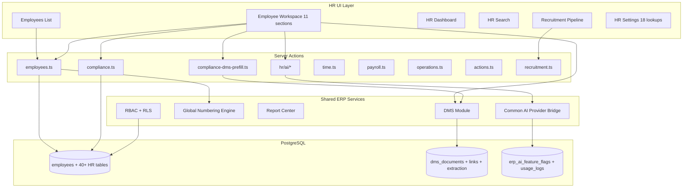
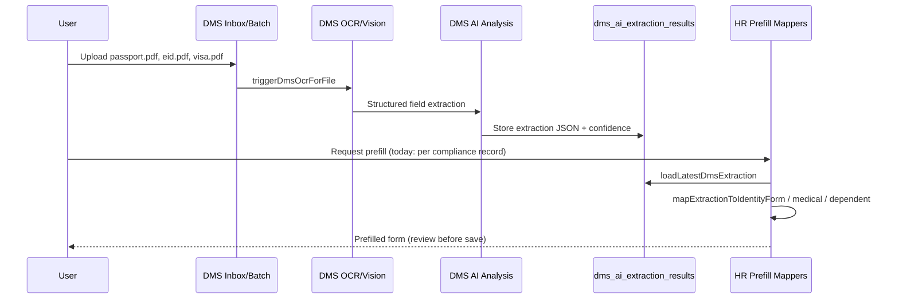
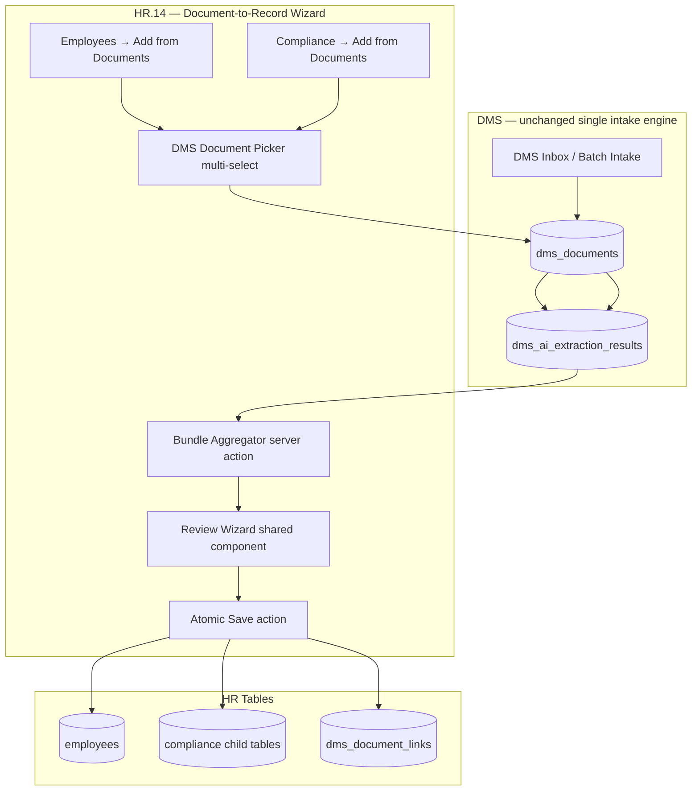

# ALGT ERP — HR Module Deep Audit & AI Enhancement Plan

**Report:** `implementation_Review/HR_Module/ALGT_ERP_HR_MODULE_DEEP_AUDIT_AND_AI_ENHANCEMENT_PLAN.md`  
**Date:** 2026-07-09 (updated 2026-07-09 — HR.14 plan correction)  
**Type:** Full module audit + DMS→HR document-to-record wizard plan  
**Status:** Planning / advisory — no implementation performed in this report  
**Audience:** Sameer / Dina / HR module stakeholders  

> **Plan correction (2026-07-09):** Sameer rejected a separate HR Pre-Hire Intake menu/sidebar and duplicate DMS batch mechanism. **DMS remains the single document intake engine.** HR.14 is corrected to **HR Document-to-Record Wizard Using Existing DMS** — two phases only. See `HR_14_PLAN_UPDATE_EXISTING_DMS_DOCUMENT_TO_RECORD_WIZARD_REPORT.md`.

---

## 1. Executive Summary

The ALGT ERP **Human Resources module is substantially complete**. All planned phases **HR.0 through HR.13** are closed. The module delivers a unified employee profile (11 workspace sections), global HR dashboard, global HR search, recruitment pipeline, compliance tracking, time/leave, payroll/WPS readiness, operations readiness, HR actions, 26 reports/letters, and gated AI assist (HR.12).

**Your proposed workflow — upload employee documents to DMS first, then create an employee profile from those documents with AI extraction (passport, Emirates ID, certificates, etc.) — is feasible**, but it is **not fully implemented today**. The building blocks exist; a **document-to-record wizard** (not a new intake system) is required.

### Corrected product model (Sameer, 2026-07-09)

```text
DMS = document upload, OCR, AI extraction, classification, storage
HR  = choose existing DMS documents → review AI suggestions → create/update HR records
```

- **No** new HR intake sidebar/menu  
- **No** duplicate DMS batch intake  
- **No** new staging table for pre-hire sessions (unless strictly needed for wizard draft state in browser/server session — prefer ephemeral draft)

### What exists today (partial match to your vision)

| Capability | Status |
|---|---|
| Upload documents to DMS (inbox, batch intake — existing DMS only) | ✅ Live |
| DMS AI/OCR extraction + metadata fields for HR doc types (passport, visa, EID, labour card, medical insurance) | ✅ Live |
| Prefill **compliance child records** from a selected DMS document (existing employee) | ✅ Live (`ComplianceDmsAddDialog`, `identity-document-add-dialog.tsx`) |
| AI Fill suggestions on **existing** employee profile from linked DMS docs | ✅ Live (HR.12, review-only) |
| **Add Employee from existing DMS documents** (multi-doc wizard, no employee yet) | ❌ Not built |
| Auto-save AI-extracted data into employee/compliance tables | ❌ By design — human review required |

### Recommended path forward

Implement **HR.14 — HR Document-to-Record Wizard Using Existing DMS** in **exactly two phases**:

- **HR.14A** — Employee creation from existing DMS documents (`Add from Documents` on Employees list)
- **HR.14B** — Existing employee record updates from existing DMS documents (Compliance tab actions + shared wizard)

Reuse existing DMS outputs, extraction results, and HR mappers — no new intake engine.

**Estimated complexity:** Medium (2 phases). **Feasibility:** High.

---

## 2. Audit Scope & Methodology

### 2.1 What was reviewed

1. **All HR markdown in the project** (22 `.md` files under `implementation_Review/` with HR scope)
2. **Live source code** — routes, features, server actions, lib helpers, migrations
3. **Live database** — numbering rule, employee count, category seeds (via Supabase MCP)
4. **Cross-module integration** — DMS, Common AI, Report Center, RBAC, Realtime
5. **Source of Truth** — `.cursor/ALGT_ERP_SOURCE_OF_TRUTH.md` (HR sections)

### 2.2 Authority hierarchy (per ALGT rules)

| Priority | Source |
|---|---|
| 1 | Live source code + latest closure reports |
| 2 | `.cursor/ALGT_ERP_SOURCE_OF_TRUTH.md` |
| 3 | Master plan (`ALGT_ERP_HR_MODULE_FULL_MASTER_IMPLEMENTATION_PLAN.md`) — **historical planning only** |

The master plan still says "PLANNING ONLY — No implementation performed." **Treat closure reports HR.0–HR.13 as authoritative.**

---

## 3. Documentation Review Index

### 3.1 Core planning documents

| File | Role | Notes |
|---|---|---|
| `implementation_Review/HR_Module/ALGT_ERP_HR_MODULE_FULL_MASTER_IMPLEMENTATION_PLAN.md` | Original 14-phase master plan | Stale status banner; content still useful for scope reference |
| `implementation_Review/HR_Module/ALGT_ERP_HR_MODULE_PLAN_DEEP_REVIEW_REPORT.md` | Pre-implementation plan review (2026-06-18) | Fixed RLS names, indexes, DMS entity types |
| `implementation_Review/HR_Module/_hr_plan_for_docx.md` | Export-oriented plan copy | Same scope as master plan |

### 3.2 Phase closure reports (HR.0 – HR.13)

| Phase | Report path | Status |
|---|---|---|
| HR.0 | `HR_Phases/Phase_HR_0/ERP_HR_0_READINESS_AUDIT_AND_FINAL_PLAN_CONFIRMATION_REPORT.md` | CLOSED (audit only) |
| HR.1 | `HR_Phases/Phase_HR_1/ERP_HR_1_SETTINGS_FOUNDATION_IMPLEMENTATION_REPORT.md` | IMPLEMENTED ✅ |
| HR.2 | `HR_Phases/Phase_HR_2/ERP_HR_2_EMPLOYEE_MASTER_PROFILE_SHELL_IMPLEMENTATION_REPORT.md` | IMPLEMENTED ✅ |
| HR.3 | `HR_Phases/Phase_HR_3/ERP_HR_3_COMPLIANCE_INSIDE_EMPLOYEE_PROFILE_IMPLEMENTATION_REPORT.md` | IMPLEMENTED ✅ |
| HR.4 | `HR_Phases/Phase_HR_4/ERP_HR_4_TIME_FOUNDATION_IMPLEMENTATION_REPORT.md` | IMPLEMENTED (notes) |
| HR.5 | `HR_Phases/Phase_HR_5/ERP_HR_5_PAYROLL_WPS_READINESS_IMPLEMENTATION_REPORT.md` | IMPLEMENTED ✅ |
| HR.6 | `HR_Phases/Phase_HR_6/ERP_HR_6_OPERATIONS_AND_READINESS_IMPLEMENTATION_REPORT.md` | IMPLEMENTED ✅ |
| HR.7 | `HR_Phases/Phase_HR_7/ERP_HR_7_HR_ACTIONS_IMPLEMENTATION_REPORT.md` | IMPLEMENTED ✅ |
| HR.8 | `HR_Phases/Phase_HR_8/ERP_HR_8_RECRUITMENT_ONBOARDING_IMPLEMENTATION_REPORT.md` | IMPLEMENTED ✅ |
| HR.9 | `HR_Phases/Phase_HR_9/ERP_HR_9_SINGLE_HR_DASHBOARD_IMPLEMENTATION_REPORT.md` | IMPLEMENTED ✅ |
| HR.10 | `HR_Phases/Phase_HR_10/ERP_HR_10_SINGLE_HR_SEARCH_IMPLEMENTATION_REPORT.md` | IMPLEMENTED ✅ |
| HR.11 | `Reports/REPORT_4_HR11_REPORTS_LETTERS_FORMS_LIBRARY_IMPLEMENTATION_REPORT.md` | IMPLEMENTED ✅ (via REPORT.4) |
| HR.12 | `HR/HR_12_HR_AI_INTEGRATION_IMPLEMENTATION_REPORT.md` | IMPLEMENTED ✅ |
| HR.13 | `HR/HR_13_SECURITY_RLS_QA_UAT_CLOSURE_REPORT.md` | CLOSED PASS WITH NOTES ✅ |

### 3.3 Ancillary HR-related reports

| File | Topic |
|---|---|
| `Reports/HR11_REPORT_FINAL_RUNTIME_QA_SECURITY_GAP_REPORT.md` | Pre-HR.12 report QA gaps |
| `Reports/HR11_REPORT_FINAL_FIX_CRITICAL_RUNTIME_QA_FIXES_BEFORE_HR12_IMPLEMENTATION_REPORT.md` | Critical fixes before HR.12 |
| `Realtime/ERP_REALTIME_1C_EMPLOYEES_HR_LISTS_IMPLEMENTATION_REPORT.md` | Realtime on employees, leave, attendance, candidates |
| `ERP_USERS_4_CRITICAL_SIDEBAR_HR_DMS_PERMISSION_CORRECTION_REPORT.md` | RBAC sidebar fix for HR/DMS visibility |
| `ERP_USERS_4_SIDEBAR_AND_HR_ROUTE_FIX_REPORT.md` | Route/sidebar corrections |

---

## 4. Module Architecture Overview

### 4.1 Design principles (implemented)

- **One Employee Profile** — single workspace at `/admin/hr/employees/record/[id]`
- **One HR Dashboard** — `/admin/hr/dashboard`
- **One HR Search** — `/admin/hr/search`
- **DMS-backed documents** — no separate HR file store
- **Compliance-first** — identity, medical, training, access cards inside profile
- **Human-review-first AI** — suggestions only; no auto-save (HR.12)
- **Finance excluded** — payroll runs, gratuity, accounting postings deferred

### 4.2 High-level architecture



### 4.3 Route inventory (49 pages)

**Hub:** `/admin/hr`, `/admin/hr/dashboard`, `/admin/hr/search`

**Core:** employees list + record new/edit

**Domains:** time (4), payroll (3), operations (4), actions (5), recruitment (8), settings (19)

**Sidebar:** registered in `src/components/layout/app-sidebar.tsx`  
**Workspace tabs:** registered in `src/lib/workspace/workspace-route-registry.ts`

---

## 5. Database & Data Model Summary

### 5.1 Table groups (~50 HR tables)

| Domain | Tables | Count |
|---|---|---|
| Core employee | `employees`, `employee_status_events`, `employee_document_links` | 3 |
| Settings lookups | `hr_employee_categories`, `hr_employment_types`, `hr_grades`, … (18 total) | 18 |
| Compliance | identity docs, medical insurance, dependents, access cards, training certs, medical records | 6 |
| Time | punches, daily summary, corrections, shifts, leave requests/balances, overtime | 7 |
| Payroll/WPS | profiles, salary components, revisions, holds, WPS profiles | 5 |
| Operations | assignments, role requirements, site readiness, blocks, assets, PPE, accommodation | 7 |
| HR Actions | PRO, actions, performance, disciplinary, notes, approvals, EOS, clearance | 8 |
| Recruitment | requisitions, candidates, candidate docs, interviews, offers, onboarding tasks, recruitment links | 7 |

All HR tables: **BIGINT PK**, **RLS ENABLED + FORCED**, indexes co-located in migrations.

### 5.2 Employee code numbering

| Rule | Value |
|---|---|
| Rule code | `HR_EMPLOYEE` |
| Format | `EMP-{SEQ6}` → e.g. `EMP-000001` |
| Policy | Single company-wide serial (not category-segmented) |
| Generation | `generate_next_reference_number` in `createEmployee` |

### 5.3 Live data snapshot (2026-07-09)

- **1 active employee** (`EMP-000001`, category: Owner)
- **12 seeded employee categories** (Driver, Operator, Technician, Admin, Engineer, etc.)
- **HR AI feature flags:** all disabled by default (by design post-HR.13)

---

## 6. Feature Domain Audit

### 6.1 Employee Master (HR.2)

| Feature | Status | Notes |
|---|---|---|
| Create / edit / archive employee | ✅ | `createEmployee`, `updateEmployee`, `archiveEmployee` |
| Status history (append-only) | ✅ | `employee_status_events` |
| 11-section workspace | ✅ | Overview, Profile, Compliance, Time, Payroll, Operations, HR Actions, Documents, Letters, AI Review, Audit |
| Employee code auto-generation | ✅ | `HR_EMPLOYEE` rule |
| Photo from DMS | ⚠️ Column only | `photo_dms_document_id` — no upload UI |
| Reporting manager combobox | ⚠️ Partial | DB columns exist; UI improvement deferred |

**Required fields on create** (cannot be AI-inferred alone):

- `full_name_en`, `gender`, `date_of_birth`, `mobile_number`
- `owner_company_id`, `joining_date`
- `emergency_contact_name`, `emergency_contact_mobile`

### 6.2 Compliance (HR.3) — strongest DMS integration

| Compliance type | CRUD | DMS link | DMS prefill | AI prefill |
|---|---|---|---|---|
| Identity documents (EID, passport, visa, labour card, etc.) | ✅ | ✅ | ✅ | ✅ (`prefillIdentityDocumentFromDms`) |
| Medical insurance | ✅ | ✅ | ✅ | ✅ |
| Dependents | ✅ | ✅ | ✅ | ✅ |
| Access cards | ✅ | ✅ | ✅ | Partial |
| Training certificates | ✅ | ✅ | ✅ | Partial |
| Medical records | ✅ | ✅ | ✅ | Partial (permission-gated) |

**Key files:**

- `src/server/actions/hr/compliance.ts` — CRUD + auto DMS linking
- `src/server/actions/hr/compliance-dms-prefill.ts` — metadata + OCR + AI enrichment
- `src/server/actions/hr/ai/identity-document-ai-fill.ts` — identity-specific AI extraction
- `src/lib/hr/compliance/dms-to-identity-map.ts` — DMS type → HR identity type mapping
- `src/features/hr/employees/compliance/compliance-dms-add-dialog.tsx` — pick DMS doc when adding compliance record

**DMS metadata seeds:** migration `20260620170000_erp_dms_metadata_hr_compliance_seed.sql` — VISA, MEDICAL_INSURANCE, LABOUR_CARD, DRIVING_LICENSE field definitions aligned to HR columns.

### 6.3 Time & Leave (HR.4)

| Feature | Status | Gap |
|---|---|---|
| Attendance punches + daily summary | ✅ | |
| Corrections (append-only audit) | ✅ | |
| Shift assignments | ✅ | |
| Leave requests + balances | ✅ | Cancelled approved leave does not auto-reverse `used_days` |
| Overtime | ✅ | |
| Sick cert DMS FK | ✅ | Preview via Documents tab |

### 6.4 Payroll & WPS Readiness (HR.5)

| Feature | Status | Gap |
|---|---|---|
| Payroll profile + salary components | ✅ | |
| Salary revisions (append-only) | ✅ | |
| Payroll holds | ✅ | |
| WPS profiles + readiness scoring | ✅ | |
| IBAN/account masking in UI | ✅ | Stored plain text (RLS + redaction, not encrypted) |
| WPS SIF export | ❌ | Deferred |
| Payroll runs / payslips | ❌ | Finance module scope |

### 6.5 Operations & Readiness (HR.6)

| Feature | Status | Notes |
|---|---|---|
| Assignments, blocks, assets, PPE, accommodation | ✅ | |
| Deterministic readiness engine | ✅ | **No AI** — rule-based only |
| Site readiness scoring | ✅ | JSONB missing requirements |
| Work site combobox | ⚠️ | Numeric input in some flows |

### 6.6 HR Actions (HR.7)

| Feature | Status | Gap |
|---|---|---|
| PRO processes | ✅ | |
| Disciplinary / performance / notes | ✅ | Notes not in HR search (sensitive) |
| EOS case shell + clearance checklist | ✅ | No financial settlement |
| Approval requests (one-step) | ✅ | Full workflow engine deferred |

### 6.7 Recruitment & Onboarding (HR.8)

| Feature | Status | Relevance to DMS-first hire |
|---|---|---|
| Requisitions → Candidates → Interviews → Offers | ✅ | |
| Candidate DMS documents | ✅ | **Alternative pre-employee document staging** |
| Candidate → Employee conversion | ✅ | Copies basic personal fields only |
| Onboarding task checklist | ✅ | |
| Public candidate portal | ❌ | Internal only |

**Conversion gap:** `convertCandidateToEmployee` does **not** auto-create compliance records from linked DMS documents.

### 6.8 Dashboard & Search (HR.9, HR.10)

| Feature | Status |
|---|---|
| Permission-gated KPI aggregates | ✅ |
| Attention items (expiry, blocks, leave, etc.) | ✅ |
| 8-category deterministic search | ✅ |
| AI Search Assist (NL → filters) | ✅ HR.12, flag-gated |
| Dashboard filter bar UI | ⚠️ URL params only |

### 6.9 Reports & Letters (HR.11 / REPORT.4)

| Deliverable | Count | Formats |
|---|---|---|
| Registry entries | 26 | PDF, Excel, CSV, Print |
| Letter/form generators on employee profile | ✅ | Experience letter, NOC, salary cert, ID card, etc. |
| DOCX output | ❌ | PDF v1 per HR.0 decision |
| Report schedule cron | ❌ | UI + DB only |

### 6.10 HR AI (HR.12)

| Feature | Flag | Permission | Auto-save |
|---|---|---|---|
| Master switch | `ERP_AI_HR_EMPLOYEE_ASSIST` | — | — |
| Fill from Documents | `ERP_AI_HR_FILL` | `hr.ai.use` + `dms.documents.view` | ❌ |
| Profile corrections | `ERP_AI_HR_CORRECTIONS` | `hr.ai.use` | ❌ |
| Duplicate detection | `ERP_AI_HR_DUPLICATES` | `hr.ai.use` | ❌ (deterministic v1) |
| Compliance explain | `ERP_AI_HR_COMPLIANCE_EXPLAIN` | `hr.ai.use` | ❌ |
| Readiness explain | `ERP_AI_HR_READINESS_EXPLAIN` | `hr.ai.use` | ❌ |
| Letter/email draft | `ERP_AI_HR_LETTER_DRAFT` / `EMAIL` | `hr.ai.use` | ❌ |
| Search assist | `ERP_AI_HR_SEARCH_ASSIST` | `hr.ai.use` | ❌ |
| Activity log | — | `hr.ai.view` | Read-only |

**Critical constraint:** `generateEmployeeDocumentFillSuggestions(employeeId)` requires an **existing employee**. It reads `dms_document_links WHERE entity_type='employee' AND entity_id=employeeId`.

### 6.11 Security closure (HR.13)

| Check | Result |
|---|---|
| All HR tables RLS enabled + forced | ✅ |
| Sensitive data redaction (payroll, medical, disciplinary) | ✅ |
| HR AI flags disabled by default | ✅ (fixed post-HR.12) |
| `reports.*` + `hr.ai.*` role assignments | ✅ (fixed in HR.13) |
| `full_name` → `full_name_en` column bug | ✅ Fixed (127+ replacements) |
| Module readiness decision | **Ready for next ERP module** (with documented minor gaps) |

---

## 7. DMS Integration — Current State (Deep Dive)

### 7.1 Entity types registered for HR

From `src/lib/dms/dms-entity-types.ts`:

- `employee` (primary)
- `employee_compliance`, `employee_identity_document`, `employee_medical_insurance`, `employee_dependent`, `employee_access_card`, `employee_training_certificate`, `employee_medical_record`, `employee_contract`, `employee_leave_request`

### 7.2 Document upload paths

| Path | Entity required? | Use case |
|---|---|---|
| `/dms/inbox` | Optional (`entity_type` + `entity_id` query params) | General upload; can attach entity context |
| `/dms/inbox?entity_type=employee&entity_id={id}` | Yes — employee must exist | Upload from employee Documents tab |
| DMS Batch Intake | Optional batch-level `entity_type` | Multi-file upload with review queue |
| Candidate Documents tab | Candidate must exist | Pre-hire document staging |

### 7.3 Linking model

```
dms_documents  ←——  dms_document_links(entity_type, entity_id)
                           ↓
                    employees.id (when entity_type='employee')
```

Compliance child tables also store `dms_document_id` FK for direct record↔document binding.

### 7.4 Extraction pipeline (reusable for HR.14)



### 7.5 DMS entity matching (Phase 13)

`entity-matcher.ts` can suggest `employee_id` matches from document metadata/OCR signals — but:

- **Human review only** (review queue)
- **No auto-link** to employee
- Useful for linking orphan inbox documents to existing employees, not for creating new ones

---

## 8. Your Proposed Workflow — Analysis

### 8.1 Desired flow (as described)

1. HR uploads employee documents to DMS (passport, Emirates ID, visa, labour card, certificates, medical insurance, etc.)
2. DMS runs OCR/AI extraction
3. HR opens "Create Employee from DMS Documents"
4. System aggregates extractions across the document bundle
5. HR reviews prefilled employee profile + compliance records
6. HR confirms → employee created + all documents linked + compliance records created

### 8.2 Current flow (what happens today)


Documents can exist in DMS **without** an employee link (inbox/batch). Today HR has no wizard to select those orphan documents and create an employee in one step. Per-record prefill (`ComplianceDmsAddDialog`, `identity-document-add-dialog.tsx`) already works for **existing** employees.

### 8.3 Partial alternatives today

| Approach | Steps | Limitation |
|---|---|---|
| **A. Minimal shell first** | Create employee manually → link docs → prefill compliance | No bundle wizard; duplicate data entry |
| **B. Candidate pipeline** | Create candidate → link DMS docs → convert to employee | Conversion doesn't import compliance from DMS |
| **C. Per-record Add from DMS** | Employee exists → Compliance → pick one DMS doc | ✅ Works today; one record at a time |
| **D. AI Fill on existing employee** | AI Review → Fill from Documents | Suggestions only; employee must exist |

### 8.4 Feasibility verdict

| Aspect | Assessment |
|---|---|
| Technical feasibility | **HIGH** — extraction, mappers, compliance CRUD, DMS picker patterns exist |
| Data model changes | **LOW** — no new intake tables; optional wizard draft in client/session only |
| AI/OCR dependency | **MEDIUM** — quality varies by scan; human review mandatory |
| Security/compliance | **MANAGEABLE** — extend HR.12 redaction + existing permission gates |
| UX complexity | **MEDIUM** — shared multi-step wizard; HR.14B reuses HR.14A core |
| Effort estimate | **2 phases**, ~12–16 working days |

**Conclusion: Feasible. Requires document-to-record wizard on top of existing DMS — not a new intake system.**

---

## 9. Proposed Enhancement: HR.14 — HR Document-to-Record Wizard Using Existing DMS

### 9.1 Design principles (mandatory)

| Principle | Rule |
|---|---|
| DMS owns intake | Upload, OCR, AI, classification, storage stay in DMS only |
| HR consumes documents | HR selects **existing** DMS documents and converts them into reviewed records |
| No new menus | No HR intake sidebar; no duplicate DMS upload flow |
| Human review | AI output = suggestions only; **no auto-save** |
| Save on confirm | Writes happen only after explicit user Save |
| Preserve links | Selected DMS documents linked via `dms_document_links` + `dms_document_id` on child rows |
| Shared wizard | Same mechanism for employee create, dependent, and compliance targets |

### 9.2 Architecture



### 9.3 Menu / action placement (no new sidebar)

| Location | Action | Phase |
|---|---|---|
| **HR → Employees** (list toolbar) | **Add from Documents** | HR.14A |
| **Employee Profile → Compliance** (per section) | **Add from Documents** / **Add Dependent from Documents** | HR.14B (extends/enhances existing dialogs) |
| **Employee Profile → Documents** (optional) | Create/Update HR Record from linked documents | HR.14B optional |

**Explicitly excluded:** `/admin/hr/employees/intake/*`, HR Pre-Hire Intake sidebar, `hr_pre_hire_intake_sessions` table.

### 9.4 User workflow — Employee creation (HR.14A)

1. User uploads employee documents in **DMS** (inbox or batch — existing mechanism).
2. DMS runs OCR / AI / metadata extraction (already implemented).
3. User goes to **HR → Employees**.
4. User clicks **Add from Documents**.
5. Wizard opens — user selects **one or more existing DMS documents** (search/filter by type, title, document no, upload date).
6. System reads **existing** `dms_ai_extraction_results` + DMS metadata (no re-OCR in HR).
7. System merges extracted values into an **employee draft** + **compliance child suggestions**.
8. User reviews employee core fields (name, DOB, gender, nationality, mobile, etc.).
9. User reviews compliance suggestions per detected doc type:
   - passport, Emirates ID, visa, labour card, medical insurance, training certificates, access cards (if applicable)
10. User manually completes required fields not reliably extractable:
    - owner company, branch, department, designation, employee category
    - joining date (if not reliable from contract)
    - emergency contact, reporting manager
11. User reviews conflicts and low-confidence fields (same field, different values across docs).
12. User clicks **Save**.
13. ERP atomically:
    - creates employee + status event
    - creates confirmed compliance child records
    - links selected DMS documents (`entity_type='employee'`)
    - sets `dms_document_id` on relevant child rows
    - writes audit log (+ AI usage log if AI enrichment used)

### 9.5 User workflow — Dependent creation (HR.14B)

1. User opens **Employee Profile → Compliance → Dependents**.
2. User clicks **Add Dependent from Documents**.
3. User selects existing DMS document(s) via shared picker.
4. System maps extraction → dependent draft (`dependent-dms-map.ts`).
5. User reviews: name, relationship, DOB, nationality, passport/EID, expiry dates.
6. User clicks **Save** → dependent record created + DMS documents linked.

### 9.6 User workflow — Compliance record creation (HR.14B)

Enhances/standardizes existing per-type flows under **Employee Profile → Compliance**:

| Target | Current UI | HR.14B change |
|---|---|---|
| Identity document | `identity-document-add-dialog.tsx` | Align to shared wizard; label **Add from Documents** |
| Medical insurance | `ComplianceDmsAddDialog` | Same shared picker + review pattern |
| Training certificate | `ComplianceDmsAddDialog` | Same |
| Access card | `ComplianceDmsAddDialog` | Same |
| Medical record | `ComplianceDmsAddDialog` | Same (permission-gated) |
| Dependent | `ComplianceDmsAddDialog` | **Add Dependent from Documents** |

Optional: update existing compliance record from a newly selected DMS document (review-only, no overwrite without confirm).

---

## 9.7 Implementation phases (exactly two)

### HR.14A — Employee Creation from Existing DMS Documents

**Scope:**

- Add **Add from Documents** button on `src/features/hr/employees/employees-table.tsx` (or employees page toolbar)
- New shared components:
  - `HrDmsDocumentPickerDialog` — multi-select existing DMS documents (reuse DMS list/search patterns)
  - `HrDocumentToRecordWizard` — multi-step review (documents → profile → compliance → employment → confirm)
- New server actions (proposed paths):
  - `src/server/actions/hr/document-to-record/aggregate-dms-documents.ts` — merge extractions for selected `dms_document` IDs
  - `src/server/actions/hr/document-to-record/create-employee-from-documents.ts` — atomic save
- Read from: `dms_documents`, `dms_ai_extraction_results`, DMS metadata values
- Map via existing libs: `dms-to-identity-map.ts`, `medical-insurance-dms-map.ts`, `dependent-dms-map.ts`, `compliance-dms-ocr.ts`, geography/nationality resolvers
- Duplicate checks before save: mobile, EID number, passport number (extend HR.12 duplicate logic)
- Human confirmation before any write
- **No** new intake sidebar, **no** new DMS batch mechanism, **no** new intake DB table

**Reuse:** `createEmployee`, compliance create actions, `linkDmsDocumentToEntity` from `entity-documents.ts`

### HR.14B — Existing Employee Record Updates from Existing DMS Documents

**Scope:**

- Add **Add from Documents** actions inside Employee Profile compliance sections
- **Add Dependent from Documents** on Dependents section
- Refactor `ComplianceDmsAddDialog` + `identity-document-add-dialog.tsx` to use shared:
  - `HrDmsDocumentPickerDialog`
  - extraction/review steps from `HrDocumentToRecordWizard` (single-target mode)
- Targets: identity document, medical insurance, training certificate, access card, medical record, dependent
- Optional: update existing compliance row from document with review
- Shared save path: create/update target record + link DMS + audit log

**Reuse:** `prefillComplianceRecordFromDms`, `prefillIdentityDocumentFromDms`, all HR.14A picker/aggregator logic in single-doc mode

---

## 9.8 Data mapping (extraction → HR records)

| Source document (DMS type) | → Employee profile | → Compliance child |
|---|---|---|
| Passport | `full_name_en`, `full_name_ar`, `date_of_birth`, `gender`, `nationality_id` | `employee_identity_documents` (PASSPORT) |
| Emirates ID | name/DOB verify | `employee_identity_documents` (EMIRATES_ID) |
| Residence Visa | — | `employee_identity_documents` (RESIDENCE_VISA) |
| Labour Card | — | `employee_identity_documents` (LABOUR_CARD) |
| Medical Insurance | — | `employee_medical_insurances` |
| Training Certificate | — | `employee_training_certificates` |
| Access Card | — | `employee_access_cards` |
| Employment Contract | `joining_date` hint | contract dates on employee profile |

**Manual only (not auto-filled):** `owner_company_id`, `branch_id`, `department_id`, `designation_id`, `employee_category_id`, `emergency_contact_*`, `reporting_manager_id`.

**DB tables involved (read):** `dms_documents`, `dms_document_links`, `dms_ai_extraction_results`, DMS metadata tables  
**DB tables involved (write):** `employees`, `employee_status_events`, compliance child tables, `dms_document_links`, `employee_document_links` (if used for readiness bridge)

---

## 9.9 Permissions & feature flags

### Permissions (prefer existing)

| Permission | Use |
|---|---|
| `hr.employees.create` | HR.14A employee create |
| `hr.compliance.manage` | HR.14B compliance/dependent create |
| `hr.ai.use` | AI enrichment in wizard (optional layer) |
| `dms.documents.view` | Document picker + read extraction |
| `dms.ai.view` | Read AI extraction summaries if gated separately |

Optional new permissions **only if** separate gate needed: `hr.documents_to_record.use`, `hr.documents_to_record.manage` — **default: use existing permissions**.

### Feature flags (all disabled by default)

| Flag | Purpose |
|---|---|
| `ERP_AI_HR_EMPLOYEE_ASSIST` | Master switch (existing) |
| `ERP_AI_HR_DOCUMENT_TO_EMPLOYEE` | HR.14A wizard (proposed) |
| `ERP_AI_HR_DOCUMENT_TO_COMPLIANCE` | HR.14B compliance/dependent wizard (proposed) |
| `ERP_AI_HR_DOCUMENT_TO_DEPENDENT` | Optional split flag for dependents only |

---

## 9.10 Safety & audit controls

1. **No AI auto-save** — all fields editable; Save is explicit
2. **Suggestion labeling** — show source document, confidence, conflict warnings per field
3. **Redaction** — extend `hr-ai-redaction.ts`; mask document numbers in prompts
4. **Confidentiality gate** — HR/legal/executive DMS docs require `dms.admin` for AI read (existing DMS rule)
5. **Duplicate prevention** — mobile, EID, passport checks before HR.14A save
6. **Audit log** — document IDs used, fields accepted/rejected, creating user, target record IDs
7. **AI usage log** — `erp_ai_usage_logs` metadata only (no raw prompts/responses)
8. **Atomic save** — employee + children + links in one transaction (RPC or rollback sequence)
9. **RLS** — all writes through existing HR RLS policies; no bypass except admin client for extraction read (same pattern as `compliance-dms-prefill.ts`)

---

## 9.11 Implementation risks

| Risk | Mitigation |
|---|---|
| Conflicting values across multiple docs (name/DOB differ) | Conflict UI step; user must resolve before Save |
| Documents uploaded without OCR/AI run yet | Wizard shows "extraction pending"; block Save or allow manual entry only |
| Orphan DMS docs hard to find in picker | Filter by HR-relevant doc types; search by holder name from metadata |
| Overlap with existing `ComplianceDmsAddDialog` | HR.14B refactors to shared wizard — don't maintain two UX paths long-term |
| User expects HR to upload documents | Clear copy: "Upload in DMS first, then Add from Documents here" |
| Low OCR quality on mobile photos | Human review mandatory; confidence thresholds hide low-trust suggestions |

---

## 9.12 Updated recommendation

**Approve HR.14 as two phases only:**

1. **HR.14A** — Employees list → **Add from Documents** → create employee from selected existing DMS documents  
2. **HR.14B** — Employee Profile compliance → **Add from Documents** (all compliance types + dependents)

Do **not** implement pre-hire intake menu, staging table, or duplicate DMS batch flow.

---

## 10. Additional Enhancement Backlog (Beyond HR.14)

Prioritized by value vs effort:

### P1 — High value, builds on existing code

| # | Enhancement | Rationale |
|---|---|---|
| E1 | **HR.14 Document-to-Record Wizard** (2 phases) | Directly addresses Sameer's corrected workflow |
| E2 | Enable HR AI flags in staging + UAT test pack | HR.12 built but disabled |
| E3 | Candidate conversion + DMS compliance import | Extends recruitment → employee path |
| E4 | Employee photo upload via DMS | Column exists; quick win |
| E5 | Dashboard "Headcount by Category" widget | Reporting without encoding category in emp no |

### P2 — Operational completeness

| # | Enhancement | Rationale |
|---|---|---|
| E6 | Leave balance auto-deduction/reversal on approve/cancel | Documented gap HR.4 |
| E7 | WPS SIF export file generation | UAE payroll ops |
| E8 | Report schedule background job | REPORT.5 UI exists, no cron |
| E9 | Reporting manager / supervisor ERPCombobox | HR.2 deferred UI |
| E10 | Complex settings editors (MOHRE, readiness matrices) | Currently read-only lists |

### P3 — Advanced AI (post HR.14)

| # | Enhancement | Rationale |
|---|---|---|
| E11 | Fuzzy AI duplicate detection (beyond deterministic) | HR.12 v1 is exact-match only |
| E12 | AI-suggested employee category from profession on visa/labour card | Classification assist |
| E13 | Bulk document-to-record (multi-employee folder) | Scale onboarding — post HR.14 |
| E14 | AI compliance gap auto-queue (create review items) | Cross-link DMS validation → HR |

### Explicitly out of scope (Finance module)

- Payroll runs, payslip generation, salary payment
- EOS gratuity calculation and settlement posting
- GL / accounting integration

---

## 11. Known Gaps & Technical Debt Register

| ID | Gap | Severity | Source |
|---|---|---|---|
| G1 | Post-create employee: child tabs empty until page reload | LOW | HR.13 |
| G2 | Permission-check failures don't write audit log | LOW | HR.13 |
| G3 | Leave balance not auto-adjusted on leave cancel | LOW | HR.4 |
| G4 | `hr.ai.apply_suggestion` not on `company_admin` | LOW | HR.13 |
| G5 | Report schedule cron not implemented | LOW | REPORT.5 |
| G6 | IBAN stored plain text (RLS + redaction only) | MEDIUM | HR.5 |
| G7 | WPS SIF export missing | MEDIUM | HR.5 |
| G8 | `dashboard.ts` may reference `employee_dms_links` (verify table name) | LOW | Code review |
| G9 | HR role codes (`hr_officer`, `payroll_officer`) not seeded | LOW | HR.1 |
| G10 | Master plan doc status banner stale | INFO | Documentation |
| G11 | **No Add Employee from existing DMS documents wizard** | **HIGH** | This audit — HR.14A |

---

## 12. Security & Compliance Considerations for HR.14

See **Section 9.10** for the full safety and audit control list. Key points:

- Human confirm before any write; no AI auto-save
- Redaction in AI prompts; confidentiality tiers for sensitive DMS docs
- Duplicate prevention on employee create
- All writes through existing HR RLS — no new intake tables bypassing RLS

---

## 13. Dependencies & Prerequisites

Before starting HR.14:

| Prerequisite | Status |
|---|---|
| DMS OCR/AI pipeline working | ✅ (DMS.9–DMS.11) |
| HR compliance DMS metadata seeds | ✅ |
| HR compliance prefill mappers | ✅ |
| Common AI provider configured | ⚠️ Verify env keys + `erp_ai_provider_configs` |
| HR AI master flag enabled for UAT | ⚠️ Currently disabled |
| DMS document types for PASSPORT, EID, VISA, etc. | ✅ Verify in live DB |
| RBAC: hr_manager can access DMS | ✅ (20260706100000 migration) |

---

## 14. Implementation Effort Estimate (HR.14)

| Phase | Scope | Estimate |
|---|---|---|
| HR.14A | Document picker + aggregator + employee create wizard + atomic save | 6–9 days |
| HR.14B | Shared wizard refactor + compliance/dependent actions on profile | 4–5 days |
| QA + UAT + closure report | Permissions, redaction, conflict UX, audit | 2–3 days |
| **Total** | **2 phases only** | **~12–17 working days** |

---

## 15. Recommended Decision Points for Sameer

1. **Approve HR.14 (2 phases)?** — Document-to-record wizard using existing DMS documents
2. **Minimum document selection for HR.14A?** e.g. require at least passport or EID before Save enabled
3. **Enable HR AI flags for UAT?** Required to test AI enrichment in wizard
4. **HR.14B priority order?** Dependents first vs unify all compliance dialogs in one pass
5. **Optional Documents tab action?** Create/Update HR Record from linked documents on employee Documents tab

---

## 16. Appendix — Key Source File Index

### Server actions
- `src/server/actions/hr/employees.ts` — employee CRUD
- `src/server/actions/hr/compliance.ts` — compliance CRUD
- `src/server/actions/hr/compliance-dms-prefill.ts` — DMS→compliance prefill
- `src/server/actions/hr/ai/employee-ai-fill.ts` — AI fill (existing employee)
- `src/server/actions/hr/ai/identity-document-ai-fill.ts` — identity prefill
- `src/server/actions/hr/recruitment.ts` — candidate conversion
- `src/server/actions/dms/entity-documents.ts` — generic entity document linking
- `src/server/actions/dms/batch-intake.ts` — batch upload sessions

### UI (existing + proposed)
- `src/features/hr/employees/employees-table.tsx` — **HR.14A:** Add from Documents entry
- `src/features/hr/employees/compliance/compliance-dms-add-dialog.tsx` — **HR.14B:** refactor to shared wizard
- `src/features/hr/employees/compliance/identity-document-add-dialog.tsx` — **HR.14B:** refactor to shared wizard
- `src/features/hr/employees/tabs/employee-compliance-tab.tsx` — compliance section actions
- `src/features/hr/ai/hr-ai-review-tab.tsx` — AI Review hub (existing employee, suggestions only)

### Proposed new (HR.14)
- `src/features/hr/document-to-record/hr-dms-document-picker-dialog.tsx`
- `src/features/hr/document-to-record/hr-document-to-record-wizard.tsx`
- `src/server/actions/hr/document-to-record/aggregate-dms-documents.ts`
- `src/server/actions/hr/document-to-record/create-employee-from-documents.ts`

### Lib / mappers
- `src/lib/hr/compliance/dms-to-identity-map.ts`
- `src/lib/hr/compliance/medical-insurance-dms-map.ts`
- `src/lib/hr/compliance/compliance-dms-ocr.ts`
- `src/lib/hr/ai/feature-flags.ts`
- `src/lib/dms/entity-matching/entity-matcher.ts`

### Migrations (HR core)
- `20260618100000_erp_hr_1_settings_foundation.sql`
- `20260618200000_erp_hr_2_employee_master_profile_shell.sql`
- `20260618210000_erp_hr_3_compliance_inside_employee_profile.sql`
- `20260619180000_hr12_hr_ai_integration.sql`
- `20260620170000_erp_dms_metadata_hr_compliance_seed.sql`

---

## 17. Audit Conclusion

The ALGT ERP HR module is a **mature, production-ready foundation** with deep compliance and DMS integration. HR.12 added AI assist in a safe, review-first model — but only for **existing** employees and suggestions only.

Sameer's corrected workflow — **upload in DMS first, then Add from Documents in HR** — is **architecturally sound and feasible** as **HR.14 (two phases)**. ~70% of plumbing exists (DMS extraction, HR mappers, per-record prefill dialogs, compliance CRUD, entity linking). The missing piece is a **shared document-to-record wizard** starting from the Employees list, plus standardization of compliance **Add from Documents** actions on the employee profile.

**Do not build:** separate HR intake menu, pre-hire staging table, or duplicate DMS batch intake.

**Next step:** Sameer reviews updated plan + `HR_14_PLAN_UPDATE_EXISTING_DMS_DOCUMENT_TO_RECORD_WIZARD_REPORT.md`, then author formal HR.14A implementation prompt.

---

*End of report.*
